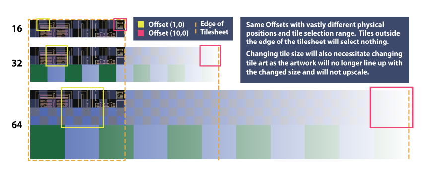

# Changing Tile Size

*Источник: https://docs.rpg-architect.com/03-cookbook/01-changing-tile-size/*

---

# Changing Tile Size

## **Changing Tile Size**[¶](#changing-tile-size "Permanent link")

Changing tile size is **technically** possible in RPG Architect, but is not officially supported, due to the complexity of the workflow.

If you're willing to do the manual work necessary (which will need to be selective), then you can follow this guide.

## **Considerations**[¶](#considerations "Permanent link")

If you update the tile size, everything will need to be adjusted. This means that any assigned tileset images will need to be updated to the new scale, or maps will break. Maps leverage offsets (based on the tile size provided) to determine the position inside the tileset image to use. Thus, if you increase your tile size, but not your tileset image, you may be trying to grab a position that doesn't exist in it.

> **Example**: A 176 x 176 pixel tileset image is used on Map 1, with the tile size originally set to 16 pixels. The top-left tile in the image would be at (0,0) with a tile offset of (0, 0); one tile to the right would be at (16, 0) and have a tile offset of (1, 0); the top right would be at (160, 0) and have a tile offset of (10, 0). Assume that you change your tile size from 16 to 32. The tile offset of (10, 0) would now register as (320, 0), which does not exist on the original 176 x 176 pixel tileset image. **You would need to manually scale your image for the new tile size to render correctly**.

While this would be a relatively "easy" process, RPG Architect makes no assumptions about how your images are setup (or where they are setup), so you may have tileset images in different directories, or you may have already imported some tileset images that are the new "size" you want to use.

Additionally, anything that renders on a map will also need to be adjusted, since they leverage the "scale" in relation to the tile.

> **Note**: If you don't have any maps made or characters, then **you can change your tile size without any repercussions**.

## **Changing the Tile Size**[¶](#changing-the-tile-size "Permanent link")

Make sure your project is not currently loaded in RPG Architect.

Load up your favorite text (or code/JSON) editor and open the "Database.json" file in the Content directory of your project. One of the first things you'll see is "TileDimension". Update the number immediately after it. **That's as simple as it is.**

> **Example of a 16 Pixel Tile Size**: `{"TileDimension":16,"ActionSequences":{...`
> 
> **Example of a 64 Pixel Tile Size**: `{"TileDimension":64,"ActionSequences":{...`

## **Future Notes**[¶](#future-notes "Permanent link")

A tool to manually scale a directory of images may eventually be added so that this process is less painful (e.g. everything is well organized and you want to do a batch scale on tilesets, characters, etc; you would point the tool toward the directory or files and it would do the work for you). Many image tools that come with the ability to use the command line do allow for batch re-scaling, such as Aseprite.