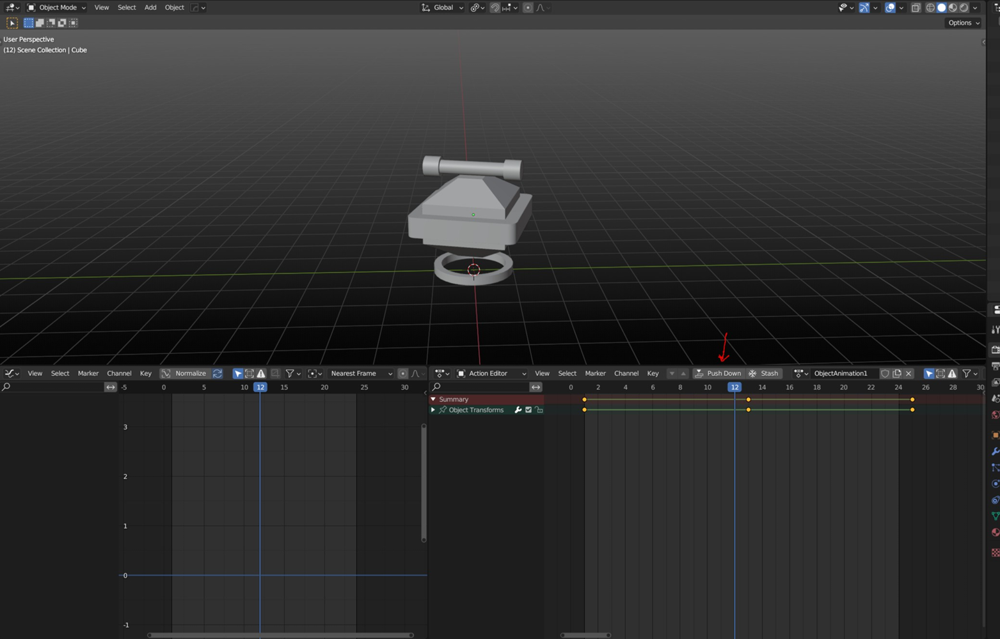
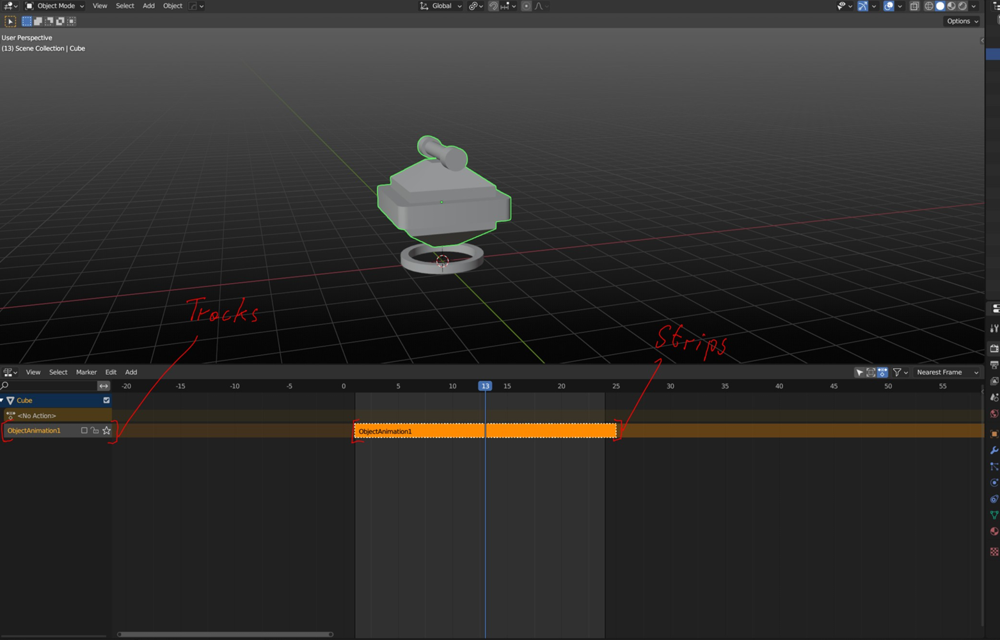
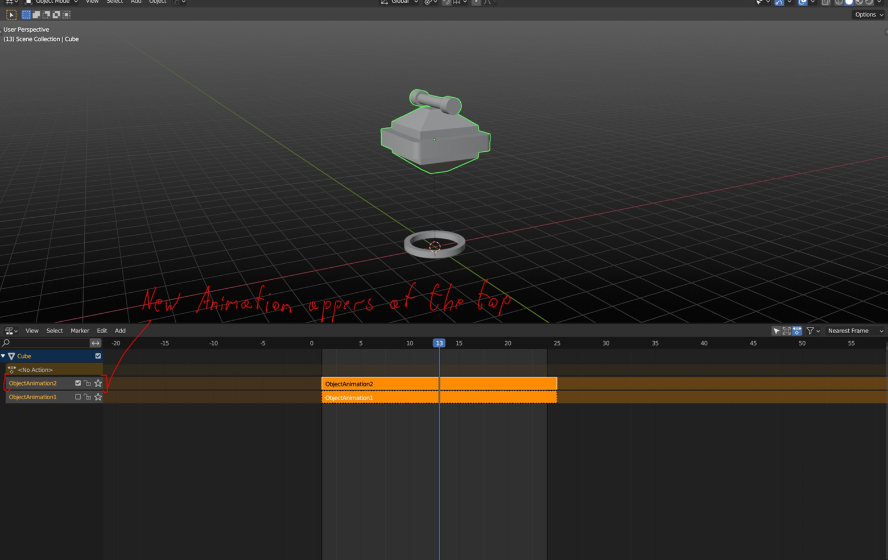
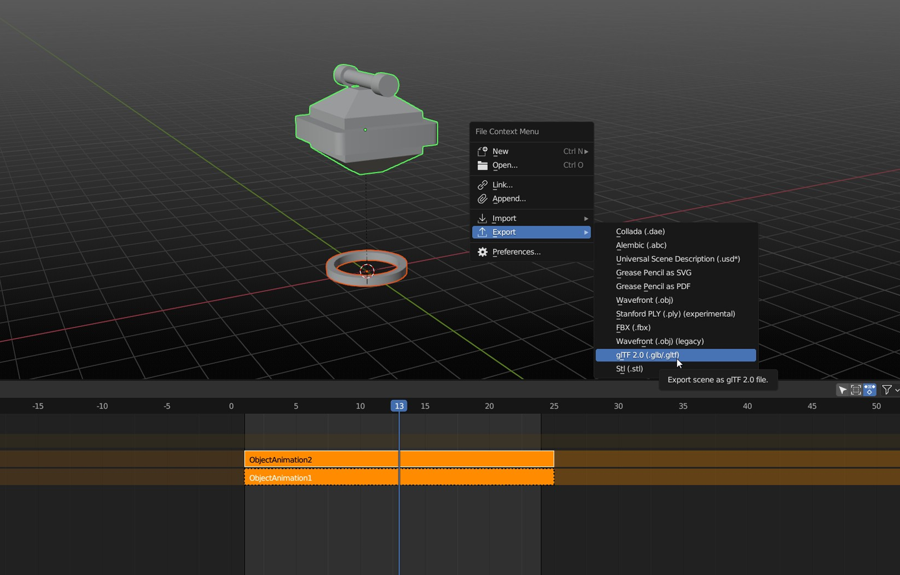
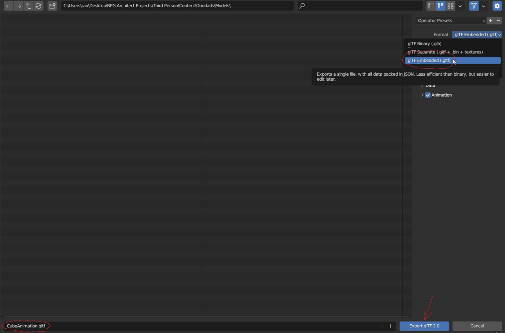

# Modeling Best Practices

*Источник: https://docs.rpg-architect.com/03-cookbook/05-3d-cookbook/modeling-best-practices/*

---

# Modeling Best Practices

## **Modeling Best Practices**[¶](#modeling-best-practices "Permanent link")

RPG Architect supports 3D models in the glTF 2.0 format. To get them working optimally, it is advised that you use [Blender](https://www.blender.org/).

The following steps outline best practice for 3D models in RPG Architect.

Once you have created the animation for your object, inside the Action Editor (which is accessible through the Dope Sheet Editor) you have to push it down to the NLA Editor.

Inside the NLA Editor, you will then have your animation pop up at the top of the NLA stack. The orange colored animations in the middle are called strips and the grey colored parts to the left are called tracks where the animations are listed.

Every time you push a new animation clip down, they will pop up as animation tracks inside the NLA Editor at the top of the stack. This allows you to have multiple animations per object.

To export the model and animation correctly, select the model together with their parent/child objects, and open up the File Context Menu with F4. Select Export \\ GLTF 2.0.

Select the location to export, glTF format options, name and then click the Export button at the bottom.

> **Note**: Alternatively, this can be done via File \\ Export \\ GLTF 2.0.
> 
> **Note**: RPG Architect supports glTF Binary and glTF Embedded options.