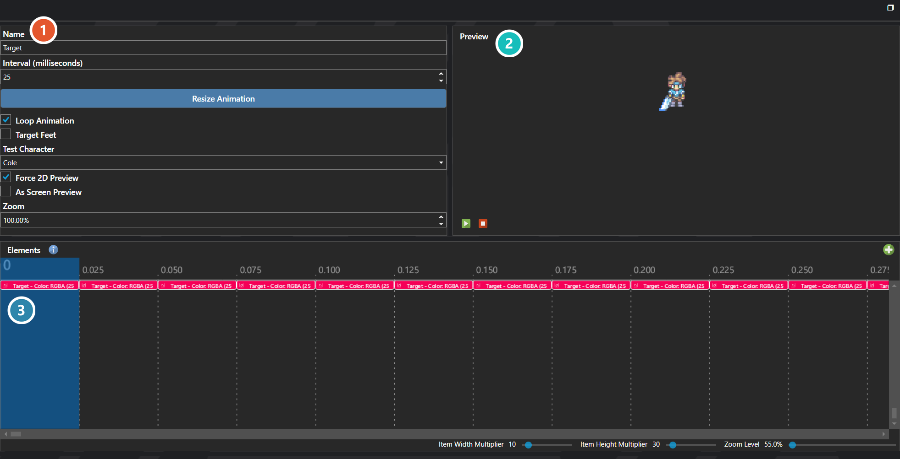

# Animations

*Источник: https://docs.rpg-architect.com/06-database/08-animations/00-animations/*

---

# Animations

## **Animations**[¶](#animations "Permanent link")

Animations are reusable visual sequences built from a timeline of keyframes that can play during battles, skills, items, weather effects, scripts, and any other system that needs an on-screen visual effect. Each animation defines its keyframe interval, the keyframes themselves, and the rules for whether it loops, requires a target, and where it anchors when played.

Animations are how the visual side of nearly every effect in the game is built — slashes and impacts, spell casts and explosions, status effect overlays, weather particles, hit flashes, and screen-wide flourishes — and the same animation can be reused by any number of skills, items, or scripts that reference it.

###  Properties[¶](#properties "Permanent link")

The animation's own fields — its name, the sheet it draws from, and how its frames are laid out. Every one of them is listed under **Properties** further down this page.

###  Preview[¶](#preview "Permanent link")

Plays the animation as it is currently configured, so a change to framing or timing can be judged without leaving the editor.

###  Timeline[¶](#timeline "Permanent link")

Lays the animation out against time: each row is a track and each block one element's frame. Timing is edited here rather than in the fields above.

> **Note**: An animation can be configured to play targeted (anchored to a specific battler or entity), to play at a fixed location on screen rather than tracking a target, or to play targetless entirely. Recycling animations loop continuously until they are explicitly stopped, which is what makes them suitable as ongoing overlays for status effects, weather, or persistent visual states.

## **Properties**[¶](#properties_1 "Permanent link")

#### **System**[¶](#system "Permanent link")

Name

Explanation

Type

Is Recycling

Toggle

Is Targetless

Toggle

Name

String

Target Location

Toggle