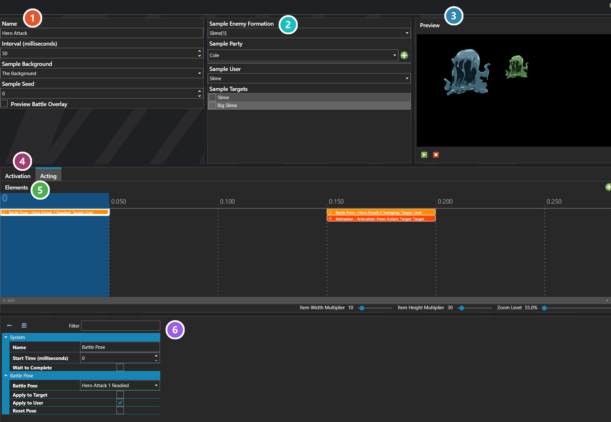

# Action Sequences

*Источник: https://docs.rpg-architect.com/06-database/07-battles/08-action-sequences/*

---

# Action Sequences

## **Action Sequences**[¶](#action-sequences "Permanent link")

Action Sequences are reusable visual choreographies that play when a battle action — a skill, item use, basic attack, or any other battle command — is performed. They control what the user and targets do on screen during the action: the animations they play, how they move, the camera shifts, the sound effects, the on-screen visual effects, and when damage and other results are actually applied to the targets.

An Action Sequence is built from a timeline of elements, each with its own starting time, that fire in order during playback. The same Action Sequence can be reused by any number of skills or items, so a single sequence such as "melee strike" or "cast a spell" can drive the visuals for an entire family of battle actions.

###  Properties[¶](#properties "Permanent link")

The sequence's own fields — its name, and the interval that sets how far apart the timeline's steps sit. Every one of them is listed under **Properties** further down this page.

###  Sample Setup[¶](#sample-setup "Permanent link")

Who and what the preview uses — a backdrop, an enemy formation, a party, and which of them acts and is targeted. These only drive the preview; they are not part of the sequence.

###  Preview[¶](#preview "Permanent link")

The sequence played against the sample setup, so the choreography can be judged without starting a battle. The buttons below it run and stop playback.

###  Activation / Acting[¶](#activation-acting "Permanent link")

Two separate timelines. **Activation** plays the moment the action is queued — a windup or charge. **Acting** plays when the action resolves on its turn, and is where most of the choreography lives.

###  Timeline[¶](#timeline "Permanent link")

The sequence itself, laid out in time. Each element — an animation, a movement, a camera shift, a sound, or the moment damage lands — sits at its own start time, and they fire in order as the sequence plays. Click one to edit it below.

###  Selected Element[¶](#selected-element "Permanent link")

The element picked out on the timeline above. Its fields change to suit the kind of element — here a Battle Pose, with the pose to strike and who it applies to.

> **Note**: An Action Sequence runs in two phases. The Activation Sequence plays the moment the action is queued — typically a windup, charge, or "ready" pose — and the Acting Sequence plays when the action actually resolves and applies its results. Splitting these two phases lets the windup happen immediately when a battler decides on an action, while the resolution waits for its turn in the battle's execution order.

## **Properties**[¶](#properties_1 "Permanent link")

#### **System**[¶](#system "Permanent link")

Name

Explanation

Type

Acting Sequence

The timeline played when the battle action resolves on its turn, where the bulk of the choreography lives.

[Action Sequence Element](../../../11-battles/01-action-sequences/action-sequence-element/)

Activation Sequence

The timeline played the instant the battle action is queued, before its turn comes up — typically a windup, charge, or "ready" reaction.

[Action Sequence Element](../../../11-battles/01-action-sequences/action-sequence-element/)

Name

The name of the action sequence. Used to identify it in the editor and database.

String