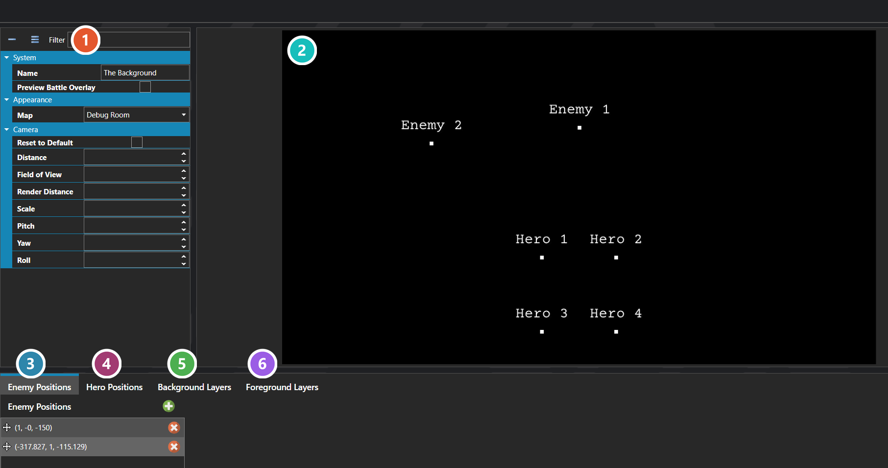

# Battle Backdrops

*Источник: https://docs.rpg-architect.com/06-database/07-battles/05-battle-backdrops/*

---

# Battle Backdrops

## **Battle Backdrops**[¶](#battle-backdrops "Permanent link")

Battle Backdrops define where a battle takes place and where its heroes and enemies stand. A backdrop is selected when a battle begins and determines both the environment the player sees and the slot layout that battlers are assigned to.

Which fields on a backdrop are actually used depends on the battle configuration. In UI-based battles, the backdrop is composited from its Background and Foreground Elements, with battlers placed in pixel coordinates relative to the center of the screen. In map-based battles, the backdrop instead renders a 3D map as the environment, with battlers placed in tile coordinates relative to the battle's focal point on that map.

###  Properties[¶](#properties "Permanent link")

The backdrop's own fields — the map it renders and the camera overrides applied to it. Every one of them is listed under **Properties** further down this page.

###  Preview[¶](#preview "Permanent link")

How the backdrop will look in battle, with a marker for every hero and enemy slot so the layout can be judged before a battle is ever run.

###  Enemy Positions[¶](#enemy-positions "Permanent link")

The slots enemies are assigned to, in order. Provide enough for the largest enemy formation that can use this backdrop — extra slots simply go unused.

###  Hero Positions[¶](#hero-positions "Permanent link")

The slots heroes are assigned to, in order. Provide enough for the largest party that can enter a battle on this backdrop.

###  Background Layers[¶](#background-layers "Permanent link")

Image layers composited behind the battlers. These are only drawn in UI-based battles and are ignored entirely when the backdrop renders a map.

###  Foreground Layers[¶](#foreground-layers "Permanent link")

Image layers composited in front of the battlers, for effects like mist or foliage. Also UI-based battles only.

> **Note**: Background and Foreground Elements are only rendered in UI-based battles and are ignored entirely in map-based battles. The Map field is the opposite — it is only used in map-based battles and is ignored in UI-based ones. The camera overrides apply in both modes and tune the camera relative to whichever environment the battle is using.
> 
> **Note**: Hero and Enemy Placements are used by both modes, but the unit and origin differ. In UI-based battles each placement is a pixel offset from the center of the screen; in map-based battles each placement is a tile offset from the battle's focal point. Provide enough placement slots to cover the largest party and largest enemy formation that can use this backdrop, since extras simply remain unused.

## **Properties**[¶](#properties_1 "Permanent link")

#### **System**[¶](#system "Permanent link")

Name

Explanation

Type

Background Elements

2D image or sprite layers composited behind the battlers in UI-based battles. Ignored in map-based battles.

BattleBackdropElement

Distance

The overridden distance of the camera. Leave empty to use the default.

Number

Enemy Placements

The ordered list of slots where enemies stand on the backdrop. Each slot defines a position and an optional facing direction.

BattleBackdropPlacement

Field of View

The overridden field of view of the camera. Leave empty to use the default.

Number

Foreground Elements

2D image or sprite layers composited in front of the battlers in UI-based battles. Ignored in map-based battles.

BattleBackdropElement

Hero Placements

The ordered list of slots where heroes stand on the backdrop. Each slot defines a position and an optional facing direction.

BattleBackdropPlacement

Map

The 3D map rendered as the environment in map-based battles. Ignored in UI-based battles.

Number

Name

The name of the backdrop. Used to identify it in the editor and database.

String

Pitch

The overridden pitch of the camera. Leave empty to use the default.

Number

Render Distance

The overridden render distance of the camera. Leave empty to use the default.

Number

Reset to Default

Whether to reset the camera to the default values, ignoring any overrides on this backdrop.

Toggle

Roll

The overridden roll of the camera. Leave empty to use the default.

Number

Rotation

The rotation of the camera for the scene, based off of the default camera view.

Vector

Scale

The overridden scale of the camera. Leave empty to use the default.

Number

Yaw

The overridden yaw of the camera. Leave empty to use the default.

Number

## **Battle Backdrop Element**[¶](#battle-backdrop-element "Permanent link")

A single image or sprite layer composited into the backdrop, positioned either in pixels or as a percentage of the screen.

## **Properties**[¶](#properties_2 "Permanent link")

#### **System**[¶](#system_1 "Permanent link")

Name

Explanation

Type

Blend Mode

The blend mode of the layer.

[Blend Mode](#blend-mode)

Color Mask

The color mask to apply to the element.

Color

Image

The static image associated with the layer.

[Image](../../../05-reference/image/)

Name

The name of the layer.

String

Pixel Height

The height of the layer in pixels.

Number

Pixel Width

The width of the layer in pixels.

Number

Pixel X

The x coordinate of the layer in pixels.

Number

Pixel Y

The y coordinate of the layer in pixels.

Number

Relative Height

The height of the layer in screen percentage.

Number

Relative Width

The width of the layer in screen percentage.

Number

Relative X

The x coordinate of the layer in screen percentage.

Number

Relative Y

The y coordinate of the layer in screen percentage.

Number

Sprite

The sprite associated with the layer.

[Sprite or Model](../../../05-reference/sprite-or-model/)

Use Relative Positioning

Whether to use measurements based on a percentage of the screen rather than pixels.

Toggle

Use Sprite

Whether to use a sprite instead of a static image for this layer.

Toggle

## **Battle Backdrop Placement**[¶](#battle-backdrop-placement "Permanent link")

A single slot on the backdrop where a hero or enemy stands, defining where the battler appears and which way it faces.

## **Properties**[¶](#properties_3 "Permanent link")

#### **System**[¶](#system_2 "Permanent link")

Name

Explanation

Type

Direction

The facing direction to assign to the battler placed in this slot.

[Direction](../../../05-reference/direction/)

Position

The world-space position where the battler is placed on the backdrop.

Vector

## **[Blend Mode](#blend-mode)**[¶](#blend-mode "Permanent link")

Name

Explanation

Non Pre-Multiplied

The default blend mode with standard transparency handling.

Additive

Adds source and destination colors together, creating a brightening glow effect.

Alpha-Blend

Blends source and destination using pre-multiplied alpha transparency.

Opaque

Renders fully opaque with no transparency.

Burn / Subtractive

Subtracts source color from the destination, creating a darkening burn effect.

Glow / Screen

Inverts, multiplies, and inverts again, creating a brightening screen effect.

Shade / Multiply

Multiplies source and destination colors, creating a darkening shade effect.

Mask (Alpha)

Multiplies the destination's alpha by the source's alpha, clipping content to the source's opaque areas.