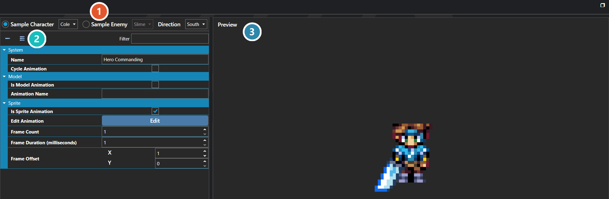

# Battle Poses

*Источник: https://docs.rpg-architect.com/06-database/07-battles/10-battle-poses/*

---

# Battle Poses

## **Battle Poses**[¶](#battle-poses "Permanent link")

Battle Poses are reusable animation poses that can be played on any battler's battle sprite or model during combat. They cover the stances and motions battlers cycle through in a fight — idle, attacking, casting, hurt, defeated, and any other state — and are triggered by Action Sequences and other battle systems.

A Battle Pose does not replace the target's battler sprite — it operates as a frame offset into whatever battler sheet the target is already using. The same pose played on two different battlers pulls frames from each battler's own sheet at the offsets the pose defines. The pose never swaps in another battler's art.

###  Preview Settings[¶](#preview-settings "Permanent link")

Chooses who the pose is previewed on — a character or an enemy — and which way they face. These settings drive the preview only; they are not part of the pose.

###  Properties[¶](#properties "Permanent link")

The pose's own fields. Every one of them is listed under **Properties** further down this page.

###  Preview[¶](#preview "Permanent link")

Shows the pose applied to the subject chosen above, so the result can be judged without starting a battle.

> **Note**: Because Battle Poses are frame offsets rather than fixed art, the best practice is to lay out every battler sheet in the same frame order so that a single pose works correctly on every battler. The frame offsets are interpreted against the base battler's frame width and height, so battler sheets with different frame sizes will still animate correctly as long as their internal layout matches.
> 
> **Note**: Battle Poses are the battle counterpart to Character Animations, which serve the same role for on-map sprites. The editor's preview helpers are there to make verifying offsets against a real battler sheet easier.