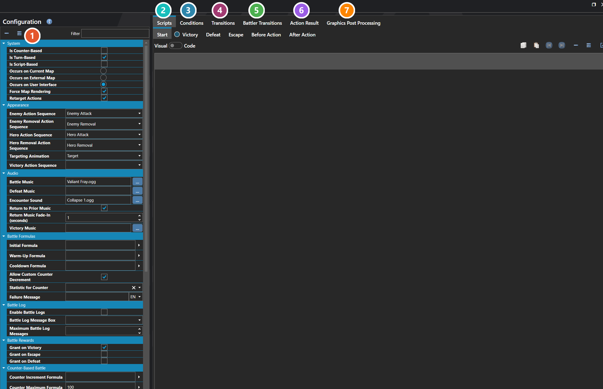
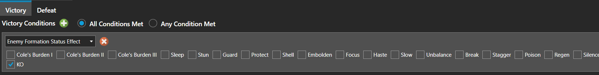

# Configuration

*Источник: https://docs.rpg-architect.com/06-database/07-battles/00-configuration/*

---

# Configuration

## **Configuration**[¶](#configuration "Permanent link")

Battle Configuration defines how battles work across the entire project. It selects which battle system the game uses, where battles take place, what scripts and transitions run around them, which user interfaces are shown during combat, and the default behavior for rewards, action sequences, and battler setup.

The settings here are the project-wide defaults that apply to every battle unless an individual battle, formation, or script overrides them. Most projects configure these once early in development to lock in the style of combat the game uses.

###  Properties[¶](#properties "Permanent link")

The project-wide battle settings, grouped by topic. Every one of them is listed under **Properties** further down this page.

###  Scripts[¶](#scripts "Permanent link")

Six script hooks that fire around a battle — Start, Victory, Defeat, Escape, Before Action and After Action. Each is edited with the [Script Editor](../../../04-editor/script-editor/).

###  Conditions[¶](#conditions "Permanent link")

The victory and defeat conditions used by every battle in the project. An [Enemy Formation](../../06-enemies/01-enemy-formations/) can override them for one encounter by setting its own; leave a formation's list empty and it falls back to these.

###  Transitions[¶](#transitions "Permanent link")

How the screen moves into and out of a battle — see [Transition Editor](../../../04-editor/transition-editor/).

###  Battler Transitions[¶](#battler-transitions "Permanent link")

How individual heroes and enemies animate onto the battlefield as the battle opens, separately from the screen transition.

###  Action Result[¶](#action-result "Permanent link")

The pop-up numbers and text shown when an action lands — damage, healing, misses and status changes.

###  Graphics Post Processing[¶](#graphics-post-processing "Permanent link")

Full-screen visual effects applied for the duration of a battle — see [Graphics Post Processor Editor](../../../04-editor/graphics-post-processor-editor/).

> **Note**: The battle system in RPG Architect is very customizable. Action turn based systems, which use a counter based on a Statistic as a timer between actions in a battle, like many popular RPGs, and turn based style systems, where turn order is simply decided in advance by a Statistic are available as default options. To enable an action turn based system, select 'Is Counter-Based', and define the statistic you want to use for your Counter. For a traditional turn-based system, select Turn-Based. More advanced users can use a battle system based on a custom script, by using Use Script-Based.

From there, you can select whether the Battles will take place on the current map, an external map, or on the user interface.

Current and external maps take place on Battle Focal Points. This means the background of the battle will be rendered in-engine, on a map - whether it's the current map the player is on, or whether it uses a different map to the one the player is currently on.

User Interface Battles are intended for battles that take place entirely on a user interface - for example, battles in the style of blobber-type games.

## **Properties**[¶](#properties_1 "Permanent link")

#### **System**[¶](#system "Permanent link")

Name

Explanation

Type

After Action Script

The script executed after each action completes.

[Script](../../../05-reference/script/)

Battle Process Script

The ongoing management script that drives a script-based battle. It runs continuously on its own execution context — maintaining its state across frames and rounds — and is responsible for requesting battler input, scheduling actions, and controlling the flow of the battle.

[Script](../../../05-reference/script/)

Before Action Script

The script executed before each action begins.

[Script](../../../05-reference/script/)

Defeat Conditions

The conditions that determine when defeat occurs.

[Battle Condition](../../../11-battles/02-battle-conditions/)

Defeat Script

The script executed upon defeat.

[Script](../../../05-reference/script/)

Enter Transition

The scene transition played when entering.

[Scene Transition](../../../05-reference/scene-transition/)

Escape Script

The script executed when the party escapes battle.

[Script](../../../05-reference/script/)

Exit Transition

The scene transition played when exiting.

[Scene Transition](../../../05-reference/scene-transition/)

Force Map Rendering

Whether the prior map scene renders in the background during an interface-based battle.

Toggle

Graphics Post Processors

The post-processing effects applied to the scene.

[Graphics Post Processor](../../../05-reference/graphics-post-processor/)

Is Counter-Based

Whether battlers act independently on a timer instead of turns.

Toggle

Is Script-Based

Whether battler actions are driven entirely by a script.

Toggle

Is Turn-Based

Whether battlers act in a sequential turn order.

Toggle

Occurs on Current Map

Whether the battle takes place on the same map where the encounter was triggered.

Toggle

Occurs on External Map

Whether the battle takes place on a separate map from where the encounter was triggered.

Toggle

Occurs on User Interface

Whether the battle takes place as a 2D projection using the interface layer.

Toggle

Retarget Actions

Retargets an action or sequence when the target is no longer available.

Toggle

Start Script

The script executed when battle starts.

[Script](../../../05-reference/script/)

Victory Conditions

The conditions that determine when victory occurs.

[Battle Condition](../../../11-battles/02-battle-conditions/)

Victory Script

The script executed upon victory.

[Script](../../../05-reference/script/)

#### **Appearance**[¶](#appearance "Permanent link")

Name

Explanation

Type

Action Result

The default way to display action results.

[Action Sequence Result](../../../11-battles/01-action-sequences/action-sequence-result/)

Enemy Action Sequence

The default action sequence to use for enemies.

[Action Sequence](../08-action-sequences/)

Enemy Removal Action Sequence

The default action sequence to use for enemies when they are removed from battle.

[Action Sequence](../08-action-sequences/)

Enemy Start Setup

The setup sequence played for enemies at battle start.

[Setup Sequence](../../../11-battles/05-setup-sequences/)

Hero Action Sequence

The default action sequence to use for heroes.

[Action Sequence](../08-action-sequences/)

Hero End Setup

The setup sequence played for heroes at battle end.

[Setup Sequence](../../../11-battles/05-setup-sequences/)

Hero Removal Action Sequence

The default action sequence to use for heroes when they are removed from battle.

[Action Sequence](../08-action-sequences/)

Hero Start Setup

The setup sequence played for heroes at battle start.

[Setup Sequence](../../../11-battles/05-setup-sequences/)

Targeting Animation

The default animation to use when selecting a target.

[Animation](../../08-animations/00-animations/)

Victory Action Sequence

The action sequence to use when victory occurs.

[Action Sequence](../08-action-sequences/)

#### **Audio**[¶](#audio "Permanent link")

Name

Explanation

Type

Battle Music

The music to play during battle.

[Music](../../../05-reference/music/)

Defeat Music

The music to play upon defeat in battle.

[Music](../../../05-reference/music/)

Encounter Sound

The sound effect to play when a battle begins.

[Sound Effect](../../../05-reference/sound-effect/)

Return Music Fade-In (seconds)

The fade-in duration in seconds when resuming music from the prior scene after battle.

Number

Return to Prior Music

Whether to resume the music from the scene prior to battle.

Toggle

Victory Music

The music to play upon victory in battle.

[Music](../../../05-reference/music/)

#### **Battle Formulas**[¶](#battle-formulas "Permanent link")

Name

Explanation

Type

Allow Custom Counter Decrement

Whether to allow actions to override the counter or turn value through their user effect.

Toggle

Cooldown Formula

The default formula to use after a battler acts to calculate the delay before they can begin to act again.

[Formula](../../../05-reference/formulas/)

Failure Message

The message that shows when the action fails.

String

Initial Formula

The formula to use to determine the initial order of battlers.

[Formula](../../../05-reference/formulas/)

Statistic for Counter

The statistic formula name used to store the current counter or turn-order value.

[Statistic](../../05-statistics/01-statistics/)

Warm-Up Formula

The default formula to use before a battler acts to calculate the delay before the action begins.

[Formula](../../../05-reference/formulas/)

#### **Battle Log**[¶](#battle-log "Permanent link")

Name

Explanation

Type

Battle Log Message Box

The message box to display the battle log in.

[User Interface](../../09-user-interfaces/00-user-interfaces/)

Enable Battle Logs

Whether to enable the battle log display during combat.

Toggle

Maximum Battle Log Messages

The maximum number of messages to maintain in the battle log.

Number

#### **Battle Rewards**[¶](#battle-rewards "Permanent link")

Name

Explanation

Type

Grant on Defeat

Whether battle rewards are granted when the party is defeated.

Toggle

Grant on Escape

Whether battle rewards are granted when the party escapes.

Toggle

Grant on Victory

Whether battle rewards are granted when the party wins.

Toggle

#### **Counter-Based Battle**[¶](#counter-based-battle "Permanent link")

Name

Explanation

Type

Counter Increment Formula

The formula to calculate how quickly a battler accumulates their counter.

[Formula](../../../05-reference/formulas/)

Counter Maximum Formula

The formula to calculate how high a battler can accumulate their counter.

[Formula](../../../05-reference/formulas/)

Counter Target Formula

The formula to calculate how soon a battler can act based on their counter.

[Formula](../../../05-reference/formulas/)

Pause During Animation

Whether to pause counter accumulation during animations.

[Switch or Value](../../../05-reference/switch-or-value/)

Pause During Input

Whether to pause counter accumulation during input.

[Switch or Value](../../../05-reference/switch-or-value/)

#### **Map-Based Battle**[¶](#map-based-battle "Permanent link")

Name

Explanation

Type

Camera Setup Duration (milliseconds)

The duration of time to setup the camera at the start of a battle.

Number

Show Doodads

Whether to render doodads in map-based battles.

Toggle

Show Entities

Whether to render entities in map-based battles.

Toggle

Update Post-Battle Positions

Whether to update hero positions to their final battle positions after a current-map battle ends.

Toggle

#### **Turn-Based Battle**[¶](#turn-based-battle "Permanent link")

Name

Explanation

Type

Order Formula

The formula to calculate the order battlers follow for their turn.

[Formula](../../../05-reference/formulas/)

Order Reduction Formula

The formula to calculate how much a battler's order is reduced upon acting. Remaining order above zero grants extra turns.

[Formula](../../../05-reference/formulas/)

Use Rounds

Whether all actions are entered in advance for available battler turns before execution begins.

[Switch or Value](../../../05-reference/switch-or-value/)

#### **User Interface**[¶](#user-interface "Permanent link")

Name

Explanation

Type

Battler Command Menu

The menu to display when a battler is entering their action.

[User Interface](../../09-user-interfaces/00-user-interfaces/)

Overlay

The overlay that displays the current battle information.

[User Interface](../../09-user-interfaces/00-user-interfaces/)

## **See Also**[¶](#see-also "Permanent link")

*   [Transition Editor](../../../04-editor/transition-editor/)
*   [Graphics Post Processor Editor](../../../04-editor/graphics-post-processor-editor/)