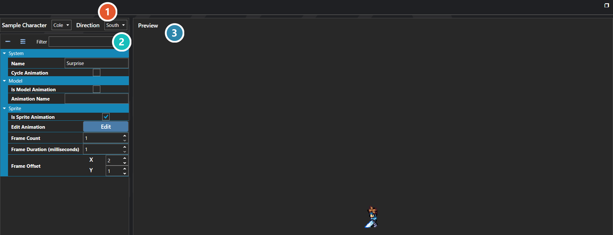

# Character Animations

*Источник: https://docs.rpg-architect.com/06-database/00-characters/10-character-animations/*

---

# Character Animations

## **Character Animations**[¶](#character-animations "Permanent link")

Character Animations are reusable on-map animation poses that can be played on any sprite or model in the overworld. They can represent emotes such as surprise, sadness, or joy, or gameplay actions like attacking, defending, or being damaged, and are triggered through Global or Entity Scripts.

A Character Animation does not replace the target's sprite sheet — it operates as a frame offset into whatever sprite sheet the target is already using. The same animation played on two different characters pulls frames from each character's own sprite sheet at the offsets the animation defines. The animation never swaps in another character's art.

###  Preview Settings[¶](#preview-settings "Permanent link")

Chooses who this is previewed on and which way they face. These settings drive the preview only; they are not part of the animation.

###  Properties[¶](#properties "Permanent link")

The animation's own fields. Every one of them is listed under **Properties** further down this page.

###  Preview[¶](#preview "Permanent link")

Shows the animation applied to the subject chosen above, so the result can be judged without running the game.

> **Note**: Because Character Animations are frame offsets rather than fixed art, the best practice is to lay out every sprite sheet in the same frame and direction order so that a single animation works correctly on every character. The frame offsets are interpreted against the base sprite's frame width and height, so sprite sheets with different frame sizes (for example 32x32 versus 32x48) will still animate correctly as long as their internal layout matches.
> 
> **Note**: Character Animations should be supplied with directional frames — for a four-direction sprite sheet, you will need all four directions of animation, even if they reuse the same frame. The editor's preview helpers are there to make verifying offsets against a real sprite sheet easier.