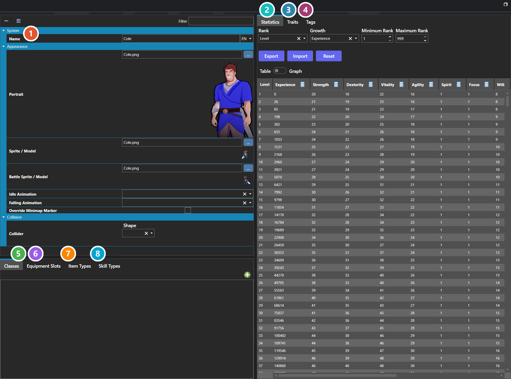
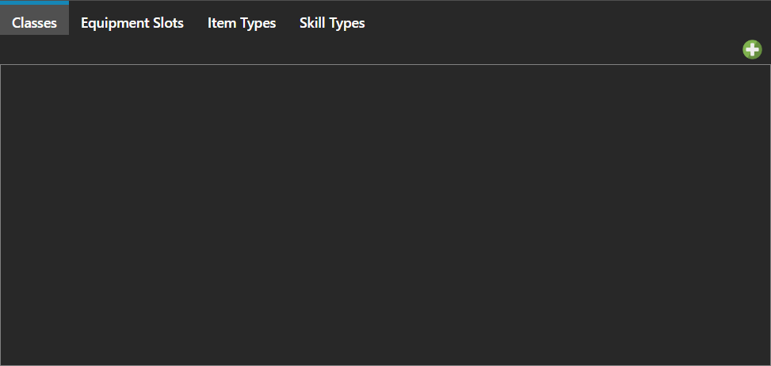
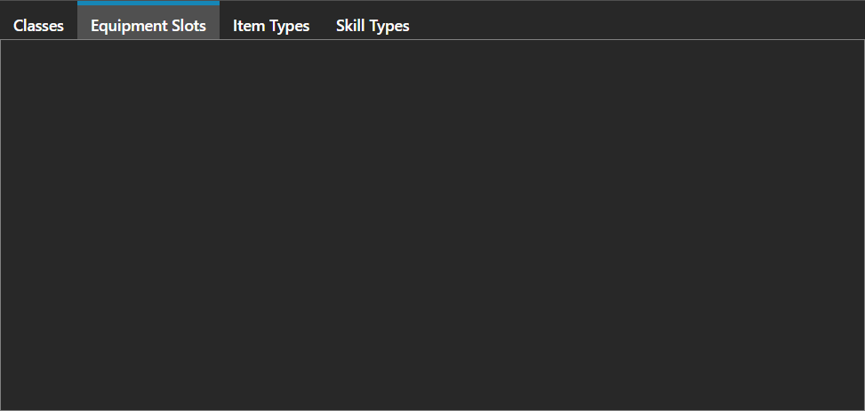
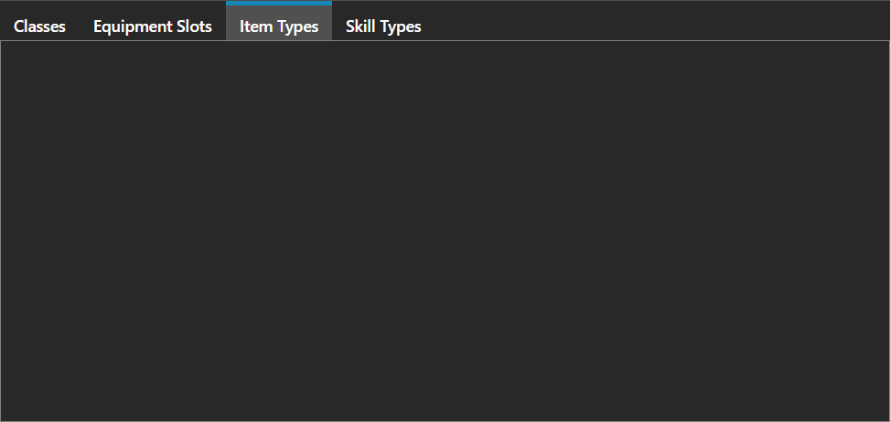
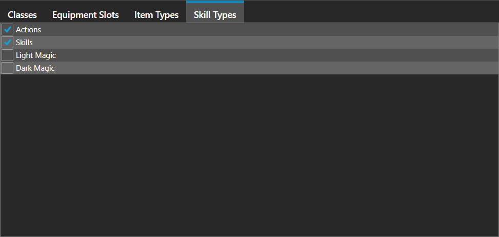

# Characters

*Источник: https://docs.rpg-architect.com/06-database/00-characters/00-characters/*

---

# Characters

## **Characters**[¶](#characters "Permanent link")

Characters are the heroes and party members that the player controls throughout the game. A character's capabilities — its statistics, traits, skills, and resistances — come from a combination of its base values, the traits applied to it, and any classes or equipment it has at the time.

Characters can be configured entirely on their own through statistics and traits, or extended through optional Classes that layer on additional growth, traits, and skills. The same is true of skills, which may be granted directly through traits or indirectly through a class or piece of equipment.

###  Properties[¶](#properties "Permanent link")

The character's own fields — its name, portrait, map and battle sprites, animations, and collision shape. Every one of them is listed under **Properties** further down this page.

###  Statistics[¶](#statistics "Permanent link")

The character's value for every statistic at every rank, as a table or a curve. The same editor is used by classes, enemies, equipment, and skills — see [Statistics Table Editor](../../../04-editor/statistics-table-editor/).

###  Traits[¶](#traits "Permanent link")

Traits grant skills, resistances, and passive effects. A character's effective traits are the sum of its own table plus those of any class it has taken and any equipment it currently has on — see [Trait Table Editor](../../../04-editor/trait-table-editor/).

###  Tags[¶](#tags "Permanent link")

Free-form labels other systems match against, so a script or condition can target _any character carrying this tag_ rather than naming one — see [Tag Editor](../../../04-editor/tag-editor/).

###  Classes[¶](#classes "Permanent link")

The optional classes the character starts the game with. A class layers its own growth, traits, and skills on top of the character's own, so a character can be built entirely from its own statistics or extended through classes.

###  Equipment Slots[¶](#equipment-slots "Permanent link")

The equipment slots this character has available, such as weapon, armor, or accessory. A character can only equip into a slot that appears here.

###  Item Types[¶](#item-types "Permanent link")

The item categories this character is allowed to use from the menu and in battle. Leaving a type off the list is how gear is restricted to particular roles or party members.

###  Skill Types[¶](#skill-types "Permanent link")

The skill categories this character is allowed to use from the menu and in battle. Skills reach a character through traits, classes, or equipment, but only those whose type appears here can be used.

> **Note**: Characters are the player-side counterpart to Enemies. Where enemies are tuned per-creature and driven by Battle Programming, characters are controlled by the player and assembled from reusable building blocks: traits, classes, equipment, and the item and skill types they have access to.
> 
> **Note**: A character's allowed Item Types, Skill Types, and Equipment Slots act as gating lists — the character can only use items, skills, or equipment whose type or slot appears in its list. This is the primary way to restrict gear and abilities to specific roles or party members.

## **Properties**[¶](#properties_1 "Permanent link")

#### **System**[¶](#system "Permanent link")

Name

Explanation

Type

Classes

The optional classes the character starts the game with.

[Class](../01-classes/)

Equipment Slots

The equipment slots this character has available, such as weapon, armor, or accessory.

[Equipment Slot](../../02-items/10-equipment-slots/)

Item Types

The item type categories this character is allowed to use from the menu and in battle.

[Item Type](../../02-items/20-item-types/)

Name

The display name of the character, shown in menus, dialogue, and battle.

String

Skill Types

The skill type categories this character is allowed to use from the menu and in battle.

[Skill Type](../../01-skills/02-skill-types/)

Statistics

The base statistic values and growth curves for the character.

[Statistics Table](../../../05-reference/statistics-table/)

Tags

The tags assigned to this character, used for filtering and conditional logic.

[Tags](../../../05-reference/tags/)

Traits

The traits assigned to this character, such as skills, resistances, or passive effects.

[Trait Table](../../../05-reference/trait-table/)

Victory Action Sequence

The action sequence played for this character when a battle is won.

[Action Sequence](../../07-battles/08-action-sequences/)

#### **Appearance**[¶](#appearance "Permanent link")

Name

Explanation

Type

Battle Sprite / Model

The sprite or model of the character in battle.

[Sprite or Model](../../../05-reference/sprite-or-model/)

Falling Animation

The animation played when the character is actively falling.

[Character Animation](../10-character-animations/)

Idle Animation

The animation played when the character is standing still on a map.

[Character Animation](../10-character-animations/)

Portrait

The face or bust of the character.

[Sprite or Model](../../../05-reference/sprite-or-model/)

Shape

The shape of the character sprite in 3D space.

[Sprite Shape](../../../05-reference/sprite-format/)

Sprite / Model

The sprite or model of the character on maps.

[Sprite or Model](../../../05-reference/sprite-or-model/)

#### **Collision**[¶](#collision "Permanent link")

Name

Explanation

Type

Collider

The settings for the dimensions of the character collider. Values are measured in tiles.

[Collider](../../../05-reference/collider/)

Collider Points

The relative X, Y, Z coordinates of the character collider. Values are measured in tiles.

Vector

## **See Also**[¶](#see-also "Permanent link")

*   [Collider Editor](../../../04-editor/collider-editor/)