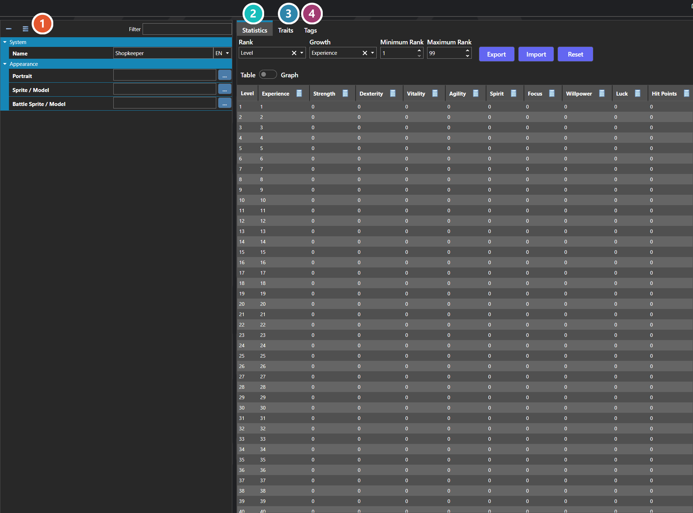

# Classes

*Источник: https://docs.rpg-architect.com/06-database/00-characters/01-classes/*

---

# Classes

## **Classes**[¶](#classes "Permanent link")

Classes are optional roles that can be applied to a character to layer on additional statistics, traits, and visual appearance. A class might represent a job like Knight or Mage, a rank or tier of progression, a transformation, or any other reusable bundle of stats and traits that should be shared across multiple characters.

A class can override a character's map sprite, battler, and portrait while it is active, allowing the same character to look different depending on its current role. Classes can be granted, removed, or swapped at runtime through scripting, and a character can hold more than one class at a time.

###  Properties[¶](#properties "Permanent link")

The class's own fields. Every one of them is listed under **Properties** further down this page.

###  Statistics[¶](#statistics "Permanent link")

The class's value for each statistic at every rank — see [Statistics Table Editor](../../../04-editor/statistics-table-editor/).

###  Traits[¶](#traits "Permanent link")

Skills, resistances and passive effects the class grants — see [Trait Table Editor](../../../04-editor/trait-table-editor/).

###  Tags[¶](#tags "Permanent link")

Free-form labels other systems can match against — see [Tag Editor](../../../04-editor/tag-editor/).

> **Note**: Classes are entirely optional — a character configured directly through its own statistics and traits is fully valid. Reach for classes when the same role needs to be reused across characters, when a character should be able to switch roles during the game, or when progression should be tracked separately from the character itself.
> 
> **Note**: The Statistics, Traits, and Tags tabs are shared editors, used the same way wherever they appear — see [Statistics Table Editor](../../../04-editor/statistics-table-editor/), [Trait Table Editor](../../../04-editor/trait-table-editor/), and [Tag Editor](../../../04-editor/tag-editor/).

## **Properties**[¶](#properties_1 "Permanent link")

#### **System**[¶](#system "Permanent link")

Name

Explanation

Type

Name

The display name of the class, shown in menus and interface elements.

String

Statistics Table

The statistic growth and base values provided by this class.

[Statistics Table](../../../05-reference/statistics-table/)

Tags

The tags assigned to this class, used for filtering and conditional logic.

[Tags](../../../05-reference/tags/)

Trait Table

The traits granted by this class, such as skills, resistances, or passive effects.

[Trait Table](../../../05-reference/trait-table/)

#### **Appearance**[¶](#appearance "Permanent link")

Name

Explanation

Type

Battle Sprite / Model

The sprite or model used for this class in battle. Overrides the character's battler when assigned.

[Sprite or Model](../../../05-reference/sprite-or-model/)

Portrait

The face or bust image of the class. Overrides the character's portrait when assigned.

[Sprite or Model](../../../05-reference/sprite-or-model/)

Sprite / Model

The sprite or model used for this class on maps. Overrides the character's appearance when assigned.

[Sprite or Model](../../../05-reference/sprite-or-model/)