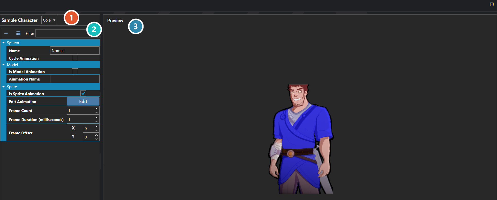

# Portrait Expressions

*Источник: https://docs.rpg-architect.com/06-database/00-characters/11-portrait-expressions/*

---

# Portrait Expressions

## **Portrait Expressions**[¶](#portrait-expressions "Permanent link")

Portrait Expressions are reusable facial poses that can be played on a character's portrait during dialogue, menus, and cutscenes. They cover emotes such as happy, angry, surprised, or sad, and any expression can be applied to any portrait in the game.

A Portrait Expression does not replace the target's portrait — it operates as a frame offset into whatever portrait sheet the target is already using. The same expression played on two different characters pulls frames from each character's own portrait sheet at the offsets the expression defines. The expression never swaps in another character's portrait art.

###  Preview Settings[¶](#preview-settings "Permanent link")

Chooses who this is previewed on and which way they face. These settings drive the preview only; they are not part of the expression.

###  Properties[¶](#properties "Permanent link")

The expression's own fields. Every one of them is listed under **Properties** further down this page.

###  Preview[¶](#preview "Permanent link")

Shows the expression applied to the subject chosen above, so the result can be judged without running the game.

> **Note**: Portrait Expressions are the portrait counterpart to Character Animations and follow the same rules. The best practice is to lay out every portrait sheet in the same frame order so that a single expression works correctly on every character. Frame offsets are interpreted against the base portrait's frame width and height, so portrait sheets with different frame sizes will still resolve correctly as long as their internal layout matches.