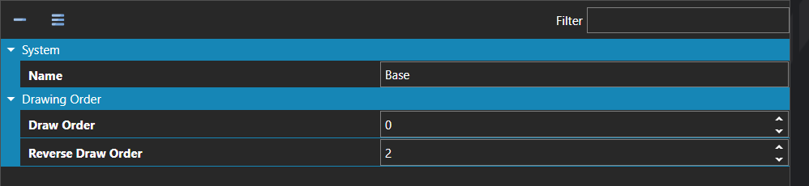

# Sprite Layers

*Источник: https://docs.rpg-architect.com/06-database/00-characters/20-sprite-layers/*

---

# Sprite Layers

## **Sprite Layers**[¶](#sprite-layers "Permanent link")

Sprite Layers define the draw order for the individual pieces that make up a layered character sprite, such as body, hair, clothing, and accessories. Each layer specifies where it sits in the stack relative to the others, so that equipment and customization pieces composite together correctly when the character is rendered.

Each layer has two draw orders: a standard order used when the character faces toward the camera (south, east, or west), and a reverse order used when the character faces away (north). The reverse order lets pieces such as hair, capes, or backpacks correctly appear in front of the body when the character is facing backwards.

## **Properties**[¶](#properties "Permanent link")

#### **System**[¶](#system "Permanent link")

Name

Explanation

Type

Name

The name of the sprite layer.

String

#### **Drawing Order**[¶](#drawing-order "Permanent link")

Name

Explanation

Type

Draw Order

The standard order for drawing the sprite.

Number

Reverse Draw Order

The order when drawing the sprite facing north (or backwards).

Number