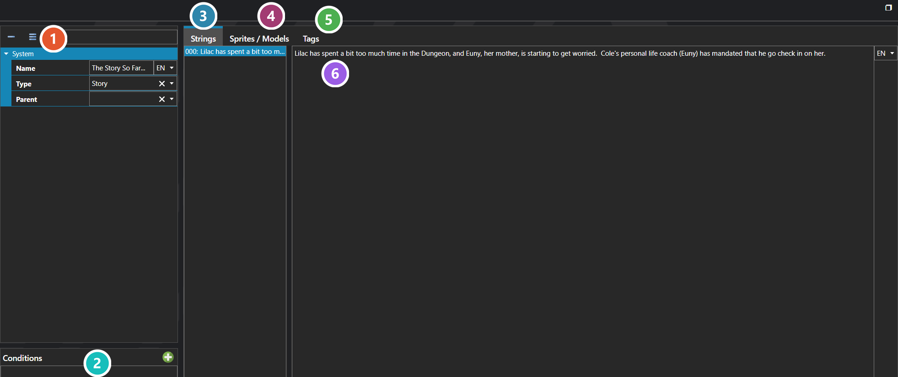

# Data Entries

*Источник: https://docs.rpg-architect.com/06-database/04-data-entries/00-data-entries/*

---

# Data Entries

## **Data Entries**[¶](#data-entries "Permanent link")

Data Entries are general-purpose, user-defined records that hold whatever content the project needs to expose through its UI without fitting into one of the built-in databases. Bestiary entries, quest logs, lore entries, achievements, recipes, journal pages, character bios — anything that is essentially structured content the player reads, browses, or unlocks lives here rather than being shoehorned into Items or Enemies.

Each entry has a Type (its category), a name, free-form strings, free-form character models, and a set of conditions that decide when the entry is currently enabled or unlocked. Entries can also be nested through a Parent reference to build hierarchies — chapters with sub-pages, quests with sub-objectives, lore categories with individual articles.

###  Properties[¶](#properties "Permanent link")

The entry's own fields — its name, the **Type** it is filed under, and an optional **Parent** entry, which is what nests entries into a hierarchy. Every one of them is listed under **Properties** further down this page.

###  Conditions[¶](#conditions "Permanent link")

What has to be true before the entry is available. This is how a bestiary fills in as enemies are met, or a journal unlocks as the story advances, rather than showing everything from the start.

###  Strings[¶](#strings "Permanent link")

The entry's text, one row per string, edited in the panel beside the list. Each string carries its own language, so the same entry holds every translation.

###  Sprites / Models[¶](#sprites-models "Permanent link")

Artwork shown alongside the text — a portrait for a journal entry, a battler for a bestiary page.

###  Tags[¶](#tags "Permanent link")

Key and value pairs attached to this entry, for matching and conditional logic — see [Tag Editor](../../../04-editor/tag-editor/).

###  Selected String[¶](#selected-string "Permanent link")

The selected string's own text, with its language beside it. Selecting a different row in the list swaps what is edited here.

> **Note**: The shape of a Data Entry is intentionally generic. The Type controls what fields the entry exposes in the editor, the Strings and Character Models arrays hold whatever the type expects, and the Conditions decide visibility — it is up to the project to decide how each Data Entry Type uses these slots, which is what makes Data Entries the right home for content systems the engine does not model directly.
> 
> **Note**: Tags are edited the same way wherever they appear — see [Tag Editor](../../../04-editor/tag-editor/).

## **Properties**[¶](#properties_1 "Permanent link")

#### **System**[¶](#system "Permanent link")

Name

Explanation

Type

Character Models

The free-form character models of the data entry.

[Sprite or Model](../../../05-reference/sprite-or-model/)

Conditions

The conditions of the data entry.

[Condition](../../../05-reference/condition/)

Name

The name of the data entry.

String

Parent

The parent of the data entry.

[Data Entry](./)

Strings

The free-form strings of the data entry.

String

Tags

The tags for the data entry.

[Tags](../../../05-reference/tags/)

Type

The data entry type classification of the data entry.

[Data Entry Type](../01-data-entry-types/)

Unique ID

The unique identifier for the data entry.

[Unique ID](../../../05-reference/unique-id/)