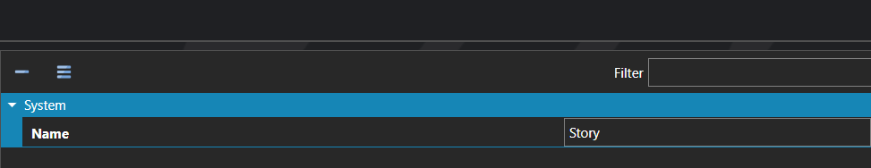

# Data Entry Types

*Источник: https://docs.rpg-architect.com/06-database/04-data-entries/01-data-entry-types/*

---

# Data Entry Types

## **Data Entry Types**[¶](#data-entry-types "Permanent link")

Data Entry Types are the categories that classify Data Entries and define what each entry of that type represents in the project. A type is what distinguishes a "Bestiary Entry" from a "Quest" or a "Recipe" — entries of the same type share a purpose, a place in the UI, and the way their free-form strings and character models are interpreted.

Defining a new type is the first step in adding any user-defined content system to the project. Once a type exists, individual Data Entries can be created against it, and the project's UIs and scripts can filter, browse, and react to entries by their type.

## **Properties**[¶](#properties "Permanent link")

#### **System**[¶](#system "Permanent link")

Name

Explanation

Type

Name

The name of the data entry type.

String