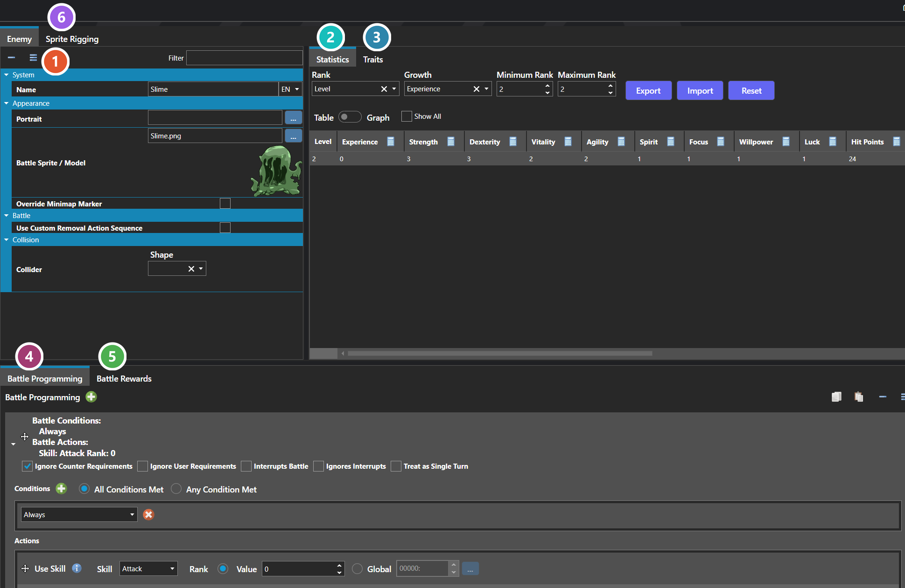
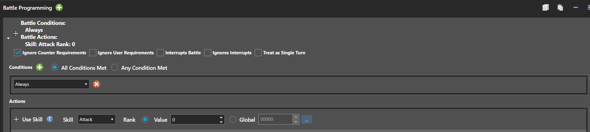
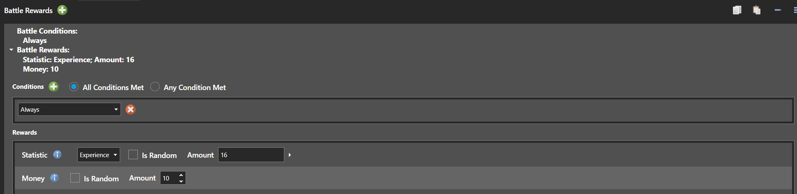

# Enemies

*Источник: https://docs.rpg-architect.com/06-database/06-enemies/00-enemies/*

---

# Enemies

## **Enemies**[¶](#enemies "Permanent link")

Enemies are the hostile combatants that the player faces in battle. Each enemy defines its own statistics, traits, appearance, battle programming, and rewards, and is referenced by Enemy Formations to populate a battle.

Unlike characters, enemies do not level up or learn skills over time. Their behavior in battle is driven by Battle Programming, which is a list of conditional commands evaluated each turn to decide what the enemy does, and their difficulty is tuned through their Statistics, Traits, and the rewards they grant on defeat.

###  Properties[¶](#properties "Permanent link")

The enemy's own fields. Every one of them is listed under **Properties** further down this page.

###  Statistics[¶](#statistics "Permanent link")

The enemy's value for each statistic at every rank — see [Statistics Table Editor](../../../04-editor/statistics-table-editor/).

###  Traits[¶](#traits "Permanent link")

Skills, resistances and passive effects the enemy has — see [Trait Table Editor](../../../04-editor/trait-table-editor/).

###  Battle Programming[¶](#battle-programming "Permanent link")

Where an enemy's behaviour is authored. Each turn the enemy works through this list of conditional commands to decide what it does.

###  Battle Rewards[¶](#battle-rewards "Permanent link")

What the party receives for defeating this enemy — experience, currency, items and equipment.

###  Sprite Rigging[¶](#sprite-rigging "Permanent link")

Lets the battler sprite bend, stretch and squash for motion its frames alone cannot produce. Each animation here is assigned to a Battle Pose and plays while that pose is active — see [Sprite Rigging Editor](../../../04-editor/sprite-rigging-editor/).

> **Note**: Enemies are referenced by index from Enemy Formations rather than placed directly into battles. To use the same creature with different difficulty, stats, or rewards, define multiple enemies and group them through formations.
> 
> **Note**: Battle Rewards are granted per enemy, so a formation containing multiple enemies grants the sum of all of their rewards on victory.
> 
> **Note**: The Statistics and Traits tabs are shared editors, used the same way wherever they appear — see [Statistics Table Editor](../../../04-editor/statistics-table-editor/) and [Trait Table Editor](../../../04-editor/trait-table-editor/).

## **Properties**[¶](#properties_1 "Permanent link")

#### **System**[¶](#system "Permanent link")

Name

Explanation

Type

Battle Programming

The ordered list of conditional commands the enemy evaluates each turn to decide its action.

[Battle Program](../../../11-battles/03-battle-programs/)

Battle Rewards

The rewards granted to the party when this enemy is defeated, such as experience, currency, items, and equipment.

[Battle Reward](../../../11-battles/04-battle-rewards/)

Name

The name of the enemy.

String

Removal Action Sequence

The action sequence that plays as this enemy is removed from battle, in place of the project default. Requires Use Custom Removal Action Sequence to be enabled.

[Action Sequence](../../07-battles/08-action-sequences/)

Statistics

The base statistics of the enemy, such as health, attack, defense, and any custom statistics defined in the database.

[Statistics Table](../../../05-reference/statistics-table/)

Traits

The traits assigned to this enemy, such as skills, resistances, or passive effects.

[Trait Table](../../../05-reference/trait-table/)

Use Custom Removal Action Sequence

Whether this enemy plays its own removal action sequence instead of the project-wide one set on the Battle scene.

Toggle

#### **Appearance**[¶](#appearance "Permanent link")

Name

Explanation

Type

Battle Sprite / Model

The sprite or model of the enemy in battle.

[Sprite or Model](../../../05-reference/sprite-or-model/)

Pitch (X Rotation)

The pitch of the enemy in degrees.

Number

Portrait

The face or bust of the enemy.

[Sprite or Model](../../../05-reference/sprite-or-model/)

Roll (Z Rotation)

The roll of the enemy in degrees.

Number

Shape

The shape of the enemy in map-based battles.

[Sprite Shape](../../../05-reference/sprite-format/)

Sprite Rig

The optional rig that lets the battler sprite bend, stretch, and squash for motion its frames alone cannot produce.

SpriteRig

Yaw (Y Rotation)

The yaw of the enemy in degrees.

Number

#### **Collision**[¶](#collision "Permanent link")

Name

Explanation

Type

Collider

The settings for the dimensions of the enemy collider. Values are measured in tiles.

[Collider](../../../05-reference/collider/)

Collider Points

The relative X, Y, Z coordinates of the enemy collider. Values are measured in tiles.

Vector

## **See Also**[¶](#see-also "Permanent link")

*   [Collider Editor](../../../04-editor/collider-editor/)