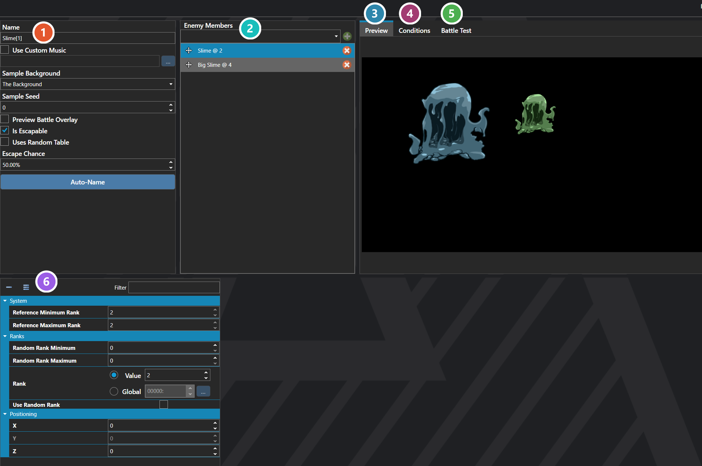

# Enemy Formations

*Источник: https://docs.rpg-architect.com/06-database/06-enemies/01-enemy-formations/*

---

# Enemy Formations

## **Enemy Formations**[¶](#enemy-formations "Permanent link")

Enemy Formations represent a group of enemies that can be fought together as a single battle encounter. Each formation defines which enemies are present, where they appear on the battlefield, the music that plays, and the conditions that determine victory, defeat, and escape.

A formation can be authored as a fixed roster, where the same enemies appear every time, or as a Formation Table, where rows are rolled against a chance evaluation method to assemble a randomized roster when the battle begins.

###  Properties[¶](#properties "Permanent link")

The formation's own fields — its music, whether the party can escape, and whether the roster is fixed or rolled from a table. Every one of them is listed under **Properties** further down this page.

###  Enemy Members[¶](#enemy-members "Permanent link")

The enemies making up this formation. Select one to edit its rank and battlefield position in the panel below. When **Uses Random Table** is enabled this list is replaced by the weighted Formation Table.

###  Preview[¶](#preview "Permanent link")

The formation laid out on a sample battle backdrop. Enemies can be dragged directly in the preview to reposition them, which edits their X and Z — drag never changes elevation.

###  Conditions[¶](#conditions "Permanent link")

Victory and defeat conditions for this formation alone. Leave them empty and the battle falls back to the project-wide conditions set on [Configuration](../../07-battles/00-configuration/), which is the same editor.

###  Battle Test[¶](#battle-test "Permanent link")

Builds a party and launches a real battle against this formation without leaving the editor. The party is assembled with the [Party Editor](../../../04-editor/party-editor/), and is stored with the project rather than in the database — it exists to test the formation and never reaches the game.

###  Enemy Properties[¶](#enemy-properties "Permanent link")

The rank and battlefield position of the enemy selected above. These fields are listed under **Enemy Formation Item** further down this page. The panel is empty until an enemy is selected.

> **Note**: Fixed rosters are typical for scripted encounters and bosses, while Formation Tables are typical for random and chance encounters where variety is desired. The chance evaluation method on a Formation Table is shared with Loot Tables, Shop Categories, and other weighted containers, and behaves the same way in each.

## **Properties**[¶](#properties_1 "Permanent link")

#### **System**[¶](#system "Permanent link")

Name

Explanation

Type

Chance Evaluation Method

Controls how the Formation Table is rolled when Uses Random Table is enabled. See Singular, Cumulative, and Reroll for the behavior of each method.

[Chance Evaluation Method](#chance-evaluation-method)

Custom Music

The music that plays during this battle in place of the default battle music. Requires Use Custom Music to be enabled.

[Music](../../../05-reference/music/)

Defeat Conditions

The conditions that end this battle in defeat.

[Battle Condition](../../../11-battles/02-battle-conditions/)

Enemies

The fixed roster of enemies that appear in the battle, each with its own rank and position on the battlefield.

[Enemy Formation Item](#enemy-formation-item)

Escape Chance

The base chance, from 0 to 100, that the party rolls under to escape this battle. Has no effect when Is Escapable is disabled.

Number

Formation Table

The weighted entries the roster is rolled from when Uses Random Table is enabled.

[Enemy Formation Table Row](#enemy-formation-table-row)

Is Escapable

Whether the enemy formation can be escaped.

Toggle

Name

The name of the enemy formation.

String

Use Custom Music

Whether to use custom music during the battle.

Toggle

Uses Random Table

When enabled, the Enemies list is ignored and the formation roster is rolled from the Formation Table each time the battle begins.

Toggle

Victory Conditions

The conditions that end this battle in victory.

[Battle Condition](../../../11-battles/02-battle-conditions/)

## **Enemy Formation Item**[¶](#enemy-formation-item "Permanent link")

A single enemy placement within a formation, defining which enemy appears, the rank it fights at, and where it stands on the battlefield.

## **Properties**[¶](#properties_2 "Permanent link")

#### **System**[¶](#system_1 "Permanent link")

Name

Explanation

Type

Enemy

The enemy from the database that fills this slot in the formation.

[Enemy](../00-enemies/)

Random Rank Maximum

The highest rank the enemy can roll when Use Random Rank is enabled.

Number

Random Rank Minimum

The lowest rank the enemy can roll when Use Random Rank is enabled.

Number

Rank

The rank the enemy fights at, which selects its values from its statistics table. Ignored while Use Random Rank is enabled.

[Variable or Value](../../../05-reference/variable-or-value/)

Use Random Rank

Whether the enemy rolls a random rank between the minimum and maximum each time the battle begins, instead of using the set rank.

Toggle

X

The horizontal offset from the position the battle backdrop assigns to this slot.

Number

Y

The elevation offset from the position the battle backdrop assigns to this slot.

Number

Z

The depth offset from the position the battle backdrop assigns to this slot.

Number

## **Enemy Formation Table Row**[¶](#enemy-formation-table-row "Permanent link")

A single weighted entry in a formation table, pairing an enemy placement with the chance that it is rolled into the roster.

## **Properties**[¶](#properties_3 "Permanent link")

#### **System**[¶](#system_2 "Permanent link")

Name

Explanation

Type

Chance

The chance weight of this formation table row.

Number

Enemy

The enemy placement added to the roster when this row is rolled.

[Enemy Formation Item](#enemy-formation-item)

## **[Chance Evaluation Method](#chance-evaluation-method)**[¶](#chance-evaluation-method "Permanent link")

Name

Explanation

Singular

Only one item will result. Calculates the total sum of all chances and picks a single result from the weighted range.

Cumulative

Each roll is evaluated against the total of all rows. Can generate every result, using a single random number against the cumulative sum.

Reroll

Each row is independently re-evaluated with its own random roll against the maximum chance. Can generate every result.