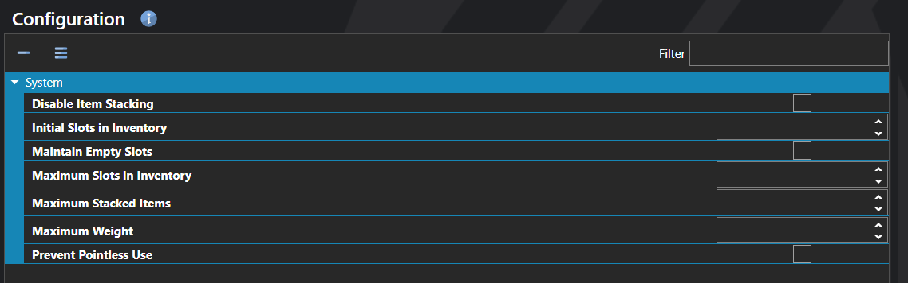

# Configuration

*Источник: https://docs.rpg-architect.com/06-database/02-items/00-configuration/*

---

# Configuration

## **Configuration**[¶](#configuration "Permanent link")

Inventory Configuration defines how the inventory works across the entire project. It controls how many slots the inventory starts with and grows to, whether items can stack and how high, the total weight the party can carry, and whether items the player tries to use without a meaningful effect are blocked at the menu.

The settings here are the project-wide defaults that apply to every inventory unless an individual Item Type or item overrides them. Most projects configure these once early in development to lock in how inventory management feels.

## **Properties**[¶](#properties "Permanent link")

#### **System**[¶](#system "Permanent link")

Name

Explanation

Type

Disable Item Stacking

Disables multiple items from occupying a slot in the inventory.

Toggle

Initial Slots in Inventory

The number of starting item slots in the inventory.

Number

Maintain Empty Slots

Whether slots are preserved in the inventory when they become empty.

Toggle

Maximum Slots in Inventory

The maximum number of inventory slots.

Number

Maximum Stacked Items

The maximum number of items that can occupy a slot in the inventory unless otherwise specified.

Number

Maximum Weight

The total weight that can be carried in the inventory.

Number

Prevent Pointless Use

Prevents items from being used if they do not have a meaningful effect.

Toggle