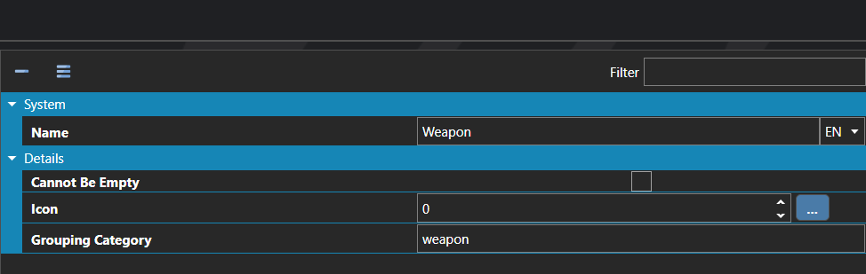

# Equipment Slots

*Источник: https://docs.rpg-architect.com/06-database/02-items/10-equipment-slots/*

---

# Equipment Slots

## **Equipment Slots**[¶](#equipment-slots "Permanent link")

Equipment Slots define the wearable positions a character can use to equip gear, such as weapon, head, body, accessory, or any other slot the project needs. Each piece of equipment in the database targets exactly one slot, and a character can only equip gear into slots that appear in its own allowed slot list.

Slots can be grouped together through a shared Grouping Category, allowing equipment built for one slot in the group to be equipped into any other slot in the same group. This is how a project might let a single "ring" definition fit into either a left-ring or right-ring slot, or let a two-handed weapon be equipped into either of two weapon slots.

## **Properties**[¶](#properties "Permanent link")

#### **System**[¶](#system "Permanent link")

Name

Explanation

Type

Name

The name of the equipment slot.

String

#### **Details**[¶](#details "Permanent link")

Name

Explanation

Type

Cannot Be Empty

When enabled, the slot cannot be left empty in the equip menu — the player can still swap pieces of equipment, but cannot remove the current piece without replacing it.

Toggle

Grouping Category

Equipment slots with the same grouping category can accept other categories with the same grouping category.

String

Icon

The icon of the equipment slot.

Icon