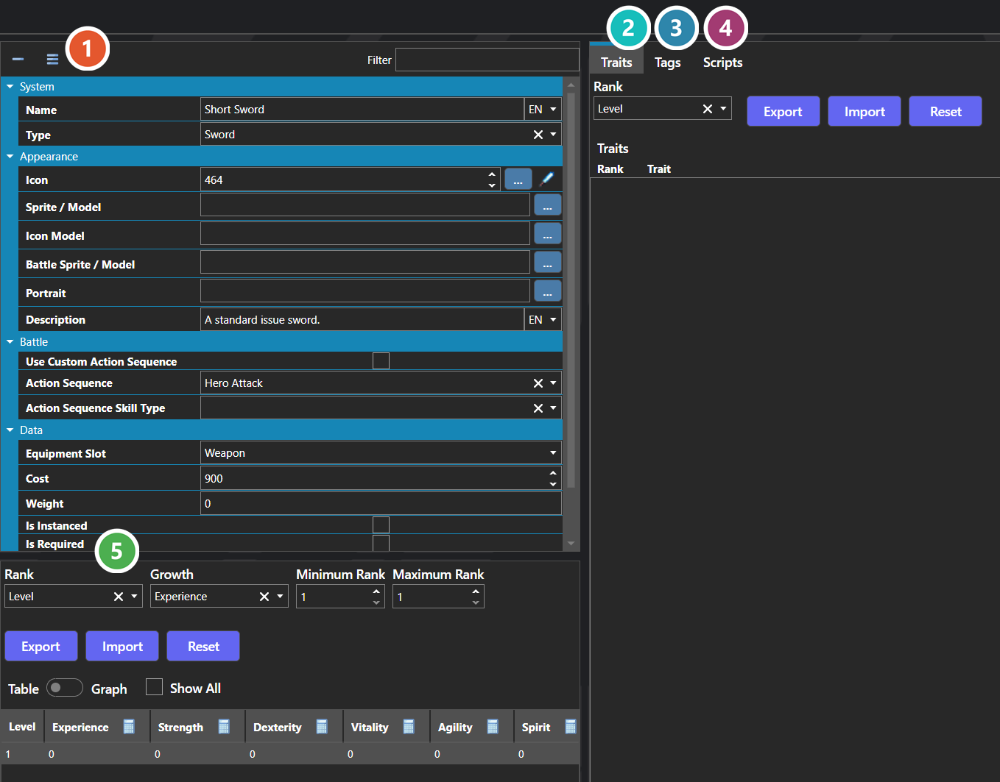

# Equipment

*Источник: https://docs.rpg-architect.com/06-database/02-items/02-equipment/*

---

# Equipment

## **Equipment**[¶](#equipment "Permanent link")

Equipment are the wearable, equipped entries in a character's inventory — weapons, armor, accessories, and any other gear that occupies a slot on the character. When equipped, a piece of equipment contributes its statistics and traits to its wearer, can change the wearer's map, battle, and portrait appearance, and can run a script on equip and unequip for custom logic.

Equipment can also override an Action Sequence on a specific Skill Type for the wearer, which is how a weapon changes the look of a basic attack or how a staff makes spell casts feel different from a sword's. Each piece of equipment fits into exactly one Equipment Slot, and can only be equipped on characters whose slot list includes that slot.

###  Properties[¶](#properties "Permanent link")

The piece of equipment's own fields — the slot it occupies, what it costs, and how it behaves when worn. Every one of them is listed under **Properties** further down this page.

###  Traits[¶](#traits "Permanent link")

Skills, resistances and passive effects the equipment grants while worn — see [Trait Table Editor](../../../04-editor/trait-table-editor/).

###  Tags[¶](#tags "Permanent link")

Free-form labels other systems can match against — see [Tag Editor](../../../04-editor/tag-editor/).

###  Scripts[¶](#scripts "Permanent link")

Two hooks that fire as the equipment is put on and taken off, edited with [Script Editor](../../../04-editor/script-editor/).

###  Statistics[¶](#statistics "Permanent link")

What the equipment adds at each rank — see [Statistics Table Editor](../../../04-editor/statistics-table-editor/).

> **Note**: Equipment differs from Items in two important ways. Items are consumed (or used) and live in the general inventory; equipment is worn, occupies a slot, and contributes its statistics and traits passively for as long as it is equipped. Cursed or story-locked gear can be marked as unremovable so that the player cannot take it off through the standard equip menu.
> 
> **Note**: The Statistics, Traits, and Tags tabs are shared editors, used the same way wherever they appear — see [Statistics Table Editor](../../../04-editor/statistics-table-editor/), [Trait Table Editor](../../../04-editor/trait-table-editor/), and [Tag Editor](../../../04-editor/tag-editor/).

## **Properties**[¶](#properties_1 "Permanent link")

#### **System**[¶](#system "Permanent link")

Name

Explanation

Type

Cannot Be Removed

When enabled, the player cannot remove this equipment through the standard equip menu.

Toggle

Equip Script

The script that runs when the equipment is put on.

[Script](../../../05-reference/script/)

Growth

The growth of the equipment, if valid.

[Statistic](../../05-statistics/01-statistics/)

Is Equipped

Whether the equipment is equipped.

Toggle

Name

The name of the item.

String

Rank

The rank of the equipment, if valid.

[Statistic](../../05-statistics/01-statistics/)

Statistics Table

The statistics the equipment contributes to its wearer while equipped.

[Statistics Table](../../../05-reference/statistics-table/)

Trait Table

The traits the equipment contributes to its wearer while equipped.

[Trait Table](../../../05-reference/trait-table/)

Type

The item type classification of the item.

[Item Type](../20-item-types/)

Unequip Script

The script that runs when the equipment is taken off.

[Script](../../../05-reference/script/)

#### **Appearance**[¶](#appearance "Permanent link")

Name

Explanation

Type

Battle Sprite / Model

The sprite or model associated with the equipment in battle.

[Sprite or Model](../../../05-reference/sprite-or-model/)

Description

The description of the item.

String

Icon

The icon associated with the item.

Icon

Icon Model

The icon model associated with the item.

[Sprite or Model](../../../05-reference/sprite-or-model/)

Portrait

The face or bust associated with the equipment.

[Sprite or Model](../../../05-reference/sprite-or-model/)

Sprite / Model

The sprite or model associated with the equipment on maps.

[Sprite or Model](../../../05-reference/sprite-or-model/)

#### **Battle**[¶](#battle "Permanent link")

Name

Explanation

Type

Action Sequence

The custom action sequence to use with the equipment.

[Action Sequence](../../07-battles/08-action-sequences/)

Action Sequence Skill Type

The skill type to apply the action sequence override on.

[Skill Type](../../01-skills/02-skill-types/)

Use Custom Action Sequence

When enabled, this equipment overrides the Action Sequence used by the wearer for a specific Skill Type.

Toggle

#### **Data**[¶](#data "Permanent link")

Name

Explanation

Type

Cost

The cost associated with the item.

Number

Equipment Slot

The slot this equipment occupies on a character.

[Equipment Slot](../10-equipment-slots/)

Is Instanced

Whether the item should be instanced.

Toggle

Is Required

Whether the item cannot be removed from the inventory.

Toggle

Weight

The weight of the item, if valid.

Number

#### **Scripting**[¶](#scripting "Permanent link")

Name

Explanation

Type

Run Equip On System Event

Whether the equip script is executed from a system event such as a new game or load save state.

Toggle

Run Unequip On System Event

Whether the unequip script is executed from a system event such as a new game or load save state.

Toggle