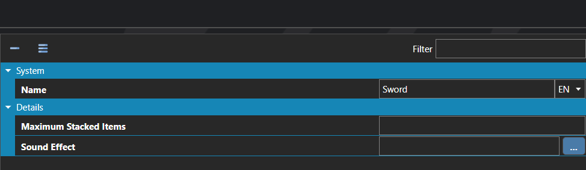

# Item Types

*Источник: https://docs.rpg-architect.com/06-database/02-items/20-item-types/*

---

# Item Types

## **Item Types**[¶](#item-types "Permanent link")

Item Types are categories that group items together and define the shared, category-wide behavior all items in that category inherit. An Item Type controls things like the default sound effect played when an item of this type is used and the default maximum stack size for items of this type in the inventory.

Item Types are also the gating mechanism for which characters can use which items. A character has its own list of allowed Item Types, and can only use items whose type appears in that list — making types the primary tool for restricting consumables and gear to specific roles or party members.

## **Properties**[¶](#properties "Permanent link")

#### **System**[¶](#system "Permanent link")

Name

Explanation

Type

Name

The name of the item type.

String

#### **Details**[¶](#details "Permanent link")

Name

Explanation

Type

Maximum Stacked Items

The maximum number of stacked items if applicable.

Number

Sound Effect

The default sound effect to play when used from a menu.

[Sound Effect](../../../05-reference/sound-effect/)