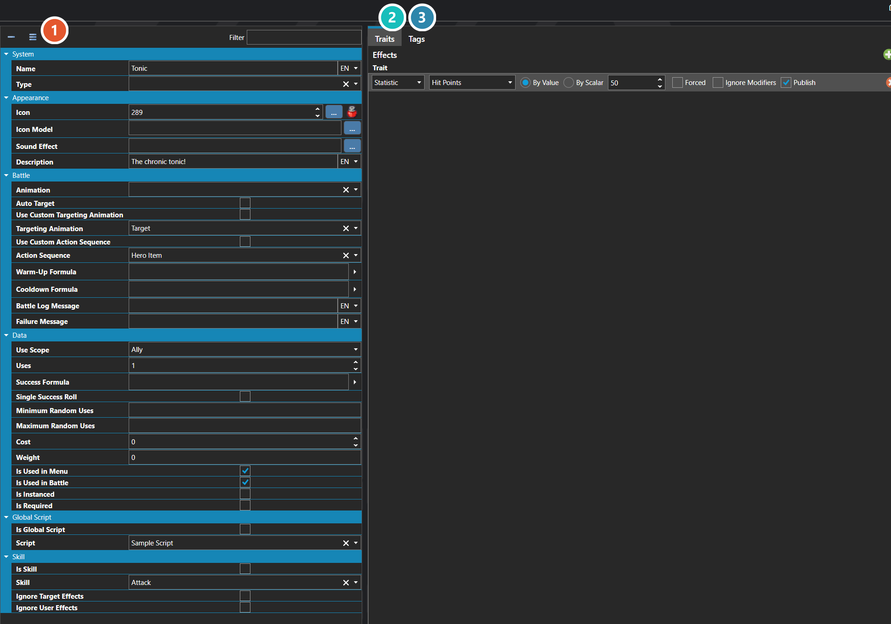

# Items

*Источник: https://docs.rpg-architect.com/06-database/02-items/01-items/*

---

# Items

## **Items**[¶](#items "Permanent link")

Items are the consumable, non-equipped entries in a character's inventory — potions, scrolls, bombs, key items, and any other object the player can hold and use. An item defines what happens when it is used, where it can be used (in battle, from the menu, or both), who it can target, and how many times it can be consumed before it is removed.

When used, an item can apply trait effects directly to its targets, invoke an existing skill so that all of that skill's behavior runs through the item, or call a global script for fully custom logic. These three modes are mutually exclusive — an item is either a trait-effect item, a skill wrapper, or a script trigger.

###  Properties[¶](#properties "Permanent link")

The item's own fields — what it costs, who it can target, whether it is consumed, and how it behaves in and out of battle. Every one of them is listed under **Properties** further down this page.

###  Traits[¶](#traits "Permanent link")

What using the item actually does — the healing, damage, and status effects it applies. The tab reads Traits, but the table inside it is an effect table — see [Effect Table Editor](../../../04-editor/effect-table-editor/).

###  Tags[¶](#tags "Permanent link")

Free-form labels other systems can match against — see [Tag Editor](../../../04-editor/tag-editor/).

> **Note**: Items represent the inventory entry, not the in-world appearance of a dropped object. Visual appearance, stack limits, default sound effects, and other category-wide behavior come from the item's Item Type. To restrict which characters can use an item, expose its type through the character's allowed Item Types — characters can only use items whose type is in their list.
> 
> **Note**: Items do not have to be consumed on use. Key items, plot triggers, and reusable tools can be configured to remain in the inventory after they are used, letting an item act more like a persistent switch or trigger than a single-use consumable.
> 
> **Note**: Tags are edited the same way wherever they appear — see [Tag Editor](../../../04-editor/tag-editor/).

## **Properties**[¶](#properties_1 "Permanent link")

#### **System**[¶](#system "Permanent link")

Name

Explanation

Type

Is Item

Whether the item has an actual item effect.

Toggle

Name

The name of the item.

String

Trait Effect Table

The trait effect table for the item.

[Trait Effect Table](../../../05-reference/trait-effect-table/)

Type

The item type classification of the item.

[Item Type](../20-item-types/)

#### **Appearance**[¶](#appearance "Permanent link")

Name

Explanation

Type

Description

The description of the item.

String

Icon

The icon associated with the item.

Icon

Icon Model

The icon model associated with the item.

[Sprite or Model](../../../05-reference/sprite-or-model/)

Sound Effect

The sound effect played during non-battle uses of the item.

[Sound Effect](../../../05-reference/sound-effect/)

#### **Battle**[¶](#battle "Permanent link")

Name

Explanation

Type

Action Sequence

The custom action sequence to use with the item.

[Action Sequence](../../07-battles/08-action-sequences/)

Animation

The animation to use with the item.

[Animation](../../08-animations/00-animations/)

Auto Target

Whether the item automatically selects a target.

Toggle

Battle Log Message

The message that shows in the battle log.

String

Cooldown Formula

The cooldown formula for the item.

[Formula](../../../05-reference/formulas/)

Failure Message

The message that shows when the item fails.

String

Targeting Animation

The custom targeting animation to use with the item.

[Animation](../../08-animations/00-animations/)

Use Custom Action Sequence

When enabled, the item plays a specific Action Sequence in battle instead of the default item-use sequence.

Toggle

Use Custom Targeting Animation

Whether to use a custom targeting animation.

Toggle

Warm-Up Formula

The warm-up formula for the item.

[Formula](../../../05-reference/formulas/)

#### **Data**[¶](#data "Permanent link")

Name

Explanation

Type

Cost

The cost associated with the item.

Number

Is Instanced

Whether the item should be instanced.

Toggle

Is Required

Whether the item cannot be removed from the inventory.

Toggle

Is Used in Battle

Whether the item can be used in battle.

Toggle

Is Used in Menu

Whether the item can be used in a menu.

Toggle

Maximum Random Uses

The maximum random uses of the item.

Number

Minimum Random Uses

The minimum random uses of the item.

Number

Single Success Roll

When enabled, the success formula is evaluated once and the result is applied to all targets uniformly.

Toggle

Success Formula

The success formula to use the item.

[Formula](../../../05-reference/formulas/)

Use Scope

Who the item is allowed to target when used.

[Use Scope](#use-scope)

Uses

The number of times the item can be used before it is consumed and removed from the inventory.

Number

Weight

The weight of the item, if valid.

Number

#### **Global Script**[¶](#global-script "Permanent link")

Name

Explanation

Type

Is Global Script

Whether to execute a script during the item use.

Toggle

Script

The script to execute when the item is used.

[Script](../../../05-reference/script/)

#### **Skill**[¶](#skill "Permanent link")

Name

Explanation

Type

Ignore Target Effects

Whether the skill ignores the target effects.

Toggle

Ignore User Effects

Whether the skill ignores the user effects.

Toggle

Is Skill

Whether the item invokes a skill usage.

Toggle

Skill

The skill to execute when the item is used.

[Skill](../../01-skills/01-skills/)

#### **[Use Scope](#use-scope)**[¶](#use-scope "Permanent link")

Name

Explanation

None

User

Ally

Random Ally

User and Allies

Enemy

Random Enemy

All Enemies

Everyone

Anyone

Random