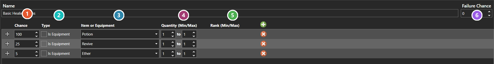

# Loot Tables

*Источник: https://docs.rpg-architect.com/06-database/02-items/03-loot-tables/*

---

# Loot Tables

## **Loot Tables**[¶](#loot-tables "Permanent link")

Loot Tables are weighted random distributions for generating items or equipment as rewards. Each row in the table specifies an item or piece of equipment, a chance weight, a quantity range, and (for equipment) a rank range, and the table is rolled to produce one or more results when a reward is granted.

Loot Tables can be used by enemy battle rewards, treasure chests, shops, scripts, and any other system that needs randomized item drops. Their behavior is controlled by the chance evaluation method, which is shared with Enemy Formations, Shop Categories, and other weighted containers, and behaves the same way in each.

###  Chance[¶](#chance "Permanent link")

The row's **weight**, not a percentage. How the weights are read — a single result, every row that passes, or a reroll — is chosen by whatever rolls the table, not by the table itself.

###  Type[¶](#type "Permanent link")

**Is Equipment** switches the next column between the item catalogue and the equipment catalogue.

###  Item or Equipment[¶](#item-or-equipment "Permanent link")

What the row produces, drawn from whichever catalogue **Type** selects.

###  Quantity (Min/Max)[¶](#quantity-minmax "Permanent link")

The range rolled for how many the row produces. Setting both ends the same makes the amount fixed.

###  Rank (Min/Max)[¶](#rank-minmax "Permanent link")

The range rolled for the equipment's rank. **It applies to equipment only**, which is why it is empty on the item rows here.

###  Failure Chance[¶](#failure-chance "Permanent link")

The weight assigned to _no result at all_. It belongs to the table rather than to a row because it competes against every row at once — a large failure weight against small row weights is how rare-drop tables are built.

> **Note**: A Loot Table can also fail to produce any result at all when its Failure Chance is set, which is how rare-drop systems are typically built — most rolls produce nothing, and only the small remaining chance window distributes the actual loot rows.

## **Properties**[¶](#properties "Permanent link")

#### **System**[¶](#system "Permanent link")

Name

Explanation

Type

Failure Chance

The weight assigned to "no result" when the table is rolled.

Number

Name

The name of the loot table.

String

Rows

The weighted entries the table can produce.

[Loot Table Row](#loot-table-row)

## **Loot Table Row**[¶](#loot-table-row "Permanent link")

## **Properties**[¶](#properties_1 "Permanent link")

#### **System**[¶](#system_1 "Permanent link")

Name

Explanation

Type

Chance

The chance weight of this loot table row.

Number

Is Equipment

Whether the row represents an equipment.

Toggle

Item or Equipment

The reference index of the item or equipment in the database.

[Item](../01-items/) or [Equipment](../02-equipment/)

Maximum Quantity

The maximum quantity of the item.

Number

Maximum Rank

The maximum rank, if equipment.

Number

Minimum Quantity

The minimum quantity of the item.

Number

Minimum Rank

The minimum rank, if equipment.

Number