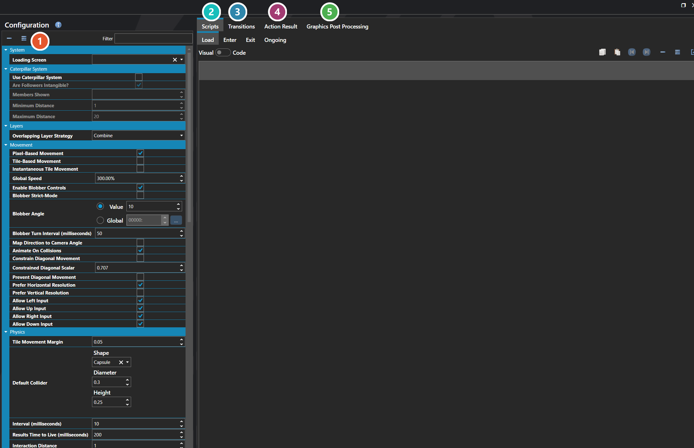

# Configuration

*Источник: https://docs.rpg-architect.com/06-database/03-maps/00-configuration/*

---

# Configuration

## **Configuration**[¶](#configuration "Permanent link")

Map Configuration defines how maps work across the entire project. It is the central place that physics is configured — gravity, collision behavior, default colliders for actors and doodads — and it also controls the global rules for player and entity movement, the default camera setup, encounter behavior, pathfinding limits, and the transitions and scripts that run when maps are entered or left.

The settings here are the project-wide defaults that apply to every map unless an individual map or script overrides them. Most projects configure these once early in development to lock in how physics, movement, and exploration feel across the game.

###  Properties[¶](#properties "Permanent link")

The project-wide map settings, grouped by topic — movement, encounters, lighting, and the rest. Every one of them is listed under **Properties** further down this page.

###  Scripts[¶](#scripts "Permanent link")

Four script hooks that fire around a map — Load, Enter, Exit and Ongoing. Each is edited with the [Script Editor](../../../04-editor/script-editor/).

###  Transitions[¶](#transitions "Permanent link")

How the screen moves into and out of a map — see [Transition Editor](../../../04-editor/transition-editor/).

###  Action Result[¶](#action-result "Permanent link")

The pop-up numbers and text shown on the map when something lands — poison damage, a status effect wearing off. Set separately from the battle scene's, so the two can look different.

###  Graphics Post Processing[¶](#graphics-post-processing "Permanent link")

Full-screen visual effects applied while the player is on a map — see [Graphics Post Processor Editor](../../../04-editor/graphics-post-processor-editor/).

## **Properties**[¶](#properties_1 "Permanent link")

#### **System**[¶](#system "Permanent link")

Name

Explanation

Type

Action Result

The default way to display action results on the map, such as poison damage or status effect messages.

[Action Sequence Result](../../../11-battles/01-action-sequences/action-sequence-result/)

Enter Map Script

The script executed when entering a map.

[Script](../../../05-reference/script/)

Enter Transition

The scene transition played when entering.

[Scene Transition](../../../05-reference/scene-transition/)

Exit For Battle Transition

The scene transition played when exiting to battle.

[Scene Transition](../../../05-reference/scene-transition/)

Exit Map Script

The script executed when exiting a map.

[Script](../../../05-reference/script/)

Exit Transition

The scene transition played when exiting.

[Scene Transition](../../../05-reference/scene-transition/)

Graphics Post Processors

The post-processing effects applied to the scene.

[Graphics Post Processor](../../../05-reference/graphics-post-processor/)

Load Map Script

The script executed when a map loads, before the enter transition is displayed.

[Script](../../../05-reference/script/)

Loading Screen

The user interface to use for the loading screen for the scene.

[User Interface](../../09-user-interfaces/00-user-interfaces/)

Ongoing Map Script

The script that runs continuously while on the map.

[Script](../../../05-reference/script/)

Pathfinding Time

The maximum time for pathfinding calculations.

Number

#### **Calculations**[¶](#calculations "Permanent link")

Name

Explanation

Type

Is Defeat/Game Over Enabled

Whether the default defeat condition from battle configuration is checked when statistics are updated on a map.

Toggle

#### **Caterpillar System**[¶](#caterpillar-system "Permanent link")

Name

Explanation

Type

Are Followers Intangible?

Whether caterpillar followers are intangible and do not interact with physics.

Toggle

Maximum Distance

The maximum distance before a caterpillar member teleports to catch up to the leader.

Number

Members Shown

The number of caterpillar followers visible on the map.

Number

Minimum Distance

The minimum distance a caterpillar follower must be from the leader before it begins moving to follow.

Number

Use Caterpillar System

Whether to use the caterpillar system, which displays party followers trailing behind the leader on the map.

Toggle

#### **Debugging**[¶](#debugging "Permanent link")

Name

Explanation

Type

Doodad Bounding Box Color

The color to render the bounding boxes for doodads.

Color

Doodad Bounding Boxes

Whether to render doodad bounding boxes for debugging.

Toggle

Entity Bounding Box Color

The color to render the bounding boxes for entities.

Color

Entity Bounding Boxes

Whether to render entity bounding boxes for debugging.

Toggle

Fence Color

The color used to render fence walls for debugging.

Color

Fence Walls

Whether to render fence walls for debugging.

Toggle

Prefab Bounding Box Color

The color to render the bounding boxes for prefabs.

Color

Prefab Bounding Boxes

Whether to render prefab bounding boxes for debugging.

Toggle

Projection Bounding Box Color

The color to render the bounding boxes for projections.

Color

Projection Bounding Boxes

Whether to render projection bounding boxes for debugging.

Toggle

Vehicle Bounding Box Color

The color to render the bounding boxes for vehicles.

Color

Vehicle Bounding Boxes

Whether to render vehicle bounding boxes for debugging.

Toggle

#### **Layers**[¶](#layers "Permanent link")

Name

Explanation

Type

Overlapping Layer Strategy

The strategy for handling duplicate tile layer data.

[Tile Overlap Strategy](#tile-overlap-strategy)

#### **Minimap**[¶](#minimap "Permanent link")

Name

Explanation

Type

Minimap

The default minimap user interface displayed on maps.

[User Interface](../../09-user-interfaces/00-user-interfaces/)

#### **Movement**[¶](#movement "Permanent link")

Name

Explanation

Type

Allow Down Input

Whether down input is registered on maps.

Toggle

Allow Left Input

Whether left input is registered on maps.

Toggle

Allow Right Input

Whether right input is registered on maps.

Toggle

Allow Up Input

Whether up input is registered on maps.

Toggle

Animate On Collisions

Whether the hero continues its walking animation when colliding with a wall or object.

Toggle

Blobber Angle

The angle to rotate the yaw when blobber-style controls are enabled.

[Variable or Value](../../../05-reference/variable-or-value/)

Blobber Strict-Mode

Whether blobber-style controls prevent forward and backward movement while turning.

Toggle

Blobber Turn Interval (milliseconds)

The fixed time that it takes to turn when blobber-style controls are enabled.

Number

Constrain Diagonal Movement

Whether to limit diagonal movement speed so it matches cardinal movement speed.

Toggle

Constrained Diagonal Scalar

The scalar to limit the diagonal movement by. The default is 0.707 or the square root of 2.

Number

Enable Blobber Controls

Whether to enable blobber-style controls for first-person camera movement.

Toggle

Global Speed

The scalar to apply to all movement.

Number

Instantaneous Tile Movement

Whether tile-based movement is instantaneous, teleporting to the next tile instead of animating.

Toggle

Map Direction to Camera Angle

Whether to map the movement direction of the controlled actor to the camera angle.

Toggle

Pixel-Based Movement

Whether pixel-based movement is enabled, allowing free movement instead of tile snapping.

Toggle

Prefer Horizontal Resolution

Whether to prefer a horizontal frame when resolving direction for sprite display.

Toggle

Prefer Vertical Resolution

Whether to prefer a vertical frame when resolving direction for sprite display.

Toggle

Prevent Diagonal Movement

Whether to prevent diagonal movement, restricting input to cardinal directions only.

Toggle

#### **Physics**[¶](#physics "Permanent link")

Name

Explanation

Type

Default Collider

The default entity collider shape, if applicable.

[Collider](../../../05-reference/collider/)

Gravity

The default gravity to apply to entities.

Vector

Interaction Distance

The distance an action key interaction searches forward.

Number

Interval (milliseconds)

The fixed interval that physics runs at.

Number

Level Collision Height

The height used to create boundaries for level geometry when a tile is marked for collision.

Number

Maximum Fall Distance

The maximum distance that something can fall and not be considered falling.

Number

Prevent Falling

Whether to actively prevent entities from falling off edges beyond the maximum fall distance.

Toggle

Results Time to Live (milliseconds)

How long the engine remembers a tile tag result when an entity briefly loses contact with the surface.

Number

Slope Climbing Angle

The maximum angle allowed for climbing slopes in degrees.

Number

Strict Collision Mode

Whether any collision prevents movement. When disabled, passable collisions are allowed through.

Toggle

Tile Movement Margin

The distance threshold for applying glue force to keep entities anchored to tiles. Also affects movement detection raycasts.

Number

#### **[Tile Overlap Strategy](#tile-overlap-strategy)**[¶](#tile-overlap-strategy "Permanent link")

Name

Explanation

Combine

Combines the geometry metadata from all overlapping tile layers into a single result.

Use First Layer Only

Uses only the first (bottom) layer's tile data and ignores tiles on higher layers at the same position.

Use Last Layer Only

Uses only the last (top) layer's tile data and ignores tiles on lower layers at the same position.

## **See Also**[¶](#see-also "Permanent link")

*   [Collider Editor](../../../04-editor/collider-editor/)
*   [Transition Editor](../../../04-editor/transition-editor/)
*   [Graphics Post Processor Editor](../../../04-editor/graphics-post-processor-editor/)