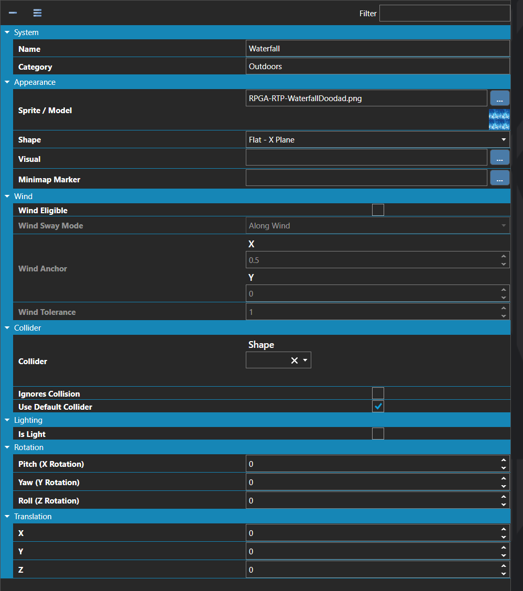

# Doodads

*Источник: https://docs.rpg-architect.com/06-database/03-maps/03-doodads/*

---

# Doodads

## **Doodads**[¶](#doodads "Permanent link")

Doodads are reusable, non-interactive map objects — trees, rocks, statues, lamp posts, furniture, props, and any other piece of scenery placed on a map. A doodad defines its visual model or sprite, its collider, the light it emits, and any rotation or translation applied to it, and acts as a template that can be placed any number of times on any number of maps.

Doodads differ from Entities in that they have no scripts, no movement, and no script pages. They exist purely as decorative or environmental objects that the player or other actors can collide with (or pass through), making them the right choice for filling out a scene without the overhead of a fully scripted entity.

> **Note**: Doodads can emit light through the Light property, which is how torches, lanterns, glowing crystals, and other light-source props are typically built — the doodad itself is the visual, and the attached light is what actually illuminates the surrounding scene at runtime.

## **Properties**[¶](#properties "Permanent link")

#### **System**[¶](#system "Permanent link")

Name

Explanation

Type

Category

The category of organization for the doodad.

String

Collider

The settings for the dimensions of the doodad collider. Values are measured in tiles.

[Collider](../../../05-reference/collider/)

Collider Points

The relative X, Y, Z coordinates of the doodad for collision purposes.

Vector

Light

The light that the doodad emits.

[Light](../../../05-reference/light/)

Name

The name of the doodad.

String

Rotation

The rotation to apply to the doodad.

Vector

Translation

The translation to apply to the doodad.

Vector

#### **Appearance**[¶](#appearance "Permanent link")

Name

Explanation

Type

Shape

The shape of the doodad in 3D.

[Sprite Shape](../../../05-reference/sprite-format/)

Sprite / Model

The sprite or model of the doodad.

[Sprite or Model](../../../05-reference/sprite-or-model/)

Visual

The visual of the doodad in the editor.

[Sprite or Model](../../../05-reference/sprite-or-model/)

#### **Collider**[¶](#collider "Permanent link")

Name

Explanation

Type

Ignores Collision

Whether the doodad ignores all collisions.

Toggle

Use Default Collider

Whether the doodad should use the default collider specified in the Map Configuration.

Toggle

#### **Wind**[¶](#wind "Permanent link")

Name

Explanation

Type

Wind Anchor

The anchor point on the sprite for wind sway, in normalized sprite-local coordinates. (0.5, 0) is bottom-center, useful for trees and signs. (0.5, 1) is top-center, useful for hanging banners and lanterns when paired with the Rotate Around Anchor sway mode.

Vector

Wind Eligible

Whether the doodad is influenced by wind.

Toggle

Wind Sway Mode

The mode of sway applied to the doodad when wind is enabled.

[Wind Sway Mode](#wind-sway-mode)

Wind Tolerance

A multiplier on the map's wind strength applied to this doodad's sway.

Number

#### **[Wind Sway Mode](#wind-sway-mode)**[¶](#wind-sway-mode "Permanent link")

Name

Explanation

Along Wind

Top vertices offset opposite to the incoming wind direction, then bob back. Models physical sway — a tree leaning with the wind.

Across Wind

Top vertices wag perpendicular to the wind direction. Reads as a flag flapping or grass shimmering across the breeze.

Rotate Around Anchor

The sprite rotates back and forth around its anchor like a pendulum. Useful for hanging signs, banners, and lanterns.

## **See Also**[¶](#see-also "Permanent link")

*   [Collider Editor](../../../04-editor/collider-editor/)