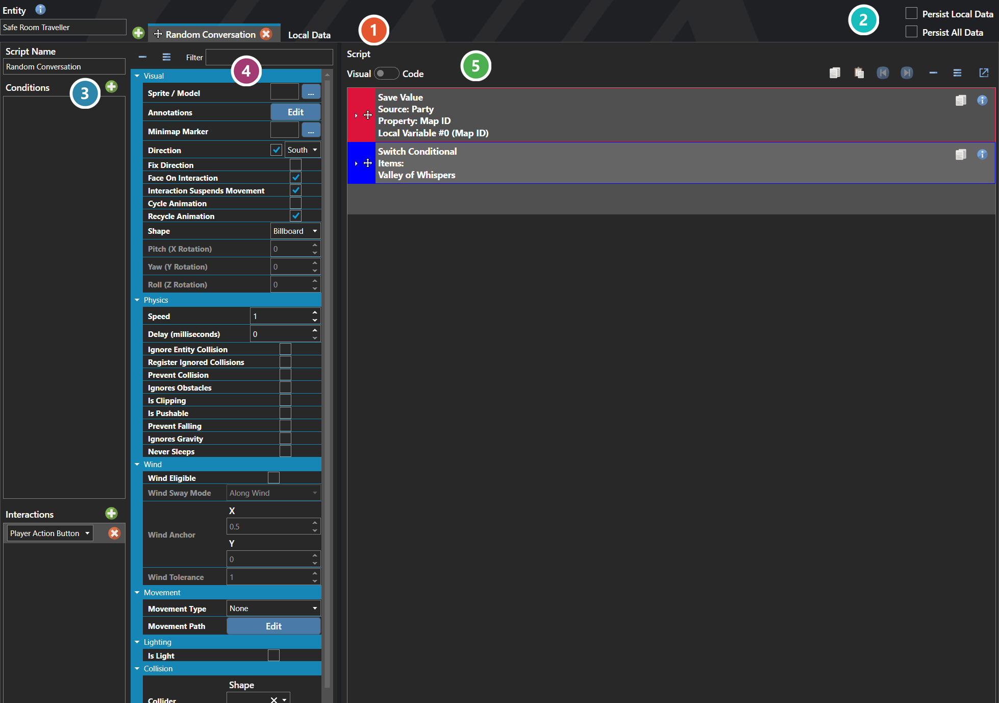

# Entity Definitions

*Источник: https://docs.rpg-architect.com/06-database/03-maps/04-entity-definitions/*

---

# Entity Definitions

## **Entity Definitions**[¶](#entity-definitions "Permanent link")

Entities are the reusable interactive objects placed on maps — NPCs, enemies on the field, doors, switches, treasure chests, signposts, moving platforms, and any other map element that needs to react, move, or run logic. An entity defines its appearance, its movement behavior, the scripts that run in response to events, and the conditions that decide when each script page is active.

Entities defined here in the database act as templates: a single Entity can be placed on any number of maps, and each placement inherits the template's behavior unless overridden. This is what allows the same shopkeeper, guard, or treasure chest to appear in multiple locations without re-authoring it for each one.

###  Scripts and Local Data[¶](#scripts-and-local-data "Permanent link")

An entity definition holds as many scripts as it needs, one per tab, plus a **Local Data** tab for the switches and variables belonging to this entity alone.

###  Persistence[¶](#persistence "Permanent link")

**Is Local Data Persisted** keeps this entity's own switches and variables across map transitions; **Is All Data Persisted** keeps its position and state as well.

###  Conditions and Interactions[¶](#conditions-and-interactions "Permanent link")

What has to be true for the selected script to run, and what sets it off. This one is triggered by the **Player Action Button** — the player pressing confirm against the entity.

###  Properties[¶](#properties "Permanent link")

The entity's own fields, grouped by concern — **Visual** for its sprite or model, facing and shape, **Physics** for speed and the collision flags, **Wind**, **Movement** for its patrol type and path, **Lighting**, and **Collision** for its collider. Every one of them is listed under **Properties** further down this page.

###  Script[¶](#script "Permanent link")

The commands the selected script runs, authored the same way as any other script — see [Script Editor](../../../04-editor/script-editor/).

> **Note**: Entities are organized into Script Pages — each page has its own activation conditions, movement settings, and script. The active page is whichever one's conditions currently pass, which is how an entity can change behavior based on switches, variables, party state, or progress through the game without ever needing to be replaced.

## **Properties**[¶](#properties_1 "Permanent link")

#### **System**[¶](#system "Permanent link")

Name

Explanation

Type

Category

The category of the entity, for organizational purposes in the editor.

String

ID

The numeric ID of the entity on the map.

Number

Is All Data Persisted

Whether all runtime data (position, state, local data) persists across map transitions.

Toggle

Is Local Data Persisted

Whether local switches and variables persist across map transitions.

Toggle

Locals

The local switches and variables belonging to this entity.

[Local and Global Data](../../../05-reference/local-and-global-data/)

Name

The display name of the entity.

String

Position

The X, Y, and Z coordinates of the entity on the map.

Vector

Scripts

The scripts attached to the entity, each with their own conditions, interactions, and commands.

[Entity Script](#entity-script)

Tags

Key-value pairs for extensible data on the entity.

[Tags](../../../05-reference/tags/)

Unique ID

The unique identifier.

[Unique ID](../../../05-reference/unique-id/)

## **Entity Script**[¶](#entity-script "Permanent link")

Entity scripts define the visual appearance, physics, movement behavior, conditions, and interactions of an entity on a map.

## **Properties**[¶](#properties_2 "Permanent link")

#### **System**[¶](#system_1 "Permanent link")

Name

Explanation

Type

Collider

The settings for the dimensions of the entity collider. Values are measured in tiles.

[Collider](../../../05-reference/collider/)

Commands

The commands to execute when the script runs.

Cycle Animation

Whether to animate the entity automatically.

Toggle

Delay (milliseconds)

The delay between movement actions.

Number

Direction

The direction the entity is facing.

[Direction](../../../05-reference/direction/)

Face On Interaction

Whether the entity will face the player on interaction.

Toggle

Fix Direction

Whether to keep the entity facing its current direction.

Toggle

Ignore Entity Collision

Whether to ignore collision between other entities.

Toggle

Ignores Gravity

Whether the entity ignores the effects of gravity.

Toggle

Ignores Obstacles

Whether or not the entity ignores collisions from terrain tags or tile collisions.

Toggle

Interaction Suspends Movement

Whether to suspend the movement pattern when interaction occurs.

Toggle

Is Clipping

Whether the entity operates independently of physics.

Toggle

Is Direction Updated

Whether direction updates during movement.

Toggle

Is Pushable

Whether the entity can be pushed.

Toggle

Light

The light attached to the entity.

[Light](../../../05-reference/light/)

Movement Type

The type of movement the entity will perform.

[Entity Movement Type](#entity-movement-type)

Name

The display name.

String

Never Sleeps

Whether the object never sleeps during physics updates.

Toggle

Prevent Collision

Whether the entity tries to avoid occupying the same tile as another entity.

Toggle

Prevent Falling

Whether the entity tries to avoid falling.

Toggle

Recycle Animation

Whether to continuously animate the entity.

Toggle

Register Ignored Collisions

Whether to register collisions even when ignored.

Toggle

Rotation

The rotation of the entity model.

Vector

Shape

The shape of the entity in 3D.

[Sprite Shape](../../../05-reference/sprite-format/)

Speed

The speed multiplier of the entity.

Number

Sprite / Model

The sprite or model of the entity on maps.

[Sprite or Model](../../../05-reference/sprite-or-model/)

#### **Wind**[¶](#wind "Permanent link")

Name

Explanation

Type

Wind Anchor

The anchor point on the sprite for wind sway, in normalized sprite-local coordinates. (0.5, 0) is bottom-center, useful for trees and signs. (0.5, 1) is top-center, useful for hanging banners and lanterns when paired with the Rotate Around Anchor sway mode.

Vector

Wind Eligible

Whether the entity is influenced by wind.

Toggle

Wind Sway Mode

The mode of sway applied to the entity when wind is enabled.

[Wind Sway Mode](#wind-sway-mode)

Wind Tolerance

A multiplier on the map's wind strength applied to this entity's sway.

Number

## **[Entity Movement Type](#entity-movement-type)**[¶](#entity-movement-type "Permanent link")

Name

Explanation

None

The entity does not move on its own.

Random

The entity moves randomly in available directions.

Path

The entity follows a predefined movement path.

## **[Wind Sway Mode](#wind-sway-mode)**[¶](#wind-sway-mode "Permanent link")

Name

Explanation

Along Wind

Top vertices offset opposite to the incoming wind direction, then bob back. Models physical sway — a tree leaning with the wind.

Across Wind

Top vertices wag perpendicular to the wind direction. Reads as a flag flapping or grass shimmering across the breeze.

Rotate Around Anchor

The sprite rotates back and forth around its anchor like a pendulum. Useful for hanging signs, banners, and lanterns.