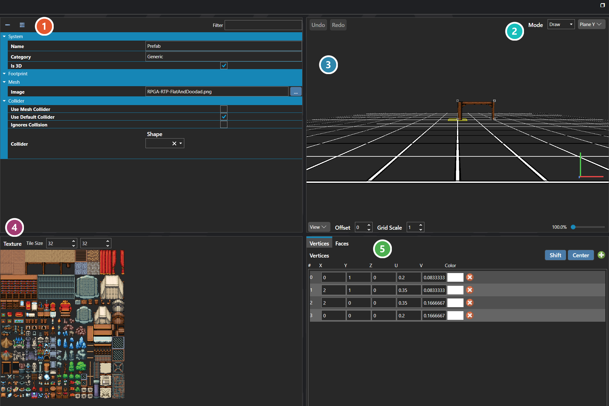

# Prefabs

*Источник: https://docs.rpg-architect.com/06-database/03-maps/08-prefabs/*

---

# Prefabs

## **Prefabs**[¶](#prefabs "Permanent link")

Prefabs are reusable, hand-authored map objects that can be built once and placed any number of times. A two-dimensional prefab is a small footprint of tiles across up to three relative layers that stamps directly onto a map's terrain. A three-dimensional prefab is a mesh, authored vertex-by-vertex and textured from a single image, that is placed into a map as a live instance.

###  Properties[¶](#properties "Permanent link")

The prefab's own fields — its name and category, whether it is 3D, its footprint, the image its mesh is textured from, and its collider. Every one of them is listed under **Properties** further down this page.

###  Mode[¶](#mode "Permanent link")

What a click on the surface does, and which plane it acts on. **Undo** and **Redo** at the far left apply to the geometry, not to the fields.

###  Editing Surface[¶](#editing-surface "Permanent link")

Where the prefab is actually built. It is a drawn surface rather than a form, so geometry is placed and reshaped directly with the mouse; the bar beneath it controls the view, the grid and the zoom rather than the prefab itself.

###  Texture[¶](#texture "Permanent link")

The image the prefab's faces are textured from, cut into tiles of the size set beside it. Picking a tile here chooses what gets painted onto the surface.

###  Vertices and Faces[¶](#vertices-and-faces "Permanent link")

The same geometry as numbers. **Vertices** lists each point's position along with its **U** and **V** coordinates into the texture and a colour, so a value can be typed exactly rather than dragged; **Faces** switches to the surfaces built between those points.

> **Note**: Whether a prefab is authored as a tile stamp or a mesh is determined by whether the project is two- or three-dimensional; the Is 3D flag records which payload the prefab uses.

## **Properties**[¶](#properties_1 "Permanent link")

#### **System**[¶](#system "Permanent link")

Name

Explanation

Type

Category

The category of organization for the prefab.

String

Collider

The settings for the dimensions of the prefab collider. Values are measured in tiles.

[Collider](../../../05-reference/collider/)

Collider Points

The relative X, Y, Z coordinates of the prefab for collision purposes.

Vector

Is 3D

Whether the prefab is authored as a three-dimensional mesh instead of a two-dimensional tile stamp.

Toggle

Name

The name of the prefab.

String

#### **Collider**[¶](#collider "Permanent link")

Name

Explanation

Type

Ignores Collision

Whether the prefab ignores all collisions.

Toggle

Use Default Collider

Whether the prefab should use the default collider specified in the Map Configuration.

Toggle

Use Mesh Collider

Whether the collider is generated from the prefab's mesh geometry. When disabled, the authored collider is used instead.

Toggle

## **See Also**[¶](#see-also "Permanent link")

*   [Collider Editor](../../../04-editor/collider-editor/)