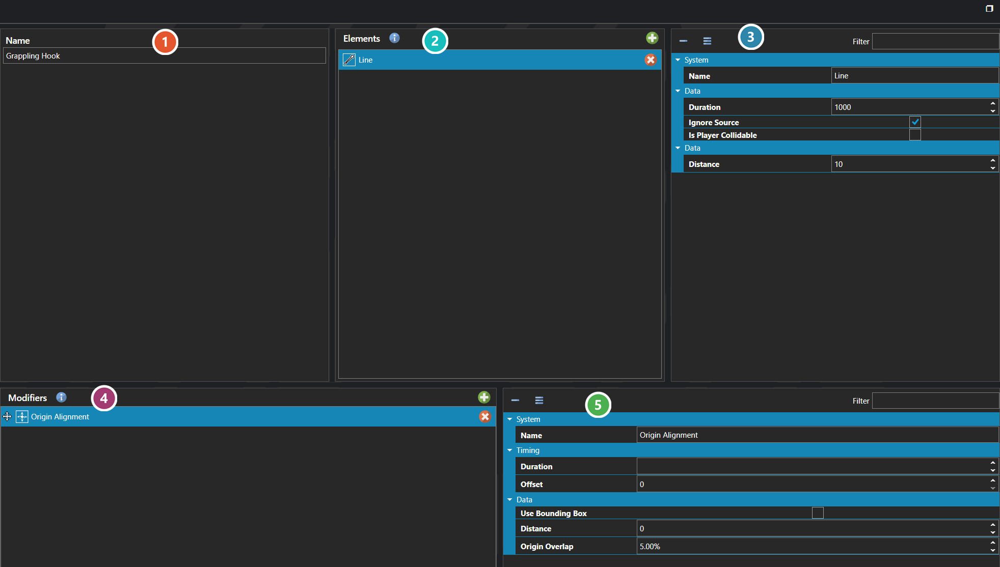

# Projections

*Источник: https://docs.rpg-architect.com/06-database/03-maps/07-projections/*

---

# Projections

## **Projections**[¶](#projections "Permanent link")

Projections are reusable physics-driven objects projected from a source into the world to interact with the environment and other actors on a map. A projection can be launched and travel — like an arrow, fireball, or thrown item — or it can be statically positioned relative to its source, like the hitbox of a sword swing in front of a hero, a melee shockwave, or an area-of-effect zone that follows a battler.

Each projection is built from a list of elements that define its shape, motion, lifetime, collision behavior, and the effects it triggers when it interacts with the world. The same projection definition can be reused by any number of skills, scripts, or systems that need to spawn dynamic physics into the scene.

###  Properties[¶](#properties "Permanent link")

The projection's own fields. Every one of them is listed under **Properties** further down this page.

###  Elements[¶](#elements "Permanent link")

The parts the projection is assembled from. This one is a single **Line** element, which casts a ray in the source's facing direction and detects what it passes through.

###  Selected Element[¶](#selected-element "Permanent link")

The selected element's own settings, which change with the kind of element it is. A Line asks how far it reaches and how long it lasts, whether it ignores the source that fired it, and whether the player can collide with it.

###  Modifiers[¶](#modifiers "Permanent link")

Modifiers attached to the selected element, applied in order. They reshape it as it plays — this one, **Origin Alignment**, offsets the projection away from its source in the direction the source is facing.

###  Selected Modifier[¶](#selected-modifier "Permanent link")

The selected modifier's own settings, which likewise change with its kind. **Duration** and **Offset** decide when within the element's life the modifier applies, rather than what it does.

> **Note**: Despite the name, projections are not limited to projectiles. The defining trait is that they are spawned from a source — a battler, an entity, a script — and given their own physics presence in the world. Use projections for any case where you need a temporary, source-relative physics body to exist on the map and react to what it touches.

## **Properties**[¶](#properties_1 "Permanent link")

#### **System**[¶](#system "Permanent link")

Name

Explanation

Type

Name

String