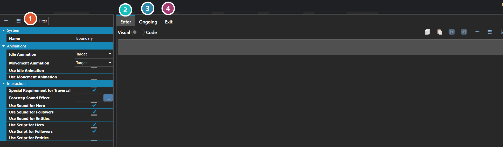

# Tile Tags

*Источник: https://docs.rpg-architect.com/06-database/03-maps/02-tile-tags/*

---

# Tile Tags

## **Tile Tags**[¶](#tile-tags "Permanent link")

Tile Tags are reusable behaviors that can be attached to tiles on a map to make them react when actors step on them. A tile tag bundles together enter, exit, and ongoing scripts, custom idle and movement animations, footstep sound effects, and the rules for which actors trigger which behaviors.

Tile Tags are how things like grass that rustles when stepped on, water that splashes and triggers a swim animation, damage tiles, conveyor belts, slippery ice, and quest-trigger zones are built — without having to attach individual entities or scripts to each tile.

###  Properties[¶](#properties "Permanent link")

The tile tag's own fields — its custom idle and movement animations, its footstep sound, and which of the party leader, the followers and other entities each behaviour reaches. Every one of them is listed under **Properties** further down this page. The one that is not self-explanatory is **Special Requirement for Traversal**: it blocks any actor that does not carry this same tile tag itself, granted through a trait or through the vehicle it is riding.

###  Enter[¶](#enter "Permanent link")

Runs once as an actor steps onto the tile — see [Script Editor](../../../04-editor/script-editor/).

###  Ongoing[¶](#ongoing "Permanent link")

Runs continuously while an actor is on the tile.

###  Exit[¶](#exit "Permanent link")

Runs once as an actor steps off.

> **Note**: Each behavior on a tile tag can be selectively enabled for the party leader, party followers, and other entities through the Use Scripts / Use Sound toggles. This is what allows a tile tag to play footsteps for the player but not for NPCs walking past, or to run a script only when the party leader steps on it.

## **Properties**[¶](#properties_1 "Permanent link")

#### **System**[¶](#system "Permanent link")

Name

Explanation

Type

Enter Script

The script called when entering a tile tag.

[Script](../../../05-reference/script/)

Exit Script

The script called when exiting a tile tag.

[Script](../../../05-reference/script/)

Name

The name of the tile tag.

String

Ongoing Script

The script called concurrently in the tile tag.

[Script](../../../05-reference/script/)

#### **Animations**[¶](#animations "Permanent link")

Name

Explanation

Type

Idle Animation

The custom animation when idle on the tile tag.

[Animation](../../08-animations/00-animations/)

Movement Animation

The custom animation when moving on the tile tag.

[Animation](../../08-animations/00-animations/)

Use Idle Animation

Whether to use a custom idle animation when on the tile tag.

Toggle

Use Movement Animation

Whether to use a custom movement animation when on the tile tag.

Toggle

#### **Interaction**[¶](#interaction "Permanent link")

Name

Explanation

Type

Footstep Sound Effect

The sound effect to play while walking on the tile tag.

[Sound Effect](../../../05-reference/sound-effect/)

Special Requirement for Traversal

Whether the tile tag has a requirement for traversal.

Toggle

Use Script for Entities

Whether to allow the scripts to execute when an entity encounters the tile tag.

Toggle

Use Script for Followers

Whether to allow the scripts to execute when a party member other than the leader encounters the tile tag.

Toggle

Use Script for Hero

Whether to allow the scripts to execute when the party leader encounters the tile tag.

Toggle

Use Sound for Entities

Whether to allow the sound effect to play when an entity encounters the tile tag.

Toggle

Use Sound for Followers

Whether to allow the sound effect to play when a party member other than the leader encounters the tile tag.

Toggle

Use Sound for Hero

Whether to allow the sound effect to play when the party leader encounters the tile tag.

Toggle