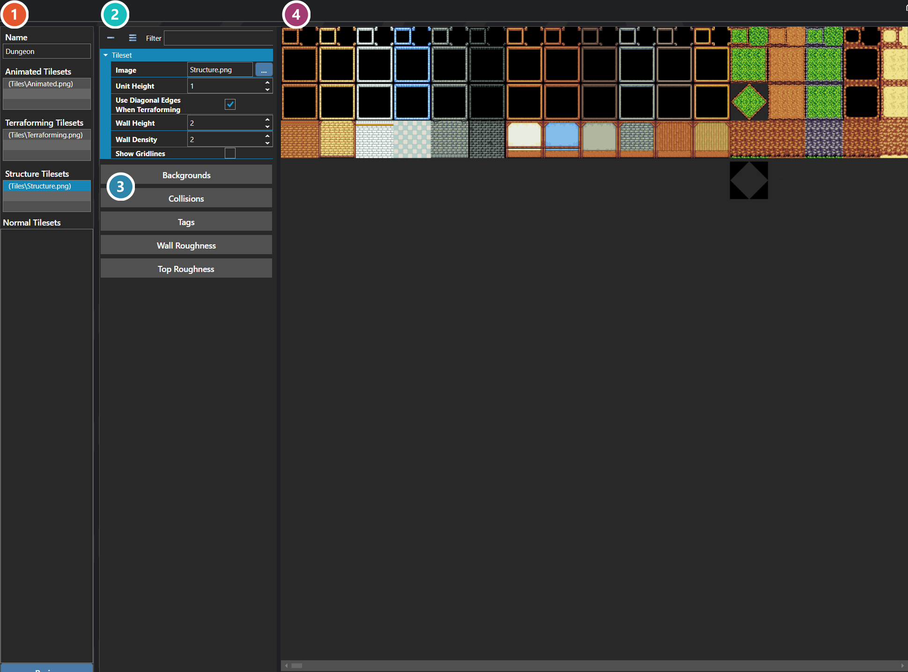

# Tilesets

*Источник: https://docs.rpg-architect.com/06-database/03-maps/01-tilesets/*

---

# Tilesets

## **Tilesets**[¶](#tilesets "Permanent link")

Tilesets are the collections of tile images that maps draw from to build their terrain and structures. Each tileset bundles together a fixed set of slots — animated tiles, terraforming tiles that auto-shape against neighbors, structural tiles for walls and buildings, and flat tiles for everything else — along with the metadata that controls how each slot renders, animates, and interacts with the world.

A map references a tileset to define what its tiles look like; changing the tileset on a map swaps every tile through the same indices, which is what allows a single map layout to be re-skinned across multiple tilesets without re-painting it.

###  Tileset Slots[¶](#tileset-slots "Permanent link")

The images that make up this tileset, grouped by how they behave: Animated, Terraforming, Structure and Normal. Select a slot to edit it.

###  Properties[¶](#properties "Permanent link")

The selected slot's own fields — its image, unit height, and how it behaves when terraformed. Which fields appear depends on the slot's kind.

###  Modifiers[¶](#modifiers "Permanent link")

Per-tile settings, each opening its own editor — backgrounds, collisions, tags, and the roughness applied to walls and tops. A Structure slot offers Wall Roughness; other kinds offer a different set.

###  Preview[¶](#preview "Permanent link")

The tileset image itself, where individual tiles are picked out to apply the settings above.

> **Note**: A tileset has three Animated slots, three Terraforming slots, and three Structure slots, plus an unlimited number of Flat slots. Animated slots cycle through frames at runtime, Terraforming slots auto-shape against their neighbors to produce smooth edges between terrain types, Structure slots build vertical pieces like walls and buildings, and Flat slots are simple non-animated images for everything else.

## **Properties**[¶](#properties_1 "Permanent link")

#### **System**[¶](#system "Permanent link")

Name

Explanation

Type

Flat Slots

All of the flat tileset slots.

TilesetDetails

Name

The name of the tileset.

String

## **Tileset Details**[¶](#tileset-details "Permanent link")

## **Properties**[¶](#properties_2 "Permanent link")

#### **System**[¶](#system_1 "Permanent link")

Name

Explanation

Type

Image

The image associated with the tileset slot.

[Image](../../../05-reference/image/)

Is Terraforming

Whether the slot should terraform.

Toggle

Unit Height

The scalar to apply to a tile with height.

Number

Use Diagonal Edges When Terraforming

Whether to use diagonal edges on corners.

Toggle