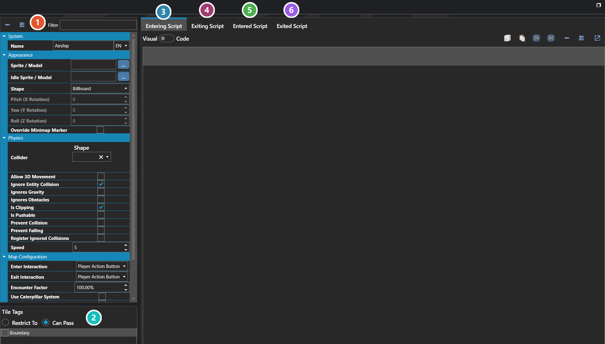

# Vehicles

*Источник: https://docs.rpg-architect.com/06-database/03-maps/05-vehicles/*

---

# Vehicles

## **Vehicles**[¶](#vehicles "Permanent link")

Vehicles are rideable transports that the party can mount to change how they traverse a map — boats that cross water, airships that fly over obstacles, horses that move faster, mine carts that follow rails, and any other transport the project needs. A vehicle defines its own appearance, movement speed, collision rules, encounter behavior, and the scripts that run as the player enters and exits it.

While riding a vehicle, the party uses the vehicle's traversal rules instead of its own — a boat can cross water tiles a hero cannot walk on, an airship can ignore collision and obstacles entirely, and a fast horse can override the base movement speed. The vehicle can also force its own music while in use, and can be configured to allow or restrict which Tile Tags it can pass over.

###  Properties[¶](#properties "Permanent link")

The vehicle's own fields — its sprite or model and shape, its collider and movement flags, its speed, and how the party boards and leaves it. Every one of them is listed under **Properties** further down this page.

###  Tile Tags[¶](#tile-tags "Permanent link")

Which tiles the vehicle may travel over. **Restrict To** limits it to tiles carrying these tags; **Can Pass** instead adds them to what it can already cross — which is how an airship clears terrain a boat cannot.

###  Entering Script[¶](#entering-script "Permanent link")

Runs as the party begins boarding, before it is aboard — see [Script Editor](../../../04-editor/script-editor/).

###  Exiting Script[¶](#exiting-script "Permanent link")

Runs as the party begins leaving, while still aboard.

###  Entered Script[¶](#entered-script "Permanent link")

Runs once the party is aboard and in control of the vehicle.

###  Exited Script[¶](#exited-script "Permanent link")

Runs once the party is off and back on foot.

> **Note**: Vehicles run a four-stage script lifecycle when the player enters or exits one — Before Enter, After Enter, Before Exit, and After Exit — which is how mounting animations, dialogue, transition effects, or eligibility checks are typically built around the actual mount and dismount.

## **Properties**[¶](#properties_1 "Permanent link")

#### **System**[¶](#system "Permanent link")

Name

Explanation

Type

Collider Points

The relative X, Y, Z coordinates of the vehicle collider. Values are measured in tiles.

Vector

Entered Script

The script that is executed after entry.

[Script](../../../05-reference/script/)

Entering Script

The script that is executed before entry.

[Script](../../../05-reference/script/)

Exited Script

The script that is executed after exit.

[Script](../../../05-reference/script/)

Exiting Script

The script that is executed before exit.

[Script](../../../05-reference/script/)

Is Tile Tag Restrictive

Whether tile tags are restricted to the selected tile tags or if they are added to, per normal.

Toggle

Name

The name of the vehicle.

String

Never Sleeps

Whether the vehicle never sleeps.

Toggle

Rotation

The rotation to apply to the vehicle.

Vector

Tile Tags

The tile tags that are traversable by the vehicle.

[Tile Tag](../02-tile-tags/)

#### **Appearance**[¶](#appearance "Permanent link")

Name

Explanation

Type

Idle Sprite / Model

The sprite or model of the vehicle on maps when it is not being ridden.

[Sprite or Model](../../../05-reference/sprite-or-model/)

Shape

The shape of the vehicle in 3D.

[Sprite Shape](../../../05-reference/sprite-format/)

Sprite / Model

The sprite or model of the vehicle on maps when in use.

[Sprite or Model](../../../05-reference/sprite-or-model/)

#### **Audio**[¶](#audio "Permanent link")

Name

Explanation

Type

Custom Music

The custom music while riding the vehicle.

[Music](../../../05-reference/music/)

Use Custom Music

Whether to use custom music while riding the vehicle.

Toggle

#### **Map Configuration**[¶](#map-configuration "Permanent link")

Name

Explanation

Type

Character Riding Animation

The animation to apply to the character when riding the vehicle.

[Character Animation](../../00-characters/10-character-animations/)

Encounter Factor

The factor applied to encounter steps.

Number

Enter Interaction

The interaction to trigger entering the vehicle.

[Interaction](../../../05-reference/interaction/)

Exit Interaction

The interaction to trigger exiting the vehicle.

[Interaction](../../../05-reference/interaction/)

Is Character Visible

Whether the character is visible on the vehicle.

Toggle

Use Caterpillar System

Whether the vehicle is setup for each character in the party.

Toggle

#### **Physics**[¶](#physics "Permanent link")

Name

Explanation

Type

Allow 3D Movement

Whether to allow movement along the Y-plane in 3D.

Toggle

Collider

The settings for the dimensions of the vehicle collider. Values are measured in tiles.

[Collider](../../../05-reference/collider/)

Ignore Entity Collision

Whether to ignore collision between other entities.

Toggle

Ignores Gravity

Whether the vehicle ignores the effects of gravity.

Toggle

Ignores Obstacles

Whether the vehicle ignores terrain obstacles.

Toggle

Is Clipping

Whether the vehicle operates independently of physics.

Toggle

Is Pushable

Whether the vehicle can be pushed.

Toggle

Prevent Collision

Whether the vehicle tries to avoid occupying the same tile as another vehicle.

Toggle

Prevent Falling

Whether the vehicle tries to avoid falling.

Toggle

Register Ignored Collisions

Whether to register collisions even when ignored.

Toggle

Speed

The speed multiplier of the vehicle.

Number

## **See Also**[¶](#see-also "Permanent link")

*   [Collider Editor](../../../04-editor/collider-editor/)