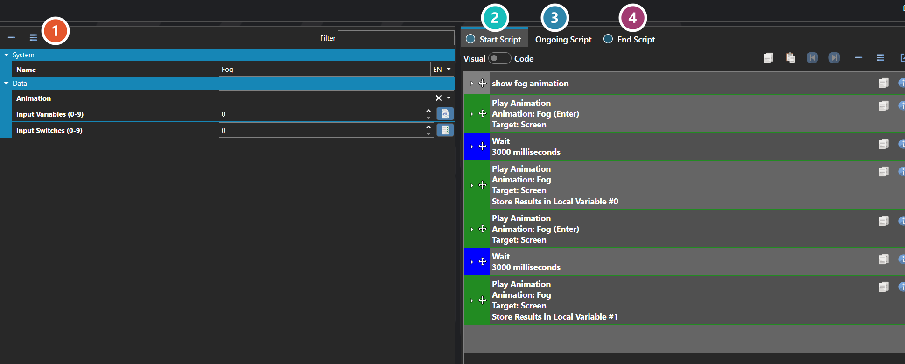

# Weather

*Источник: https://docs.rpg-architect.com/06-database/03-maps/06-weather/*

---

# Weather

## **Weather**[¶](#weather "Permanent link")

Weather effects are reusable, script-driven environmental overlays that play on top of a map — rain, snow, fog, sandstorms, falling leaves, ash, magical auras, and any other ongoing visual effect that should affect the entire scene. A weather effect bundles together a screen animation, the scripts that run when it starts, persists, and ends, and a set of input switches and variables that let the same effect be parameterized at runtime.

Weather is fully script-driven, which means a single Weather definition can produce many different in-game variants by passing different inputs — a "Rain" weather effect, for example, can be light or heavy, with or without lightning, depending on the switches and variables it is started with.

###  Properties[¶](#properties "Permanent link")

The weather effect's own fields — the screen animation it plays, and the input switches and variables that let one definition be reused for several in-game variants. Every one of them is listed under **Properties** further down this page.

###  Start Script[¶](#start-script "Permanent link")

Runs once when the weather begins — see [Script Editor](../../../04-editor/script-editor/).

###  Ongoing Script[¶](#ongoing-script "Permanent link")

Runs repeatedly while the weather persists, and is where the effect itself is driven.

###  End Script[¶](#end-script "Permanent link")

Runs once as the weather stops, for anything that needs clearing up.

> **Note**: The Enter Script runs once when the weather begins, the Ongoing Script runs continuously while it is active, and the Exit Script runs once as it ends. Use Enter and Exit for one-shot setup and teardown — fading in or out, playing a thunderclap, applying a screen tint — and Ongoing for the looping or per-frame logic that drives the effect itself.

## **Properties**[¶](#properties_1 "Permanent link")

#### **System**[¶](#system "Permanent link")

Name

Explanation

Type

Enter Script

The script to execute when the weather is started.

[Script](../../../05-reference/script/)

Exit Script

The script to execute when the weather ends.

[Script](../../../05-reference/script/)

Locals

The local data that is used in parameters.

[Local and Global Data](../../../05-reference/local-and-global-data/)

Name

The name of the weather effect.

String

Ongoing Script

The script to execute while the weather persists.

[Script](../../../05-reference/script/)

#### **Data**[¶](#data "Permanent link")

Name

Explanation

Type

Animation

The animation to use on the screen for the weather effect.

[Animation](../../08-animations/00-animations/)

Input Switches (0-9)

The input switches for the weather effect.

Number

Input Variables (0-9)

The input variables for the weather effect.

Number