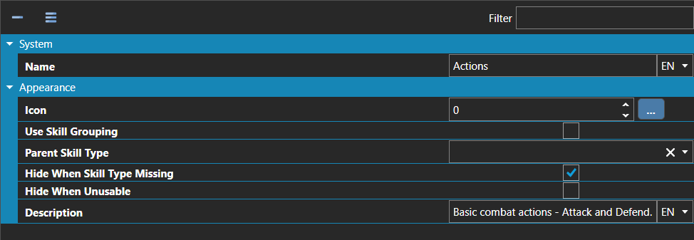

# Skill Types

*Источник: https://docs.rpg-architect.com/06-database/01-skills/02-skill-types/*

---

# Skill Types

## **Skill Types**[¶](#skill-types "Permanent link")

Skill Types are the categories that organize skills into groups for battle menus, character access, and visibility rules. Every skill belongs to exactly one type, and a character can only use skills whose type appears in its allowed Skill Types list — making types the primary tool for restricting which abilities each character has access to.

Skill Types can also be nested into a parent type, which is how the battle menu builds hierarchies like "Magic → Fire / Ice / Lightning" or "Special → Limit Breaks / Combos". Each type can be configured to hide its skills when the user lacks the type entirely, hide individual skills when they cannot be used, and group its skills under a sub-category in the battle command menu.

## **Properties**[¶](#properties "Permanent link")

#### **System**[¶](#system "Permanent link")

Name

Explanation

Type

Name

The name of the skill type.

String

#### **Appearance**[¶](#appearance "Permanent link")

Name

Explanation

Type

Description

The description of the skill type.

String

Hide When Skill Type Missing

When enabled, the entire skill type is hidden from the battle menu if the user does not have the type in its allowed Skill Types list.

Toggle

Hide When Unusable

When enabled, skills of this type are hidden from the menu when they cannot currently be used, instead of being shown grayed out.

Toggle

Icon

The icon associated with the skill type.

Icon

Parent Skill Type

The parent skill type this type nests under in the battle menu.

[Skill Type](./)

Use Skill Grouping

When enabled, skills of this type are presented as a sub-category in the battle menu.

Toggle