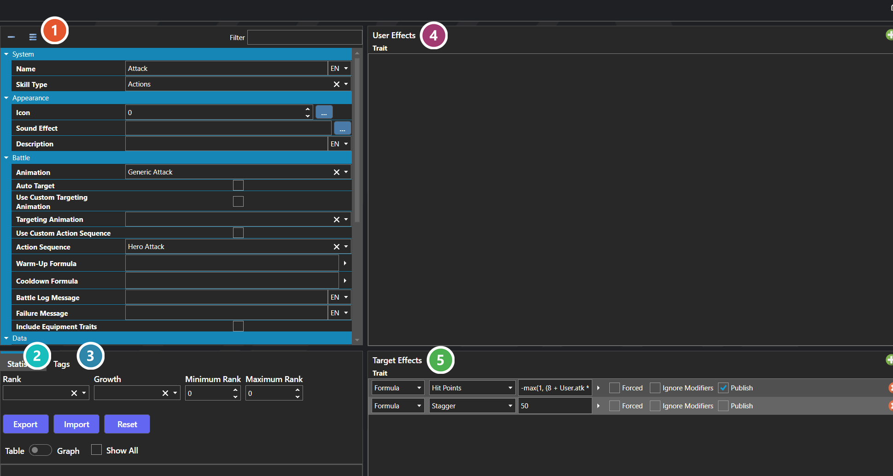

# Skills

*Источник: https://docs.rpg-architect.com/06-database/01-skills/01-skills/*

---

# Skills

## **Skills**[¶](#skills "Permanent link")

Skills are the active abilities that characters and enemies can use in battle and from the menu — attacks, spells, special techniques, item-use commands, escape attempts, and any other ability that runs when a battler chooses it. A skill defines what happens when it is used, who it can target, what it costs the user, and what visuals and animations play during execution.

When used, a skill applies its effects through two separate tables: a User Effect Table that affects the battler performing the skill (paying costs, applying buffs, triggering self-effects), and a Target Effect Table that affects whoever the skill is aimed at. A skill can additionally invoke a global script for fully custom logic that the standard effect tables do not cover.

###  Properties[¶](#properties "Permanent link")

The skill's own fields, grouped by topic — what it costs, who it can target, what it animates, and how it behaves in battle. Every one of them is listed under **Properties** further down this page.

###  Statistics[¶](#statistics "Permanent link")

The skill's value for each statistic at every rank — see [Statistics Table Editor](../../../04-editor/statistics-table-editor/).

###  Tags[¶](#tags "Permanent link")

Free-form labels other systems can match against — see [Tag Editor](../../../04-editor/tag-editor/).

###  User Effects[¶](#user-effects "Permanent link")

What the skill does to the battler using it — paying its cost, buffing itself, or any other self-applied effect. See [Effect Table Editor](../../../04-editor/effect-table-editor/).

###  Target Effects[¶](#target-effects "Permanent link")

What the skill does to whoever it is aimed at — damage, healing, and status effects. This is where most of a skill's behaviour lives. See [Effect Table Editor](../../../04-editor/effect-table-editor/).

> **Note**: Skills are gated to characters through Skill Types — a character can only use skills whose type appears in its allowed Skill Types list, and skills are organized into menus by their type. To grant a skill to a specific character without exposing it to everyone of that type, attach it through a Trait, a Class, or a piece of Equipment instead of relying on the type alone.
> 
> **Note**: Skills can also be configured as item-use skills, where the skill is the menu entry for using items of a particular kind, and as escape skills, which trigger the battle's escape logic when chosen instead of running their normal effects.
> 
> **Note**: The Statistics and Tags tabs are shared editors, used the same way wherever they appear — see [Statistics Table Editor](../../../04-editor/statistics-table-editor/) and [Tag Editor](../../../04-editor/tag-editor/).

## **Properties**[¶](#properties_1 "Permanent link")

#### **System**[¶](#system "Permanent link")

Name

Explanation

Type

Name

The name of the skill.

String

Skill Type

The category this skill belongs to. A skill always belongs to exactly one type.

[Skill Type](../02-skill-types/)

Statistics Table

The statistics table for the skill.

[Statistics Table](../../../05-reference/statistics-table/)

Tags

The tags for the skill.

[Tags](../../../05-reference/tags/)

Target Effect Table

The effects the skill applies to whoever it is aimed at, such as damage, healing, and status effects.

[Trait Effect Table](../../../05-reference/trait-effect-table/)

Unique ID

The unique identifier for the skill.

[Unique ID](../../../05-reference/unique-id/)

User Effect Table

The effects the skill applies to the battler performing it, such as costs, self-buffs, or reactive effects.

[Trait Effect Table](../../../05-reference/trait-effect-table/)

#### **Appearance**[¶](#appearance "Permanent link")

Name

Explanation

Type

Description

The description of the skill.

String

Icon

The icon associated with the skill.

Icon

Sound Effect

The sound effect played during non-battle uses of the skill.

[Sound Effect](../../../05-reference/sound-effect/)

#### **Battle**[¶](#battle "Permanent link")

Name

Explanation

Type

Action Sequence

The custom action sequence to use with the skill.

[Action Sequence](../../07-battles/08-action-sequences/)

Animation

The animation to use with the skill.

[Animation](../../08-animations/00-animations/)

Auto Target

Whether the skill automatically selects a target.

Toggle

Battle Log Message

The message that shows in the battle log.

String

Cooldown Formula

The cooldown formula for the skill.

[Formula](../../../05-reference/formulas/)

Failure Message

The message that shows when the skill fails.

String

Include Equipment Traits

Whether to include equipment traits/effects during skill use.

Toggle

Targeting Animation

The custom targeting animation to use with the skill.

[Animation](../../08-animations/00-animations/)

Use Custom Action Sequence

When enabled, the skill plays a specific Action Sequence in battle instead of the default sequence for its skill type.

Toggle

Use Custom Targeting Animation

Whether to use a custom targeting animation.

Toggle

Warm-Up Formula

The warm-up formula for the skill.

[Formula](../../../05-reference/formulas/)

#### **Data**[¶](#data "Permanent link")

Name

Explanation

Type

Ignore User Costs

Whether the skill can be used regardless of user costs.

Toggle

Is Used in Battle

Whether the skill can be used in a battle.

Toggle

Is Used in Menu

Whether the skill can be used in a menu.

Toggle

Minimum Rank to Use

The minimum rank required to use the skill.

Number

Requires User Cost

Requires the user cost to register some change to use.

Toggle

Single Success Roll

When enabled, the success formula is evaluated once and the result is applied to all targets uniformly.

Toggle

Success Formula

The success formula to use the skill.

[Formula](../../../05-reference/formulas/)

Use Scope

Who the skill is allowed to target when used.

[Use Scope](#use-scope)

#### **Escape**[¶](#escape "Permanent link")

Name

Explanation

Type

Is Escape

When enabled, choosing this skill in battle triggers the battle's escape logic instead of running the skill's normal effects. The skill's animation, action sequence, and costs still apply.

Toggle

#### **Global Script**[¶](#global-script "Permanent link")

Name

Explanation

Type

Is Global Script

Whether to execute a script during the skill use.

Toggle

Script

The script to execute when the skill is used.

[Script](../../../05-reference/script/)

#### **Item Use**[¶](#item-use "Permanent link")

Name

Explanation

Type

Is Item Use

When enabled, this skill becomes the menu entry for using items rather than running its own effects.

Toggle

Item Filter Groups

The filters that restrict which items this skill can be used with when Is Item Use is enabled.

[Filter](../../../05-reference/filter/)

#### **[Use Scope](#use-scope)**[¶](#use-scope "Permanent link")

Name

Explanation

None

User

Ally

Random Ally

User and Allies

Enemy

Random Enemy

All Enemies

Everyone

Anyone

Random