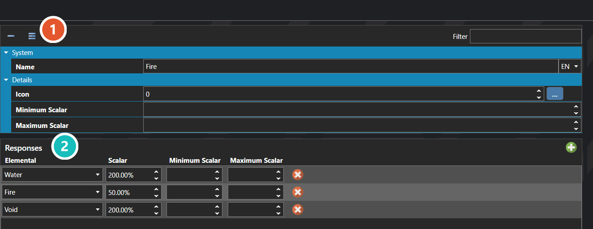

# Elementals

*Источник: https://docs.rpg-architect.com/06-database/05-statistics/02-elementals/*

---

# Elementals

## **Elementals**[¶](#elementals "Permanent link")

Elementals are the affinities and damage types that participate in damage and effect calculations — fire, ice, lightning, holy, dark, physical, or any other axis the project needs. Each elemental defines its name, its display icon, the scalar range it can reach, and a set of Responses that describe how it interacts with other elementals.

When a skill, item, or attack carries an elemental, the targets' Responses for that elemental determine the resulting multiplier — letting a fire-attuned target take double damage from fire, half damage from ice, or absorb water entirely. Responses are how weakness, resistance, immunity, and absorption are all expressed through the same uniform system.

###  Properties[¶](#properties "Permanent link")

The elemental's own fields. Every one of them is listed under **Properties** further down this page.

###  Responses[¶](#responses "Permanent link")

How each target responds to this element — the row that decides whether a hit is resisted, absorbed, or amplified.

> **Note**: An Elemental's Response list is read against the elementals carried by an incoming effect, not its own. For a fire enemy that is weak to ice, the Responses live on the fire elemental and reference ice as the trigger — the response describes "what happens to me when I am hit by ice", not the other way around.

## **Properties**[¶](#properties_1 "Permanent link")

#### **System**[¶](#system "Permanent link")

Name

Explanation

Type

Name

The display name of the elemental, shown in menus and battle text.

String

Responses

The response rules that define how this elemental reacts when hit by other elementals.

[Elemental Response](#elemental-response)

#### **Details**[¶](#details "Permanent link")

Name

Explanation

Type

Icon

The icon displayed next to the elemental in menus and battle results.

Icon

Maximum Scalar

The maximum scalar value this elemental can reach in damage and effect calculations.

Number

Minimum Scalar

The minimum scalar value this elemental can reach in damage and effect calculations.

Number

## **Elemental Response**[¶](#elemental-response "Permanent link")

## **Properties**[¶](#properties_2 "Permanent link")

#### **System**[¶](#system_1 "Permanent link")

Name

Explanation

Type

Elemental

The elemental that triggers this response when applied.

Number

Maximum Value

The highest value the response scalar can reach, capping the multiplier.

Number

Minimum Value

The lowest value the response scalar can reach, setting a floor on the multiplier.

Number

Scalar

The multiplier applied to damage or effects when this response triggers.

Number