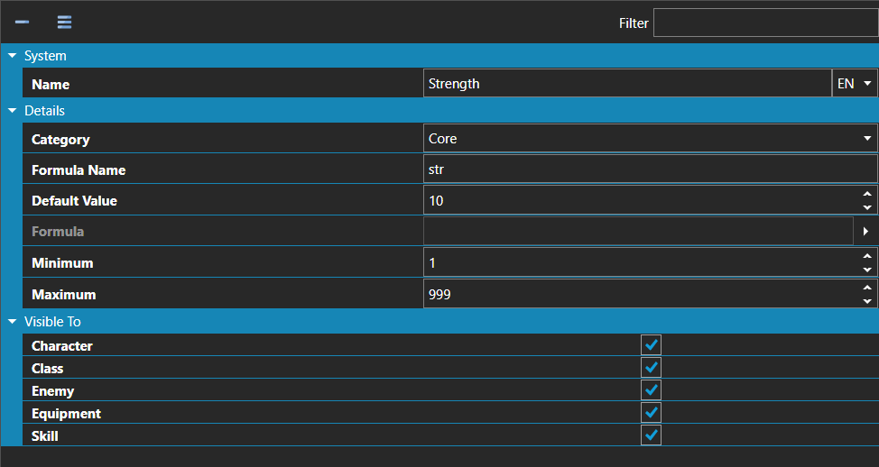

# Statistics

*Источник: https://docs.rpg-architect.com/06-database/05-statistics/01-statistics/*

---

# Statistics

## **Statistics**[¶](#statistics "Permanent link")

Statistics are the numerical attributes that drive every calculation in the game — health, attack, defense, agility, magic, level, experience, and any custom value the project needs. Each statistic defines its name, its allowed range, its starting value, and the category that controls how the engine treats it.

The Category determines how a statistic behaves at runtime: Core values are inherent attributes used in formulas; Rank values represent levels; Growth values accumulate without bound, like experience; Store values are paired against an automatically generated maximum, like hit points stored against max HP; and Calculated values are derived on the fly from a formula that references other statistics.

> **Note**: Statistics are referenced by their Formula Name in every formula, calculated statistic, and script that needs to read or write them. Choose short, lowercase, stable names — renaming a Formula Name after content has shipped requires updating every formula that references it.
> 
> **Note**: Store statistics automatically generate a paired maximum with a max\_ prefix (for example, hp creates max\_hp), and Growth statistics generate min\_, max\_, and next\_ companions for tracking thresholds. These companion statistics do not need to be created by hand and exist alongside the original.

## **Properties**[¶](#properties "Permanent link")

#### **System**[¶](#system "Permanent link")

Name

Explanation

Type

Name

The display name of the statistic, shown in menus and interface elements.

String

#### **Details**[¶](#details "Permanent link")

Name

Explanation

Type

Category

Controls how the engine treats this statistic at runtime — Core, Rank, Growth, Store, or Calculated.

[Statistic Category Type](#statistic-category-type)

Default Value

The starting value of the statistic before any modifiers or growth apply.

Number

Formula

For Calculated statistics only. The expression used to derive this statistic's value from other statistics, by Formula Name.

[Formula](../../../05-reference/formulas/)

Formula Name

The short, lowercase identifier used to reference this statistic in formulas, calculated statistics, and scripts.

String

Maximum

The maximum value of the statistic.

Number

Minimum

The lowest value this statistic can reach.

Number

#### **[Statistic Category Type](#statistic-category-type)**[¶](#statistic-category-type "Permanent link")

Name

Explanation

Core

A core or inherent value used primarily for calculations, such as Strength, Agility, or Wisdom.

Rank

A ranking or level value, such as Level or Class Level.

Growth

An endlessly accumulating value, such as Experience or Skill Points.

Store

A value stored against a maximum. Automatically generates a corresponding maximum statistic with a "max\_" prefix (e.g. "hp" creates "max\_hp").

Calculated

A derived value computed from a formula referencing other statistics. The value changes only when the formula components are adjusted.