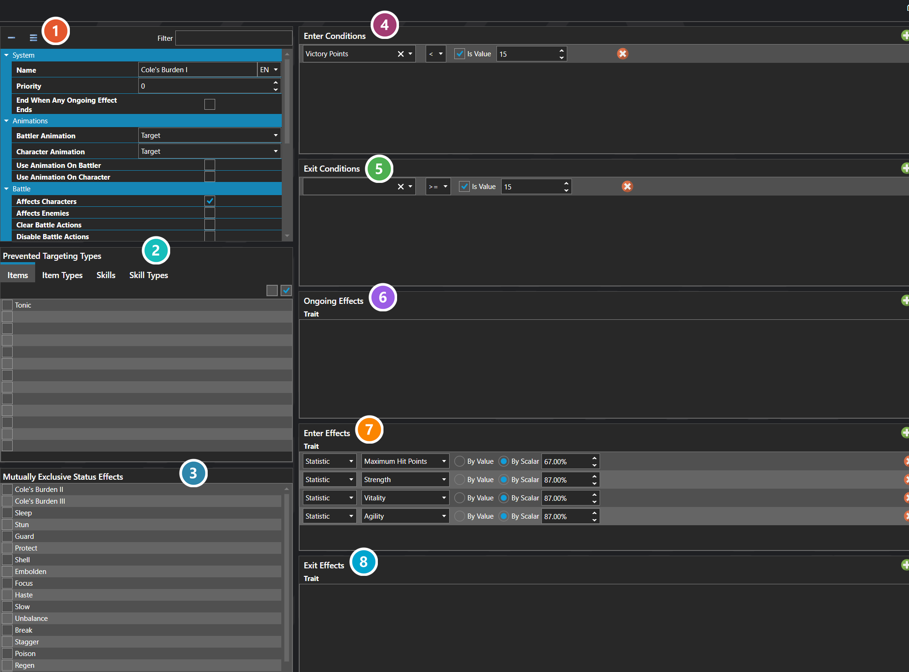

# Status Effects

*Источник: https://docs.rpg-architect.com/06-database/05-statistics/03-status-effects/*

---

# Status Effects

## **Status Effects**[¶](#status-effects "Permanent link")

Status Effects are the named conditions that can be applied to a character, enemy, or any other battler — poison, sleep, KO, haste, regen, silence, and any other temporary or persistent state the project needs. Each status effect bundles together its enter, ongoing, and exit effects, the visual poses and animations it forces while active, and the rules that govern how it interacts with other effects, items, and skills.

A status effect can be applied directly through a trait effect, or applied automatically when its Enter Conditions are met after a battler's state changes. While active, it runs its Ongoing Effect Table each turn, can force custom battle, character, and portrait poses on the affected battler, and can block targeting or actions entirely.

###  Properties[¶](#properties "Permanent link")

The status effect's own fields — how long it lasts, what it blocks, the poses it forces, and its priority. Every one of them is listed under **Properties** further down this page.

###  Prevented Targeting Types[¶](#prevented-targeting-types "Permanent link")

Items, item types, skills, and skill types that cannot target a battler while this status effect is on them. Unlike mutually exclusive _effects_ below, these block the ability outright rather than replacing anything.

###  Mutually Exclusive Effects[¶](#mutually-exclusive-effects "Permanent link")

Other status effects that cannot coexist with this one. When both would apply, the higher **Priority** wins and replaces the lower.

###  Enter Conditions[¶](#enter-conditions "Permanent link")

Tested whenever a battler's state changes; when they pass, the status effect applies itself automatically. Leave them empty and the effect only ever arrives by being applied directly.

###  Exit Conditions[¶](#exit-conditions "Permanent link")

Tested the same way, but to remove the effect — so a status can clear itself once whatever caused it no longer holds.

###  Ongoing Effects[¶](#ongoing-effects "Permanent link")

What the effect does repeatedly while it is active — the poison tick, the regen heal. This is the only effect table with an **Occurrence** column, which sets how often it fires. See [Effect Table Editor](../../../04-editor/effect-table-editor/).

###  Enter Effects[¶](#enter-effects "Permanent link")

What happens once, at the moment the status effect is applied. See [Effect Table Editor](../../../04-editor/effect-table-editor/).

###  Exit Effects[¶](#exit-effects "Permanent link")

What happens once, as the status effect is removed. See [Effect Table Editor](../../../04-editor/effect-table-editor/).

> **Note**: Status effects use a Priority value to resolve conflicts. When two effects are mutually exclusive — listed in each other's Mutually Exclusive Effects — the one with the higher priority replaces the lower. Mutually Exclusive Items, Item Types, Skills, and Skill Types work differently and instead block those abilities from targeting a battler that has the status effect at all.
> 
> **Note**: Enter Conditions are checked automatically after actions and state changes, which is how passive status effects like KO-on-zero-HP are built without requiring an explicit script to apply them.

## **Properties**[¶](#properties_1 "Permanent link")

#### **System**[¶](#system "Permanent link")

Name

Explanation

Type

End When Any Ongoing Effect Ends

Whether to end the status effect when any of its ongoing trait effects finish.

Toggle

Enter Condition Table

The conditions checked automatically after actions to determine if this status effect should be applied.

[Statistic Condition](#statistic-condition)

Enter Effect Table

The effects to apply when entering the status effect.

[Trait Effect Table](../../../05-reference/trait-effect-table/)

Exit Condition Table

The conditions re-evaluated against the battler's live statistics to determine when this status effect should be removed. While the effect is present, it is removed as soon as every condition is met.

[Statistic Condition](#statistic-condition)

Exit Effect Table

The effects to apply when exiting the status effect.

[Trait Effect Table](../../../05-reference/trait-effect-table/)

Mutually Exclusive Item Types

The item types that are prevented from targeting a battler with this status effect.

[Item Type](../../02-items/20-item-types/)

Mutually Exclusive Items

The items that are prevented from targeting a battler with this status effect.

[Item](../../02-items/01-items/)

Mutually Exclusive Skill Types

The skill types that are prevented from targeting a battler with this status effect.

[Skill Type](../../01-skills/02-skill-types/)

Mutually Exclusive Skills

The skills that are prevented from targeting a battler with this status effect.

[Skill](../../01-skills/01-skills/)

Mutually Exclusive Status Effects

The other status effects that cannot coexist with this one. The higher-priority effect replaces the lower.

[Status Effect](./)

Name

The display name of the status effect, shown in menus and battle text.

String

Ongoing Effect Table

The effects applied each turn while the status effect is active.

[Trait Effect Table](../../../05-reference/trait-effect-table/)

Priority

The priority of the status effect. Higher priority replaces lower when mutually exclusive effects conflict.

Number

#### **Animations**[¶](#animations "Permanent link")

Name

Explanation

Type

Battler Animation

The ongoing animation played on the battler in battle when enabled.

[Animation](../../08-animations/00-animations/)

Character Animation

The ongoing animation played on the character on maps when enabled.

[Animation](../../08-animations/00-animations/)

Use Animation On Battler

Whether to play an ongoing animation on the battler in battle.

Toggle

Use Animation On Character

Whether to play an ongoing animation on the character on maps.

Toggle

#### **Battle**[¶](#battle "Permanent link")

Name

Explanation

Type

Affects Characters

Whether the status effect can be applied to player characters.

Toggle

Affects Enemies

Whether the status effect can be applied to enemies.

Toggle

Clear Battle Actions

Whether to remove any scheduled battle actions when the status effect is applied.

Toggle

Disable Battle Actions

Whether to prevent scheduled and new battle actions while the status effect is active.

Toggle

Disable Battle Counter Growth

Whether to freeze the battle counter, preventing turns from advancing.

Toggle

Enter Battle Log Message

The message displayed in the battle log when the status effect is applied.

String

Exit Battle Log Message

The message displayed in the battle log when the status effect is removed.

String

Grant Rewards

Whether to grant battle rewards when an enemy is removed from battle by this status effect.

Toggle

Prevent Rewards

Whether to prevent the affected hero from receiving rewards after battle.

Toggle

Remove After Battle

Whether the status effect is automatically removed when battle ends.

Toggle

Remove Character From Battle

Whether to remove the character from battle when this status effect is applied.

Toggle

Remove Enemy From Battle

Whether to remove the enemy from battle when this status effect is applied.

Toggle

#### **Poses**[¶](#poses "Permanent link")

Name

Explanation

Type

Battle Pose

The battle pose to use on the battler when enabled.

[Battle Pose](../../07-battles/10-battle-poses/)

Character Pose

The character pose to use on maps when enabled.

[Character Animation](../../00-characters/10-character-animations/)

Portrait Expression

The portrait expression to display when enabled.

[Portrait Expression](../../00-characters/11-portrait-expressions/)

Use Custom Battle Pose

Whether to use a custom battle pose while the status effect is active.

Toggle

Use Custom Character Animation

Whether to use a custom character animation on maps while the status effect is active.

Toggle

Use Custom Portrait Pose

Whether to use a custom portrait expression while the status effect is active.

Toggle

## **Statistic Condition**[¶](#statistic-condition "Permanent link")

A condition that evaluates a statistic formula against a target value using a comparison operand.

## **Properties**[¶](#properties_2 "Permanent link")

#### **System**[¶](#system_1 "Permanent link")

Name

Explanation

Type

Floating Point Value

The floating point value to compare the statistic against.

Number

Formula Name

The name of the statistic formula to evaluate.

String

Integer Value

The whole number value to compare the statistic against.

Number

Is Integer Condition

Whether the condition compares against an integer value or a floating point value.

Toggle

Operand

The comparison operator used to evaluate the condition.

Operator