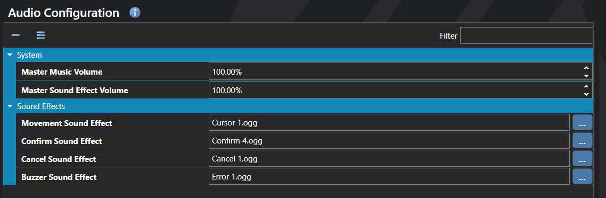

# Audio Configuration

*Источник: https://docs.rpg-architect.com/06-database/10-system/01-audio-configuration/*

---

# Audio Configuration

## **Audio Configuration**[¶](#audio-configuration "Permanent link")

Set default audio settings for the currently loaded project.

## **Properties**[¶](#properties "Permanent link")

#### **System**[¶](#system "Permanent link")

Name

Explanation

Type

Master Music Volume

The master music volume. Note: This effectively multiplies the volume of any music by the specific amount.

Number

Master Sound Effect Volume

The master sound effect volume. Note: This effectively multiplies the volume of any sound effects by the specified amount.

Number

#### **Sound Effects**[¶](#sound-effects "Permanent link")

Name

Explanation

Type

Buzzer Sound Effect

The sound to play when an invalid action occurs.

Sound Effect

Cancel Sound Effect

The sound to play when a cancellation occurs.

Sound Effect

Confirm Sound Effect

The sound to play when confirmation occurs.

Sound Effect

Movement Sound Effect

The sound to play when a cursor moves.

Sound Effect