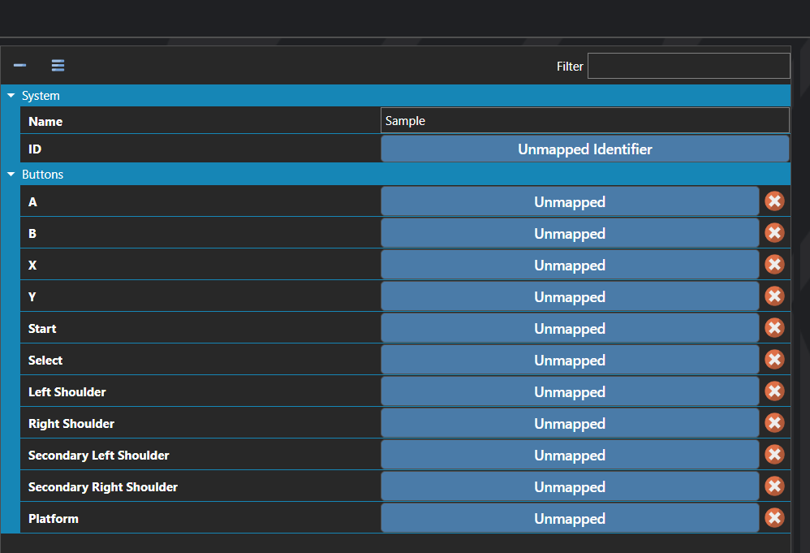

# Controllers

*Источник: https://docs.rpg-architect.com/06-database/10-system/51-controllers/*

---

# Controllers

## **Controllers**[¶](#controllers "Permanent link")

Controllers define the input mappings for gamepads and other external input devices, translating the buttons and axes of a physical device into the abstract Virtual Keys the rest of the project reacts to. Each controller bundles together a list of identifiers used to recognize devices of this type and the mapping that connects each physical button to its corresponding virtual key.

> **Note**: Controllers do not bind directly to game actions. They map the device's physical inputs to Virtual Keys, and the Virtual Keys are what actually run scripts and trigger game logic. This indirection is what allows the same in-game action to be remapped, rebound, or driven from any input source — keyboard, mouse, touch, or gamepad — without changing the scripts that respond to it.
> 
> **Note**: Most common controllers are natively supported out of the box and do not require an entry here. Only define a Controller when targeting a device that the engine does not already recognize, or when overriding the default mapping for a specific layout.

## **Properties**[¶](#properties "Permanent link")

#### **System**[¶](#system "Permanent link")

Name

Explanation

Type

Name

The name of the controller.

String