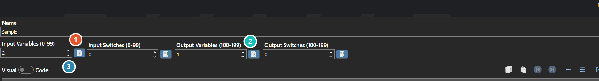

# Functions

*Источник: https://docs.rpg-architect.com/06-database/10-system/81-functions/*

---

# Functions

## **Functions**[¶](#functions "Permanent link")

Functions are reusable script routines that take input parameters and produce output values, the project's equivalent of subroutines or methods. A function bundles together a script body, a fixed number of input switches and variables that callers pass in, and a fixed number of output switches and variables that callers read back when the function returns.

Functions are how shared logic is factored out of individual scripts and reused across the game — distance calculations, formatting helpers, complex condition checks, multi-step operations — without having to copy the same commands into every script that needs them. They are called from any script, event, entity, or other function through a function-call command.

###  Input Variables / Switches[¶](#input-variables-switches "Permanent link")

How many switches and variables a caller passes in. Both use indices 0-99.

###  Output Variables / Switches[¶](#output-variables-switches "Permanent link")

How many the function writes back for the caller to read afterwards. Both use indices 100-199, so inputs and outputs never collide.

###  Script[¶](#script "Permanent link")

The body that runs when the function is called, edited with the [Script Editor](../../../04-editor/script-editor/). The Visual / Code toggle switches between the command list and its text form.

> **Note**: Functions differ from Global Scripts in that they have a defined input and output contract. Global Scripts run a fixed sequence of commands with no parameters and no return values, while Functions accept inputs and produce outputs through their declared switch and variable counts. Reach for a Function when callers need to pass data in or get data back, and a Global Script when you just need a reusable block of commands.

## **Properties**[¶](#properties "Permanent link")

#### **System**[¶](#system "Permanent link")

Name

Explanation

Type

Input Switches

The number of input switches (indices 0-99) available as parameters when calling this function.

Number

Input Variables

The number of input variables (indices 0-99) available as parameters when calling this function.

Number

Local Data

The local variables and switches used as default parameter values.

[Local and Global Data](../../../05-reference/local-and-global-data/)

Name

The name of the function.

String

Output Switches

The number of output switches (indices 100-199) written back to the caller after execution.

Number

Output Variables

The number of output variables (indices 100-199) written back to the caller after execution.

Number

Script

The script that executes when the function is called.

[Script](../../../05-reference/script/)