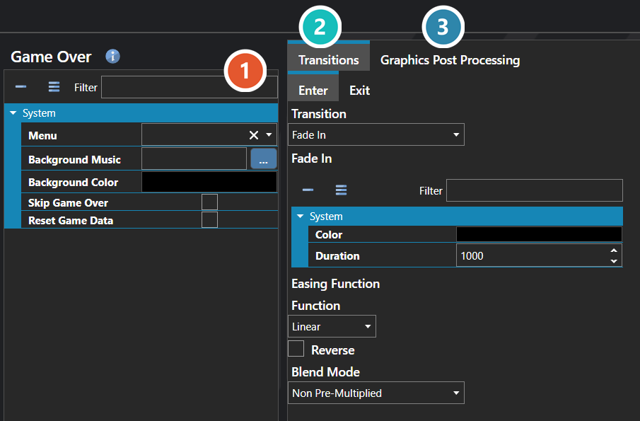

# Game Over

*Источник: https://docs.rpg-architect.com/06-database/10-system/25-game-over/*

---

# Game Over

## **Game Over**[¶](#game-over "Permanent link")

Game Over defines what happens when the party is defeated and the game ends. It controls the background visuals and music played on the game over screen, the transition effects used to enter and leave it, and the scripts that run as the player loses and the title is brought back up.

The settings here are the project-wide defaults applied to every game over event. Most projects configure these once to set the tone of failure and decide where the player is sent next — back to the title, to a continue menu, or into a custom flow.

###  Properties[¶](#properties "Permanent link")

The game over screen's own fields. Every one of them is listed under **Properties** further down this page.

###  Transitions[¶](#transitions "Permanent link")

How the screen animates in and out. Each direction is configured separately — see [Transition Editor](../../../04-editor/transition-editor/).

###  Graphics Post Processing[¶](#graphics-post-processing "Permanent link")

Effects applied over the finished frame, applied in the order listed — see [Graphics Post Processor Editor](../../../04-editor/graphics-post-processor-editor/).

## **Properties**[¶](#properties_1 "Permanent link")

#### **System**[¶](#system "Permanent link")

Name

Explanation

Type

Background Color

The background color of the scene.

Color

Background Music

The background music to play.

[Music](../../../05-reference/music/)

Enter Transition

The scene transition played when entering.

[Scene Transition](../../../05-reference/scene-transition/)

Exit Transition

The scene transition played when exiting.

[Scene Transition](../../../05-reference/scene-transition/)

Graphics Post Processors

The post-processing effects applied to the scene.

[Graphics Post Processor](../../../05-reference/graphics-post-processor/)

Menu

The user interface to use for the scene.

[User Interface](../../09-user-interfaces/00-user-interfaces/)

Reset Game Data

Whether to immediately reset all game data when the game over scene loads.

Toggle

Skip Game Over

Whether to skip the game over scene and go directly to the title screen.

Toggle

## **See Also**[¶](#see-also "Permanent link")

*   [Transition Editor](../../../04-editor/transition-editor/)
*   [Graphics Post Processor Editor](../../../04-editor/graphics-post-processor-editor/)