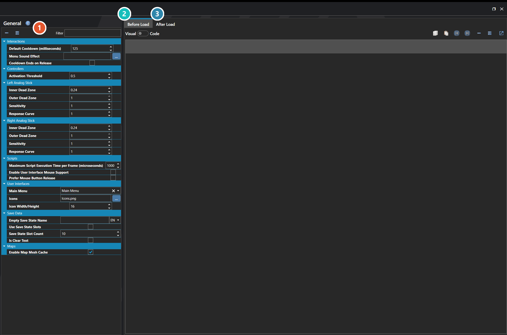
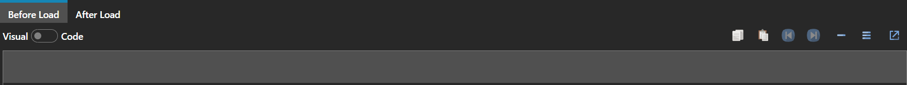
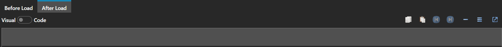

# General

*Источник: https://docs.rpg-architect.com/06-database/10-system/10-general/*

---

# General

## **General**[¶](#general "Permanent link")

General defines how the project's core game systems work across the entire game. It is the catch-all configuration for everything that does not belong to a more specific category — the icon sheet and icon dimensions, save data format and slot defaults, mouse and input behavior, the default menu UI, the lifecycle scripts that run before and after loading a save, and the global scripts that drive the engine itself.

The settings here are the project-wide defaults that apply to every play session. Most projects configure these once early in development to lock in how the game presents and persists itself.

###  Settings[¶](#settings "Permanent link")

The project-wide settings themselves, grouped into System, Interactions, Maps, Save Data, Scripts, and User Interfaces. Every one of them is listed under **Properties** further down this page, and the Filter box at the top narrows it to a matching name.

###  Before Load[¶](#before-load "Permanent link")

The script that runs _before_ a save is loaded, while the previous game state is still in place. Use it for work that has to happen against the outgoing state, or to prepare data the incoming save expects.

###  After Load[¶](#after-load "Permanent link")

The script that runs _after_ a save is loaded and the restored state is live. This is the usual place to reconcile a save with content that has changed since it was written.

## **Properties**[¶](#properties "Permanent link")

#### **System**[¶](#system "Permanent link")

Name

Explanation

Type

After Load Script

The script executed after a save state is loaded.

[Script](../../../05-reference/script/)

Before Load Script

The script executed before a save state is loaded.

[Script](../../../05-reference/script/)

#### **Interactions**[¶](#interactions "Permanent link")

Name

Explanation

Type

Cooldown Ends on Release

Whether virtual key cooldown begins when the key is released instead of when pressed.

Toggle

Default Cooldown (milliseconds)

The default virtual key cooldown in milliseconds.

Number

Menu Sound Effect

The sound to play when the main menu opens.

[Sound Effect](../../../05-reference/sound-effect/)

#### **Maps**[¶](#maps "Permanent link")

Name

Explanation

Type

Enable Map Mesh Cache

When enabled, saving a map also writes a binary mesh cache (.bin) alongside the map file. The engine uses this cache to skip tile mesh generation at load time, resulting in faster map transitions.

Toggle

#### **Save Data**[¶](#save-data "Permanent link")

Name

Explanation

Type

Empty Save State Name

The name to use on any empty save state.

String

Is Clear Text

Whether save data is stored in clear text, allowing the player to edit it manually.

Toggle

Save State Slot Count

The number of save state slots to use.

Number

Use Save State Slots

Whether to limit saves to a fixed number of save state slots.

Toggle

#### **Scripts**[¶](#scripts "Permanent link")

Name

Explanation

Type

Enable User Interface Mouse Support

Whether interface elements support mouse interaction.

Toggle

Maximum Script Execution Time per Frame (microseconds)

The maximum time in microseconds a single script will execute per frame. Acts as a throttle for long-running scripts.

Number

Prefer Mouse Button Release

Whether interface mouse interactions trigger on button release instead of button press.

Toggle

#### **User Interfaces**[¶](#user-interfaces "Permanent link")

Name

Explanation

Type

Icon Width/Height

The dimension of the cell for an individual icon.

Number

Icons

The icon sheet image used throughout the engine for items, skills, and interface elements.

[Image](../../../05-reference/image/)

Main Menu

The main menu linked to the menu virtual key.

[User Interface](../../09-user-interfaces/00-user-interfaces/)