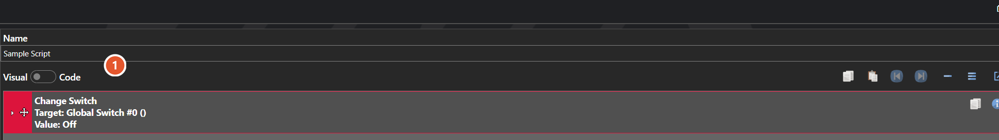

# Global Scripts

*Источник: https://docs.rpg-architect.com/06-database/10-system/80-global-scripts/*

---

# Global Scripts

## **Global Scripts**[¶](#global-scripts "Permanent link")

Global Scripts are reusable sequences of commands that can be called from any event, entity, item, skill, or other script in the project. Each global script is a named, standalone script body with no inputs or outputs — calling one runs its commands as if they were inlined into the caller's script at that point.

Global Scripts are how shared, parameterless logic is factored out and reused across the game — common transitions, recurring cutscenes, standard reward sequences, save-point routines — without having to duplicate the same commands wherever they are needed.

###  Script[¶](#script "Permanent link")

The commands the script runs, edited with [Script Editor](../../../04-editor/script-editor/). A global script takes no parameters and returns nothing — reach for a [Function](../81-functions/) when callers need to pass data in or read a result back.

> **Note**: Global Scripts differ from Functions in that they have no input or output contract. They are the right choice when callers do not need to pass data in or receive data back; for any reusable logic that does need parameters or return values, use a Function instead.

## **Properties**[¶](#properties "Permanent link")

#### **System**[¶](#system "Permanent link")

Name

Explanation

Type

Commands

The commands to execute when the script runs.

Name

The name of the script.

String