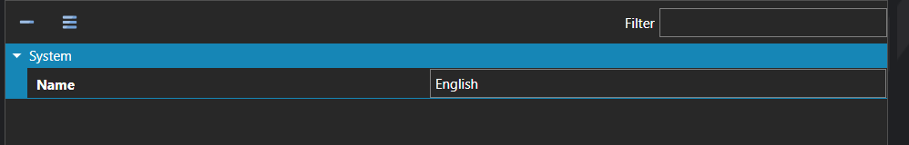

# Localizations

*Источник: https://docs.rpg-architect.com/06-database/10-system/11-localizations/*

---

# Localizations

## **Localizations**[¶](#localizations "Permanent link")

Localizations are the languages the project supports for translating in-game text. Each localization defines a single language by name; the actual translated strings live on the localizable fields throughout the project (item names, dialogue, UI text, and so on), with one entry per defined localization.

Adding a localization here makes it available everywhere in the editor that text is authored, and at runtime players can switch between any of the defined localizations to read the game in their language of choice.

> **Note**: Localizations are not limited to text. Audio assets that support localization can also be authored per language, which is how voiced dialogue, narration, and other localized sound is delivered alongside the translated strings.

## **Properties**[¶](#properties "Permanent link")

#### **System**[¶](#system "Permanent link")

Name

Explanation

Type

Name

The name of the localization.

String