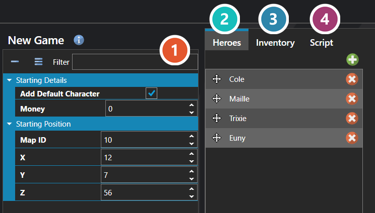

# New Game

*Источник: https://docs.rpg-architect.com/06-database/10-system/21-new-game/*

---

# New Game

## **New Game**[¶](#new-game "Permanent link")

New Game defines what happens when the player starts a fresh game. It controls the starting map and position the party arrives on, the initial party composition and inventory, the starting variables and switches, and the initialization script that runs before the player takes control.

The settings here are the project-wide defaults applied to every new game. Most projects configure these once when bootstrapping the game's opening — anything more dynamic is typically handled in the New Game initialization script rather than baked in here.

###  Properties[¶](#properties "Permanent link")

The new game screen's own fields. Every one of them is listed under **Properties** further down this page.

###  Heroes[¶](#heroes "Permanent link")

The party the game begins with — who is in it, and what they are already carrying, taught and classed. See [Party Editor](../../../04-editor/party-editor/).

###  Inventory[¶](#inventory "Permanent link")

What that party is carrying at the start — items and equipment, with a quantity each. Same editor as Heroes — see [Party Editor](../../../04-editor/party-editor/).

###  Script[¶](#script "Permanent link")

Runs once as a new game begins — see [Script Editor](../../../04-editor/script-editor/).

## **Properties**[¶](#properties_1 "Permanent link")

#### **System**[¶](#system "Permanent link")

Name

Explanation

Type

Loading Screen

The user interface displayed during loading.

[User Interface](../../09-user-interfaces/00-user-interfaces/)

Start Map Position

The starting position on the map.

Vector

#### **Starting Details**[¶](#starting-details "Permanent link")

Name

Explanation

Type

Add Default Character

Adds a default character in the database if no party is defined.

Toggle

Money

The starting money of the party.

Number

#### **Starting Position**[¶](#starting-position "Permanent link")

Name

Explanation

Type

Map ID

The starting map ID.

[Map](../../../05-reference/map/)