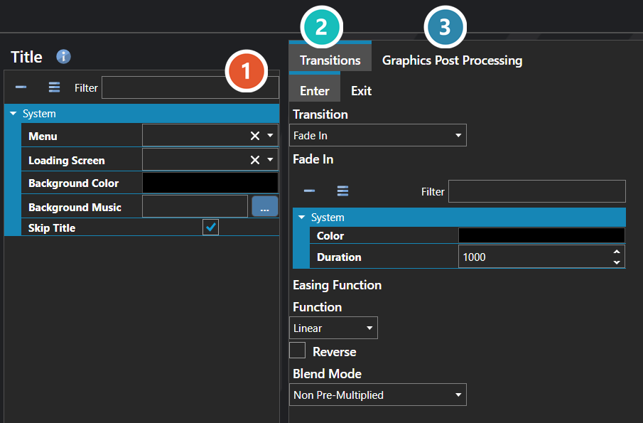

# Title

*Источник: https://docs.rpg-architect.com/06-database/10-system/20-title/*

---

# Title

## **Title**[¶](#title "Permanent link")

Title defines the project's title screen — the first thing the player sees when launching the game. It controls the background visuals and music, the menu UI displayed over them, the transition effects used to enter and leave the title, and the scripts that run as the title comes up and is dismissed.

The settings here are configured once early in development to lock in the first impression the game makes when it starts up.

###  Properties[¶](#properties "Permanent link")

The title screen's own fields. Every one of them is listed under **Properties** further down this page.

###  Transitions[¶](#transitions "Permanent link")

How the screen animates in and out. Each direction is configured separately — see [Transition Editor](../../../04-editor/transition-editor/).

###  Graphics Post Processing[¶](#graphics-post-processing "Permanent link")

Effects applied over the finished frame, applied in the order listed — see [Graphics Post Processor Editor](../../../04-editor/graphics-post-processor-editor/).

> **Note**: The title screen is not mandatory — enabling Skip Title bypasses it entirely and drops the player straight into a new game, which is useful for projects that want to launch directly into a custom intro. A title can also be used to stage a pre-menu sequence by having the title's flow transition into a temporary map first, allowing a cinematic, intro scene, or animated logo to play out before the actual menu appears.

## **Properties**[¶](#properties_1 "Permanent link")

#### **System**[¶](#system "Permanent link")

Name

Explanation

Type

Background Color

The background color of the scene.

Color

Background Music

The background music to play.

[Music](../../../05-reference/music/)

Enter Transition

The scene transition played when entering.

[Scene Transition](../../../05-reference/scene-transition/)

Exit Transition

The scene transition played when exiting.

[Scene Transition](../../../05-reference/scene-transition/)

Graphics Post Processors

The post-processing effects applied to the scene.

[Graphics Post Processor](../../../05-reference/graphics-post-processor/)

Loading Screen

The user interface to use for the loading screen for the scene.

[User Interface](../../09-user-interfaces/00-user-interfaces/)

Menu

The user interface to use for the scene.

[User Interface](../../09-user-interfaces/00-user-interfaces/)

Skip Title

When enabled, the title screen is bypassed entirely and the game proceeds directly to starting a new game.

Toggle

## **See Also**[¶](#see-also "Permanent link")

*   [Transition Editor](../../../04-editor/transition-editor/)
*   [Graphics Post Processor Editor](../../../04-editor/graphics-post-processor-editor/)