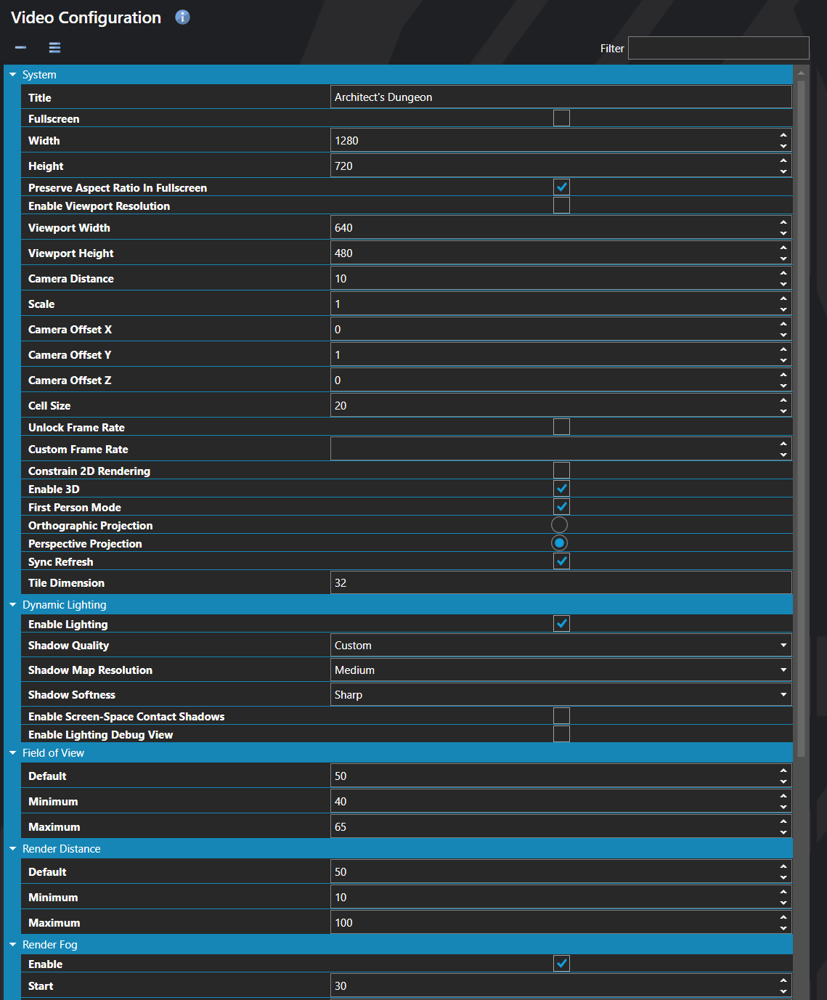

# Video Configuration

*Источник: https://docs.rpg-architect.com/06-database/10-system/00-video-configuration/*

---

# Video Configuration

## **Video Configuration**[¶](#video-configuration "Permanent link")

This section is for setting the default video settings for your currently loaded project.

**Best Practice**: When using 3D mode, it is recommended you set the rendering resolution relatively high. This prevents distortion of billboards when the game is rendered. Viewport windows can be smaller than your rendering resolution. For example, you may render your game at 1920x1080, but have the viewport be a 320x180 window.

## **Properties**[¶](#properties "Permanent link")

#### **System**[¶](#system "Permanent link")

Name

Explanation

Type

Camera Distance

The distance the camera is from its target.

Number

Cell Size

The size of each rendered cell.

Number

Constrain 2D Rendering

Whether or not to keep a 2D scene from extending beyond the map boundaries.

Toggle

Custom Frame Rate

The targeted frame rate.

Number

Enable 3D

Whether or not to render in 3D.

Toggle

Enable Viewport Resolution

Whether or not to use a resolution for the viewport independent of the internal resolution.

Toggle

First Person Mode

Whether or not to render in a first-person viewpoint within 3D.

Toggle

Fullscreen

Whether or not to render to a forced fullscreen mode.

Toggle

Height

The target resolution height, in pixels.

Number

Orthographic Projection

Whether or not to render 3D orthographically. Note: This causes all objects to render at the same unit size, regardless of the distance from the camera.

Toggle

Perspective Projection

Whether or not to render 3D from a perspective. Note: This causes objects to render at different sizes, depending of the distance from the camera.

Toggle

Scale

The scale of the rendered pixels.

Number

Sync Refresh

Whether or not to synchronize with refresh rate of a connected display.

Toggle

Tile Dimension

Tile size of the project.

Number

Title

The title of the game window.

String

Unlock Frame Rate

Whether or not to allow an unlimited frame rate.

Toggle

Viewport Height

The resolution of the viewport height, in pixels.

Number

Viewport Width

The resolution of the viewport width, in pixels.

Number

Width

The target resolution width, in pixels.

Number

#### **Dynamic Lighting**[¶](#dynamic-lighting "Permanent link")

Name

Explanation

Type

Enable Lighting

Whether or not to render positional lighting and shadows in 3D.

Toggle

Enable Lighting Debug View

Whether or not to render a lighting debug view.

Toggle

Enable Screen-Space Contact Shadows

Whether or not to apply screen-space contact shadows when using Custom shadow quality. Ignored for non-Custom presets.

Toggle

Shadow Map Resolution

The pixel dimensions of the shadow map when using Custom shadow quality. Ignored for non-Custom presets.

ShadowMapResolution

Shadow Quality

The preset for shadow rendering. Select Custom to configure resolution, softness, and contact shadows individually.

ShadowQuality

Shadow Softness

The PCF filter kernel size when using Custom shadow quality. Ignored for non-Custom presets.

ShadowSoftness

#### **Field of View**[¶](#field-of-view "Permanent link")

Name

Explanation

Type

Default

The default field of view of the camera. Default: 50

Number

Maximum

The maximum field of view of the camera. Default: 65

Number

Minimum

The minimum field of view of the camera. Default: 40

Number

#### **Render Distance**[¶](#render-distance "Permanent link")

Name

Explanation

Type

Default

The default render distance of the camera. Default: 100

Number

Maximum

The maximum render distance of the camera. Default: 100

Number

Minimum

The minimum render distance of the camera. Default: 10

Number

#### **Render Fog**[¶](#render-fog "Permanent link")

Name

Explanation

Type

Enable

Whether or not to render volumetric fog.

Toggle

End

The distance from the camera where the fog ends. Default: 50

Number

Height Fall Off

The height at which the fog ends. Default: .5

Number

Height Start

The height at which the fog begins. Default: 0

Number

Start

The distance from the camera where the fog begins. Default: 30

Number

#### **X Rotation (Pitch)**[¶](#x-rotation-pitch "Permanent link")

Name

Explanation

Type

Default

The default X value or pitch of the camera. Default: 120

Number

Maximum

The maximum X value or pitch of the camera. Default: 150

Number

Minimum

The minimum X value or pitch of the camera. Default: 95

Number

#### **Y Rotation (Yaw)**[¶](#y-rotation-yaw "Permanent link")

Name

Explanation

Type

Default

The default Y value or yaw of the camera. Default: 270

Number

Maximum

The maximum Y value or yaw of the camera. Default: 360

Number

Minimum

The minimum Y value or yaw of the camera. Default: 0

Number

#### **Z Rotation (Roll)**[¶](#z-rotation-roll "Permanent link")

Name

Explanation

Type

Default

The default Z value or roll of the camera. Default: 0

Number

Maximum

The maximum Z value or roll of the camera. Default: 360

Number

Minimum

The minimum Z value or roll of the camera. Default: 0

Number