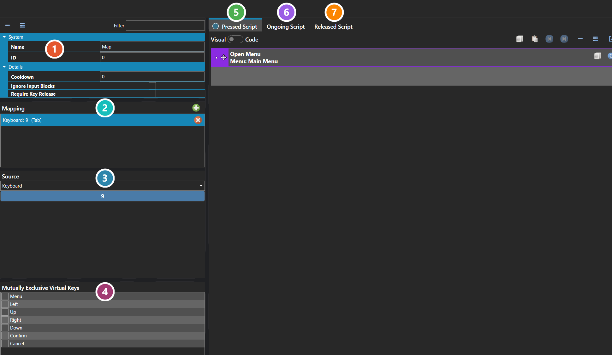

# Virtual Keys

*Источник: https://docs.rpg-architect.com/06-database/10-system/50-virtual-keys/*

---

# Virtual Keys

## **Virtual Keys**[¶](#virtual-keys "Permanent link")

Virtual Keys are the abstract input actions the project responds to — confirm, cancel, menu, the directional movement keys, and any other system-level input the player can perform. Each virtual key defines an ID, a name, the scripts that run when it is pressed, held, and released, and the physical input mappings (keyboard, mouse, touch, gamepad) that activate it.

Virtual Keys are the layer that decouples physical input from game logic. Scripts and systems react to virtual keys, never to a specific keyboard key or gamepad button, which is what allows players to remap controls and what lets the same in-game action be triggered from any supported input source.

###  Properties[¶](#properties "Permanent link")

The key's own fields— its name and ID, and how it behaves: a **Cooldown** before it can fire again, whether it **ignores input blocks**, and whether it **requires the key to be released** before it counts again. Every one of them is listed under **Properties** further down this page.

###  Mapping[¶](#mapping "Permanent link")

The physical inputs bound to this key. Each row pairs a source with a key on it, so one virtual key can answer to several inputs at once — a keyboard key and a controller button both pressing the same thing.

###  Mapping Details[¶](#mapping-details "Permanent link")

The selected binding's own settings. **Source** chooses the device it listens to, and the button beneath captures the key on that device — here the keyboard's Tab.

###  Mutually Exclusive Virtual Keys[¶](#mutually-exclusive-virtual-keys "Permanent link")

Keys that cannot be active at the same time as this one. Tick a key here and the two will not both register, which is how opposed inputs are kept from firing together.

###  Pressed Script[¶](#pressed-script "Permanent link")

Runs once when the key goes down. This is where a user-defined key does its work — the Map key here pushes a menu. See [Script Editor](../../../04-editor/script-editor/).

###  Ongoing Script[¶](#ongoing-script "Permanent link")

Runs repeatedly for as long as the key is held.

###  Released Script[¶](#released-script "Permanent link")

Runs once when the key comes back up.

> **Note**: A handful of Virtual Keys are reserved as system actions and cannot be deleted or scripted — they are owned by the engine itself for core navigation and input handling. Custom virtual keys can be added freely on top of these for any project-specific actions that need their own scripts or remappable bindings.
> 
> **Note**: Virtual Keys can run three separate scripts: Enter when the key is first pressed, Ongoing while it is held, and Exit when it is released. They can also be configured to ignore input blocks (so that critical actions still work when controls are otherwise frozen) and to require a key release before they fire again, which prevents continuous re-triggering when a key is held down.

## **Properties**[¶](#properties_1 "Permanent link")

#### **System**[¶](#system "Permanent link")

Name

Explanation

Type

Enter Script

The script executed when the virtual key is activated.

[Script](../../../05-reference/script/)

Exit Script

The script executed when the virtual key is deactivated.

[Script](../../../05-reference/script/)

ID

The ID of the virtual key.

Number

Mutually Exclusive

Commands that cannot be active simultaneously.

Name

The name of the virtual key.

String

Ongoing Script

The script that runs continuously while active.

[Script](../../../05-reference/script/)

#### **Details**[¶](#details "Permanent link")

Name

Explanation

Type

Cooldown

The duration before the virtual key is registered again, in milliseconds.

Number

Ignore Input Blocks

Whether the virtual key ignores input blockers and works even when controls are frozen.

Toggle

Require Key Release

Whether the virtual key requires a key release before it registers again.

Toggle