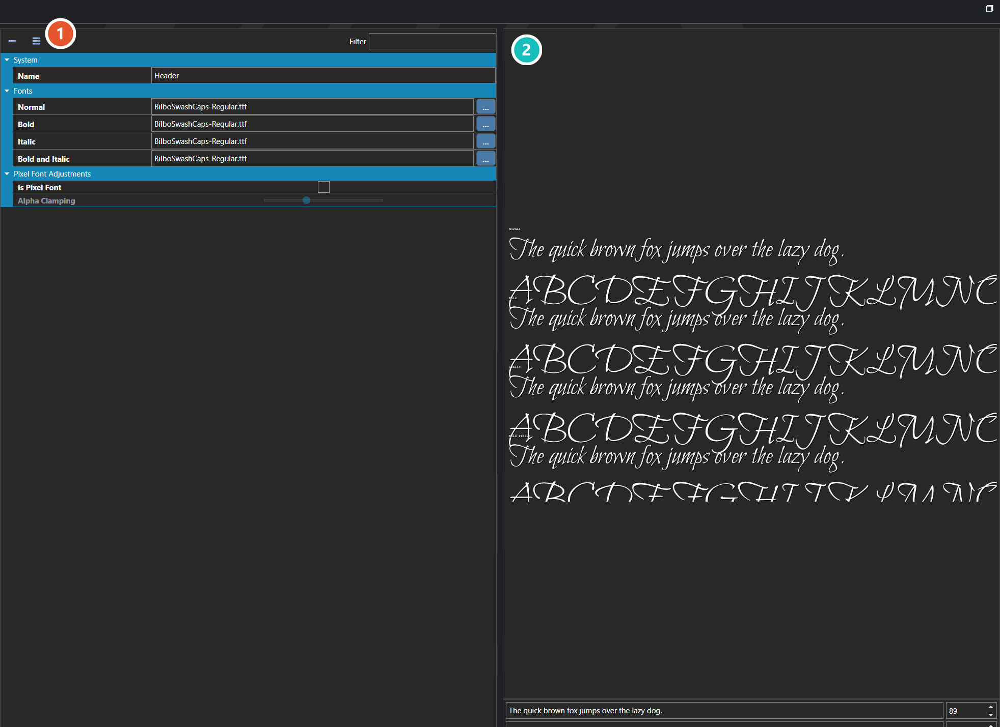

# Font Families

*Источник: https://docs.rpg-architect.com/06-database/09-user-interfaces/01-font-families/*

---

# Font Families

## **Font Families**[¶](#font-families "Permanent link")

Font Families are reusable font definitions that bundle together the four faces a single font can render in — Normal, Bold, Italic, and Bold Italic. A font family is referenced wherever text is rendered in the project, and the engine automatically picks the right face based on how the text is styled.

A font family can also be configured as a pixel font, which switches the renderer to a non-anti-aliased path with adjustable alpha clamping — preserving the crisp, hard-edged look of bitmap-style fonts that softening would otherwise destroy.

###  Properties[¶](#properties "Permanent link")

The font family's own fields — the faces it is built from and how they are sized. Every one of them is listed under **Properties** further down this page.

###  Preview[¶](#preview "Permanent link")

Renders sample text in the family as configured, which is the quickest way to judge weight and spacing before using it in a UI.

> **Note**: Only the Normal face is required. The Bold, Italic, and Bold Italic faces are optional, and any face that is left blank falls back to Normal at runtime. Define the additional faces only when the project actually uses styled text and the chosen font has dedicated artwork for them.

## **Properties**[¶](#properties_1 "Permanent link")

#### **System**[¶](#system "Permanent link")

Name

Explanation

Type

Name

The name of the font family.

String

#### **Fonts**[¶](#fonts "Permanent link")

Name

Explanation

Type

Bold

The bolded face of the font.

String

Bold and Italic

The bolded and italicized face of the font.

String

Italic

The italicized face of the font.

String

Normal

The normal face of the font.

String

#### **Pixel Font Adjustments**[¶](#pixel-font-adjustments "Permanent link")

Name

Explanation

Type

Alpha Clamping

The alpha value to test against when clamping anti-aliasing.

Number

Is Pixel Font

Whether the font should be treated as a pixel font.

Toggle