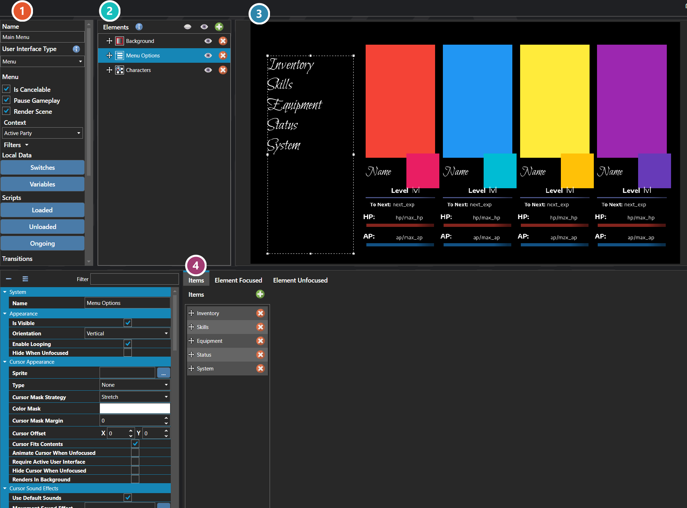

# User Interfaces

*Источник: https://docs.rpg-architect.com/06-database/09-user-interfaces/00-user-interfaces/*

---

# User Interfaces

## **User Interfaces**[¶](#user-interfaces "Permanent link")

User Interfaces are the customizable on-screen layouts the project shows to the player — main menus, dialogue boxes, HUDs, status overlays, shop screens, battle command lists, save and load menus, title screens, and any other element of the game's presentation that lives on top of the world. A user interface is built from a tree of elements (text, images, panels, lists, buttons) and can be styled, animated, and scripted to react to player input and game state.

Each user interface is a self-contained, reusable definition that can be displayed by the engine, opened from a script, or referenced by other systems (battle, title, game over, scenes) as their visual presentation. The same user interface can be opened multiple times, layered, and transitioned in and out independently from the rest of the game.

###  Properties[¶](#properties "Permanent link")

The interface's own fields — its type, the context it draws data from, its local switches and variables, its scripts, and its enter and exit transitions. Every one of them is listed under **Properties** further down this page.

###  Elements[¶](#elements "Permanent link")

Everything the interface is built from, nested as a tree — panels, lists, text, images. Select one to edit it below.

###  Preview[¶](#preview "Permanent link")

The interface drawn as it will appear in game, updating as elements are edited.

###  Selected Element[¶](#selected-element "Permanent link")

The element picked out in the tree above. Its fields change to suit the kind of element — position and size, the data it binds to, and how it is drawn.

> **Note**: User interfaces run a three-stage script lifecycle: a Loaded script when the UI first opens, an Ongoing script while it is active, and an Unloaded script when it closes. Use Loaded and Unloaded for one-shot setup and teardown, and Ongoing for the per-frame logic that drives interactivity.
> 
> **Note**: A user interface is typed (overlay, menu, dialogue, etc.), and the type controls how the engine treats it relative to other UIs that may already be open — what it blocks, what it allows underneath, and how input flows. Choose the type that matches the role the UI plays rather than treating every interface the same way.

## **Properties**[¶](#properties_1 "Permanent link")

#### **System**[¶](#system "Permanent link")

Name

Explanation

Type

Enter Transition

The transition played when opening the user interface.

[User Interface Transition](../../../10-user-interfaces/user-interface-transition/)

Exit Transition

The transition played when closing the user interface.

[User Interface Transition](../../../10-user-interfaces/user-interface-transition/)

ID

The unique identifier.

[Unique ID](../../../05-reference/unique-id/)

Locals

The local switches and variables.

[Local and Global Data](../../../05-reference/local-and-global-data/)

Name

The display name.

String

Ongoing Script

The script that runs continuously while active.

[Script](../../../05-reference/script/)

Unloaded Script

The script executed when the user interface is unloaded.

[Script](../../../05-reference/script/)