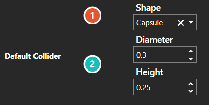

# Collider Editor

*Источник: https://docs.rpg-architect.com/04-editor/collider-editor/*

---

# Collider Editor

## **Collider Editor**[¶](#collider-editor "Permanent link")

The Collider Editor is where an object's physical shape is defined. A collider is the volume the physics system tests against, and it is separate from how the object is drawn — the two can differ deliberately.

Shape chooses the volume. A Sphere, Capsule, Cylinder, or Box covers most cases and is the cheapest to test against. A Convex Hull fits a tighter shape around the object, and a Mesh collides against its geometry directly.

The values a collider holds are documented under [Collider](../../05-reference/collider/).

###  Shape[¶](#shape "Permanent link")

Which volume the object collides with. The choice made here is what the fields below it follow from; the volumes on offer are described above.

###  Shape Parameters[¶](#shape-parameters "Permanent link")

**The fields beneath Shape belong to the shape**, so choosing a different one replaces them - a Capsule asks for a diameter and a height, a Box asks for its extents, and a Mesh asks for none of them.

> **Note**: Mesh colliders are one-sided. A surface only collides from the side its triangles face, so a wall built from a single plane can be walked through from behind.